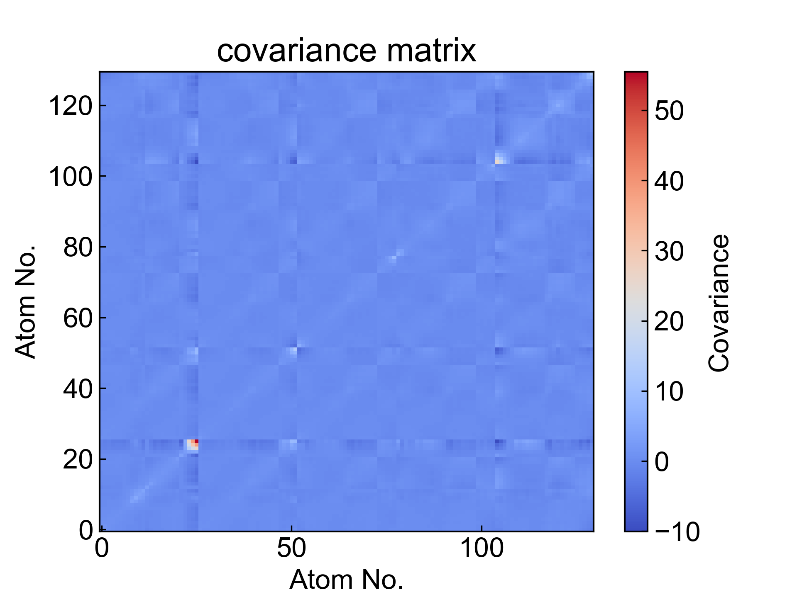
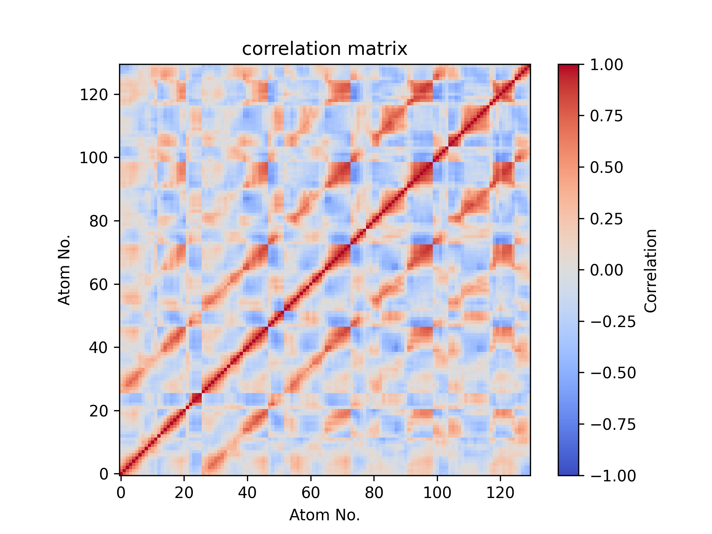

# DCCM

此模块计算用户所选原子之间的动态互相关矩阵(Dynamic Cross-Correlation Matrix, DCCM)。

更多内容请参考：https://zhuanlan.zhihu.com/p/578891660，以及https://mp.weixin.qq.com/s/Lz_I9zmzxbO_Kc5uzDjsfw

使用本模块前请注意[前置处理](https://duivyprocedures-docs.readthedocs.io/en/latest/Framework.html#id7)已经完成！

## Input YAML

```yaml
- DCCM:
    atom_selection: protein and name CA
    byType: atom # res_com, res_cog, res_coc # have to select all residues atoms
    save_xpm: yes
```

`atom_selection`：原子选择器，用于指定计算DCCM的原子。这里的原子选择的语法完全遵从MDAnalysis的原子选择语法。请参考：https://userguide.mdanalysis.org/2.7.0/selections.html

`byType`：指定计算DCCM的方式。有四种选择：`atom`、`res_com`、`res_cog`、`res_coc`。`atom`计算选中的所有原子之间的DCCM；常见的，可以在`atom_selection`中选择CA原子`protein and name CA`来计算蛋白质的DCCM；`res_com`计算每个残基的质心之间的DCCM；`res_cog`计算每个残基的几何中心之间的DCCM；`res_coc`计算每个残基的电荷中心之间的DCCM。当为`res_com`、`res_cog`或`res_coc`时，原子选择器应当包含选中的残基的所有原子，否则只会计算某一残基中选中原子的质心、几何中心或者电荷中心之间的DCCM。

`save_xpm`：是否保存xpm文件。如果设置为`yes`，则会保存DCCM的协方差矩阵和互相关矩阵，并将其保存成xpm文件；否则将只保存为csv文件。

本模块还有三个隐藏参数可以对轨迹做帧的选择：

```yaml
      frame_start:  # start frame index
      frame_end:   # end frame index, None for all frames
      frame_step:  # frame index step, default=1
```

这些参数可以指定计算轨迹的起始帧、终止帧（不包含）以及帧的步长。默认情况下，用户不需要设置这些参数，模块会自动分析整个轨迹。

例如我们计算从1000帧开始，到5000帧结束，每隔10帧的DCCM：

```yaml
      frame_start: 1000 # start frame index
      frame_end:  5001 # end frame index, None for all frames
      frame_step: 10 # frame index step, default=1
```

如果三个参数中只需要设置一个或两个，其余的参数都可以省略。

本模块对DCCM的计算过程做了一些改进，使得其计算耗时基本上不会随着原子数目和帧数的增加而增加太多，但是较大的原子数量会导致xpm文件非常大，保存成xpm文件就会是比较耗时的事情；如此，可以通过设置不保存xpm以节省时间。

如果保存了XPM文件，则还可以通过DuIvyTools（DIT，DIP的依赖之一）重新可视化DCCM，微调图片样式等。

## Output

DCCM模块会输出计算得的协方差矩阵和互相关矩阵，分别保存成xpm文件和csv文件，同时也会对这两个文件进行可视化得到图片。





## References

如果您使用了DIP的本分析模块，请一定引用MDAnalysis、DuIvyTools(https://zenodo.org/doi/10.5281/zenodo.6339993)，以及合理引用本文档(https://zenodo.org/doi/10.5281/zenodo.10646113)。
