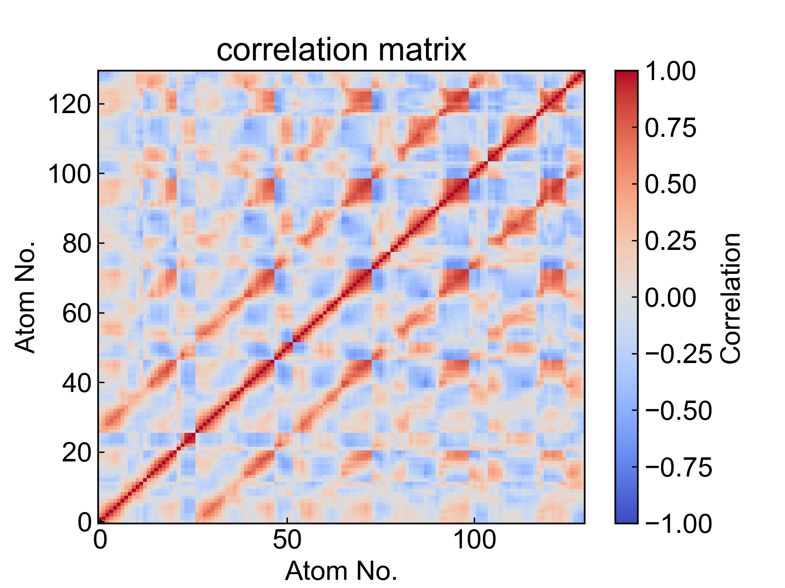

# DCCM

此模块计算用户所选原子之间的动态互相关矩阵(Dynamic Cross-Correlation Matrix, DCCM)。

更多内容请参考：https://zhuanlan.zhihu.com/p/578891660

## Input YAML

```yaml
- DCCM:
    atom_selection: protein and name CA
    save_xpm: yes
```

`atom_selection`：原子选择器，用于指定计算DCCM的原子。这里的原子选择的语法完全遵从MDAnalysis的原子选择语法。请参考：https://userguide.mdanalysis.org/1.1.1/selections.html

`save_xpm`：是否保存xpm文件。如果设置为`yes`，则会保存DCCM的协方差矩阵和互相关矩阵，并将其保存成xpm文件；否则将只保存为csv文件。

本模块对DCCM的计算过程做了一些改进，使得其计算耗时基本上不会随着原子数目和帧数的增加而增加太多，但是较大的原子数量会导致xpm文件非常大，保存成xpm文件就会是比较耗时的事情；如此，可以通过设置不保存xpm以节省时间。

## Output

DCCM模块会输出计算得的协方差矩阵和互相关矩阵，分别保存成xpm文件和csv文件，同时也会对这两个文件进行可视化得到图片。




## References

如果您使用了DIP的本分析模块，请一定引用MDAnalysis、DuIvyTools(https://zenodo.org/doi/10.5281/zenodo.6339993)，以及合理引用本文档。
