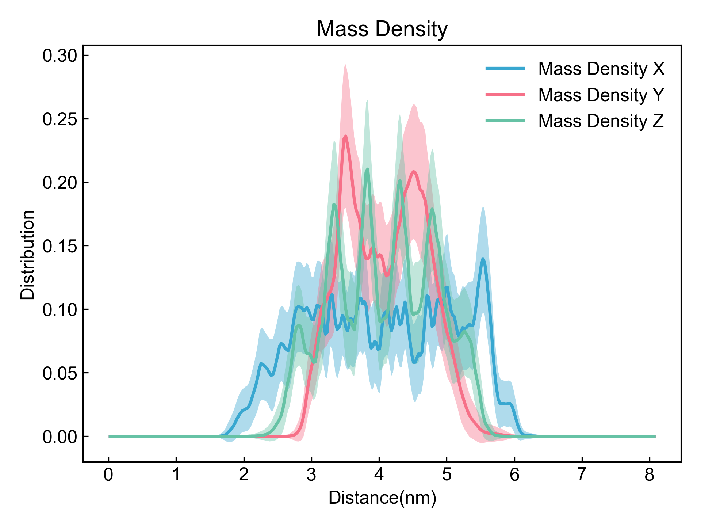

# Density

此模块计算所选原子的质量和电荷密度沿X、Y、Z方向的分布。

## Input YAML

```yaml
- Density:
    calc_group: protein  # resname *ZIN
```

`calc_group`：选择计算的原子组。这里的原子选择的语法完全遵从MDAnalysis的原子选择语法。请参考：https://userguide.mdanalysis.org/1.1.1/selections.html


## Output

DIP会输出质量密度和电荷密度在X、Y、Z方向的分布图以及相应的数据文件（xvg格式）。




## References

如果您使用了DIP的本分析模块，请一定引用MDAnalysis、DuIvyTools(https://zenodo.org/doi/10.5281/zenodo.6339993)，以及合理引用本文档(https://zenodo.org/doi/10.5281/zenodo.10646113)。
