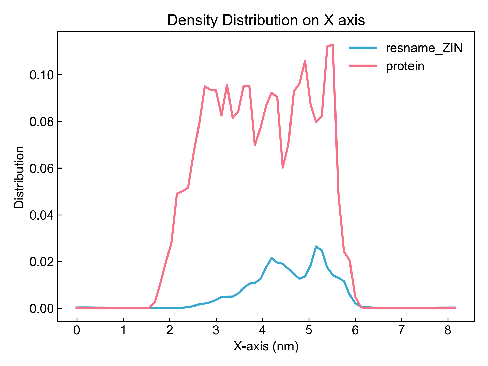
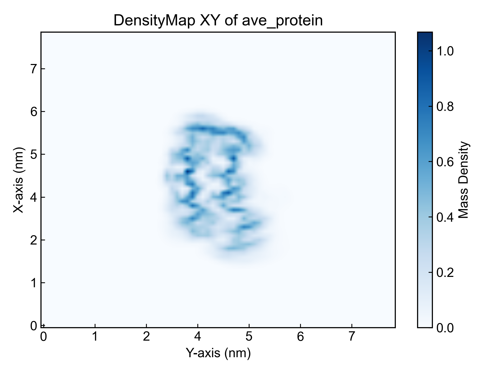
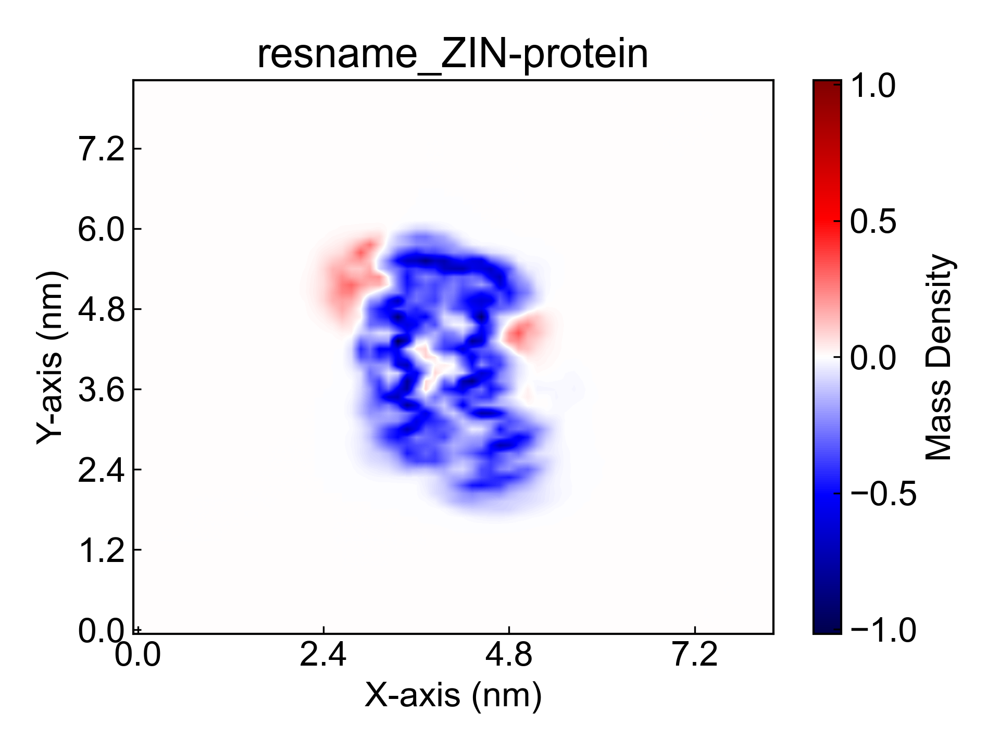
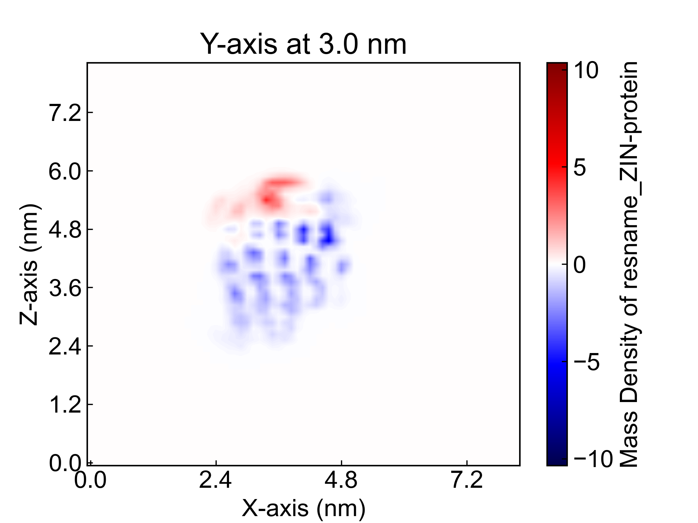
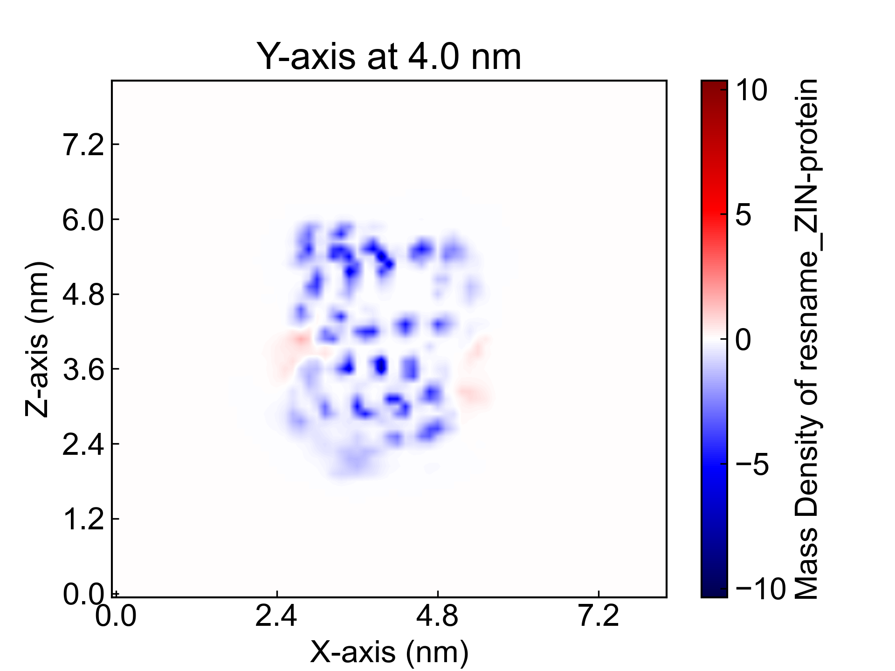

# DensityMap

此模块使用格点技术对分子的空间位置进行表征，能够获得质量密度、电荷密度、数量密度在不同轴向、不同平面上的分布。不仅可以表征单一组分的分布，还能表征两个组分在密度分布上的关系。同时，还支持对组分沿着某一轴向切片，观察切片上的密度分布。

基于格点技术，此模块还可以拓展出很多有意思的功能，欢迎大家的建议和反馈~

## Input YAML

```yaml
- DensityMap:
    byType: Mass # Number # Mass # Charge
    byIndex: no  # use gmx index or MDA selections
    groups: [resname *ZIN, protein] #[Protein, Ligands]
    grid_bin: 1.2  # vdw radius: H 1.20 C 1.70 N 1.55 O 1.52
    doSplit_axis: "Y" # "", X, Y, Z
    doSplit_saveXPM: no
```

`byType`：选择计算的类型，可选`Mass`（质量），`Number`（数量），`Charge`（电荷）。

`byIndex`：选择使用GROMACS的索引或MDAnalysis的选择语句。如果设置"no", 下面`groups`参数的值将被认为是MDAnalysis的选择语句（这里的原子选择的语法完全遵从MDAnalysis的原子选择语法。请参考：https://userguide.mdanalysis.org/1.1.1/selections.html）；如果设置"yes"，则下面的groups参数的值将被认为是GROMACS的索引组的名字，当然这个名字需要和index文件中的对应上。

`groups`：选择计算的原子组，可以同时声明多个组，用逗号分隔。

`grid_bin`：格点的大小，单位为埃。1.2埃差不多是氢原子的范德华半径。用户可以调整格点的尺寸以获得最佳的表征效果。

`doSplit_axis`：选择沿着哪个轴切片，可选`X`、`Y`、`Z`，也可以同时对多个轴向进行切片，如`XY`等。如果不选择切片，则不会进行切片的计算。

`doSplit_saveXPM`：选择是否保存切片的XPM文件，如果选择"yes"，则会将每一个切片都用xpm文件格式保存下来，这会比较耗时。

## Output

此模块会输出较多的图片。

首先是所有组分在三个轴向上的平均密度分布折线图，这里列举X轴向上的：



对于某些材料方面的领域，可能需要计算某类原子的数量密度沿着轴向的分布，可以用这里的功能去实现，只需要将`byType`设置为`Number`即可，然后`groups`参数设置为需要计算的原子，例如`name C`。

之后是每一个组分在不同平面上的平均密度分布图，这里列举XY平面上的蛋白质密度图：



之后是任意两两组分在不同平面上的平均密度分布图，因为很难很好地重叠两张热图，因而这里的分布图实际上是**一张密度分布图减去另一张热图得到的差值**。对于有上下重叠的位置关系，这样的可视化方法会带来一定的误差。

这里列举XY平面上的蛋白质和配体密度分布图：




如果选择了切片的计算，则会输出每一个切片的密度分布图，这里任意列举两帧Y轴向上的蛋白质和配体的切片图：





当然用户也可以自行将切片出来的图片文件组合成视频或者gif文件，看起来会比较有意思。例如：


## References

如果您使用了DIP的本分析模块，请一定引用MDAnalysis、DuIvyTools(https://zenodo.org/doi/10.5281/zenodo.6339993)，以及合理引用本文档(https://zenodo.org/doi/10.5281/zenodo.10646113)。
