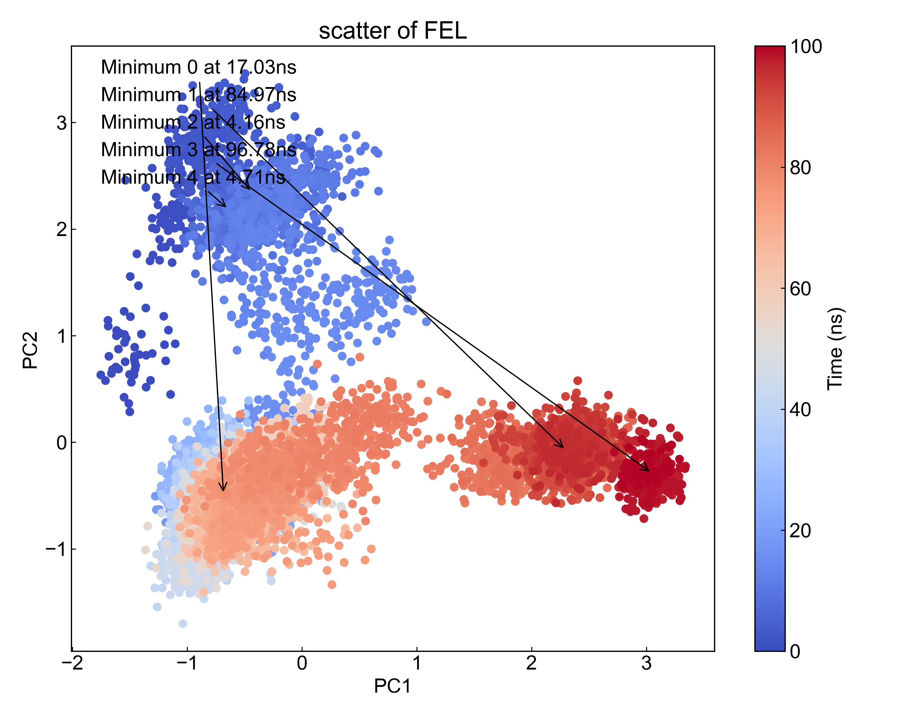

# FEL

本模块用于从三列数据（时间、第一列数据、第二列数据）的文件出发，绘制自由能形貌图（Free Energy Landscape）（FEL）。

## Input YAML

```yaml
  - FEL:
      inputfile: ../gmx_PCA/pc12.xvg  # input file, xvg format, [time, data1, data2]
      temperature: 300
      ngrid: 32
      find_minimum: true
      minimum_num: 5
```

`inputfile`：输入文件路径，要求三列数据（时间、第一列数据、第二列数据）。这里我们利用前一个模块的结果来作为输入。因为前一个模块的结果都保存在gmx_dPCA文件夹中，而我们分析模块的运行路径是默认在`FEL`目录中的，与`gmx_PCA`平级，因而这里文件路径写作`../gmx_PCA/pc12.xvg`。

`temperature`：设定体系的温度。从概率分布转换到Gibbs能量需要设定温度值，请设置与体系MD温度同样的温度值。

`ngrid`：FEL的网格数量，即FEL的横纵像素的数量。

`find_minimum`：是否寻找局部最小值。如果设置为`true`，则程序会自动寻找FEL中的局部最小值，并将其标记出来，同时输出这些最小值对应的轨迹的时间帧，也即pdb文件。

`minimum_num`：寻找的局部最小值的数量，用户可以自己设置要寻找前几个最小值，但是这个数值不能大于FEL中有的局部最小值数量。

本模块还有三个隐藏参数可以对轨迹做帧的选择：

```yaml
      frame_start:  # start frame index
      frame_end:   # end frame index, None for all frames
      frame_step:  # frame index step, default=1
```

这些参数可以指定计算轨迹的起始帧、终止帧（不包含）以及帧的步长。默认情况下，用户不需要设置这些参数，模块会自动分析整个轨迹。

例如我们计算从1000帧开始，到5000帧结束，每隔10帧的DCCM：

```yaml
      frame_start: 1000 # start frame index
      frame_end:  5001 # end frame index, None for all frames
      frame_step: 10 # frame index step, default=1
```

如果三个参数中只需要设置一个或两个，其余的参数都可以省略。

## Output

DIP会计算并可视化gibbs.xpm。这里只举例gibbs.xpm:


这里的gibbs.xpm默认使用了`dit -m contour`模式进行绘制，用户也可以自行使用`dit`绘制成其它的风格。

如果用户设置了需要寻找最小值，那么DIP会找出对应的轨迹帧并输出到pdb文件，在这里为：

```txt
Minimum_0_Protein_17030ps.pdb
Minimum_1_Protein_84970ps.pdb
```

同时会将最小值点在数据的散点图中标记出来：



因为格点设置的不同，会导致同样的输入文件，`gmx_FEL`与此模块的输出不尽相同，结果都是合理的。


## References

如果您使用了DIP的本分析模块，请一定引用MDAnalysis、DuIvyTools(https://zenodo.org/doi/10.5281/zenodo.6339993)，以及合理引用本文档(https://zenodo.org/doi/10.5281/zenodo.10646113)。
