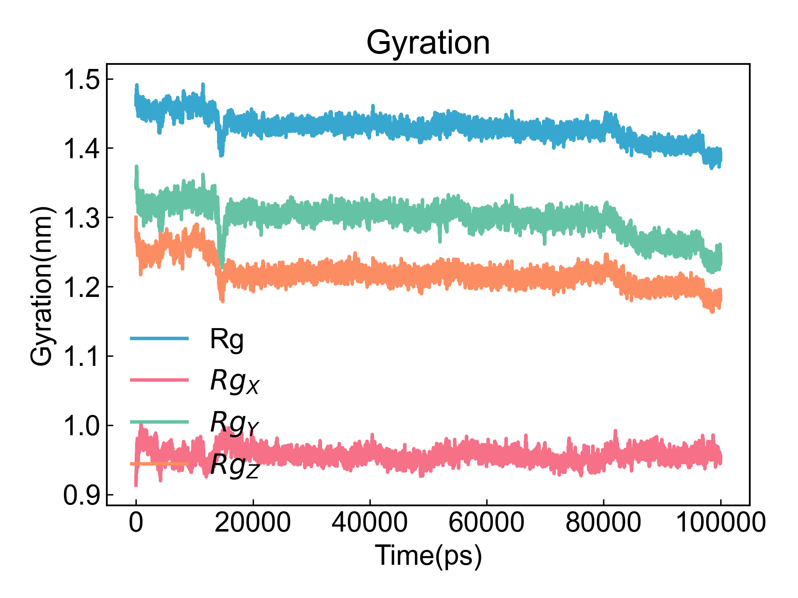

# Gyrate

此模块计算回旋半径（gyration）。

## Input YAML

```yaml
- Gyrate:
    calc_group: protein
```

`calc_group`：计算分组，即需要计算回旋半径的原子组。这里的原子选择的语法完全遵从MDAnalysis的原子选择语法。请参考：https://userguide.mdanalysis.org/1.1.1/selections.html

## Output

DIP会将数据结果保存到xvg文件并可视化：



## References

如果您使用了DIP的本分析模块，请一定引用MDAnalysis、DuIvyTools(https://zenodo.org/doi/10.5281/zenodo.6339993)，以及合理引用本文档。