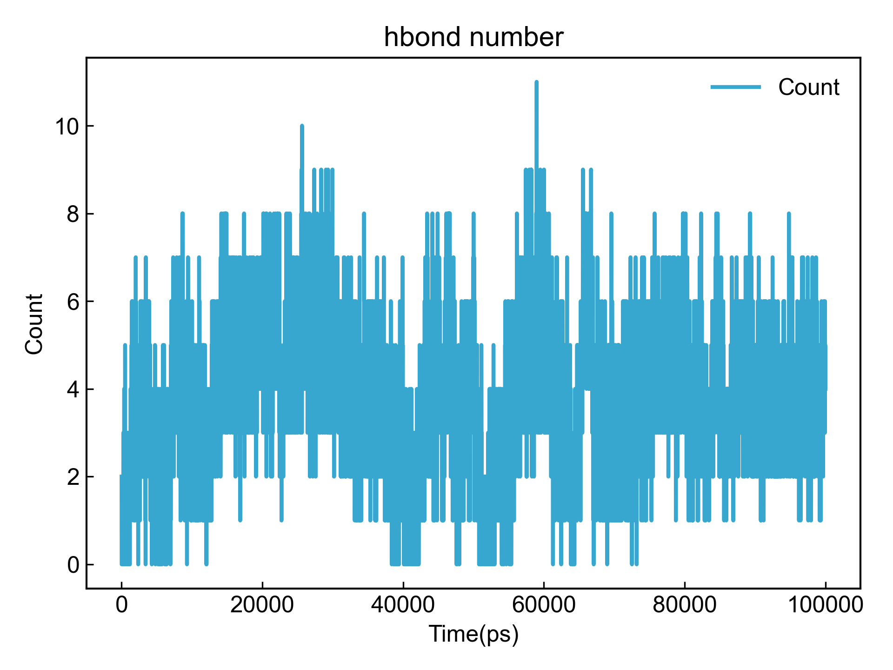
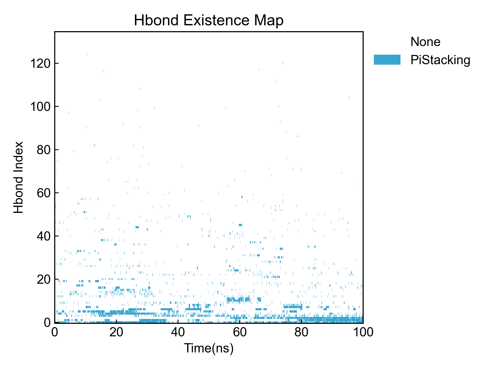
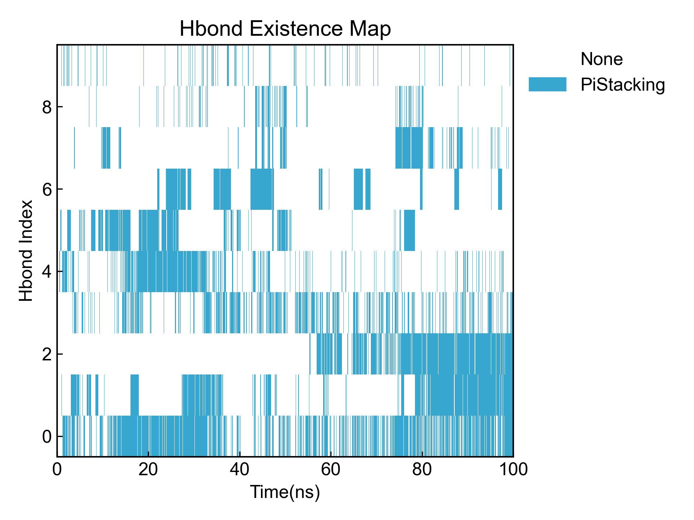
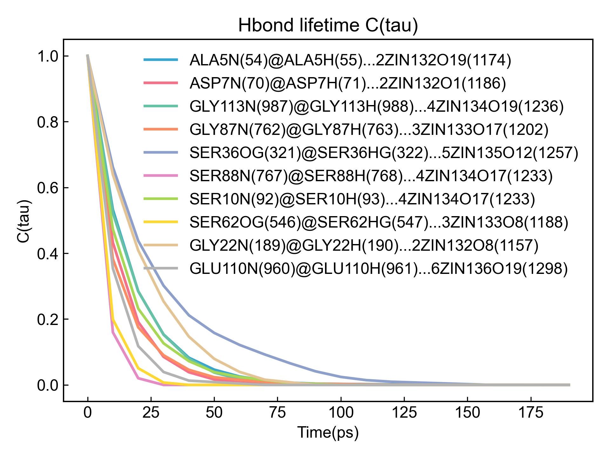

# Hbond

本模块执行氢键的计算，包括氢键的数量、时间占有率、氢键形成的平均距离和角度等。

使用本模块前请注意[前置处理](https://duivyprocedures-docs.readthedocs.io/en/latest/Framework.html#id7)已经完成！

## Input YAML

```yaml
  - Hbond:
      donor_group: protein
      acceptor_group: protein  ## the group name can't be started with number
      update_selection: no # update atom selection for each frame, no will be fast
      d_h_cutoff: 0.12 # nm
      d_a_cutoff: 0.30 # nm
      d_h_a_angle_cutoff: 150
      only_calc_number: no
      top2show: 10
      calc_lifetime: no # only for the top2show, and NO for dynamic atom selection
      tau_max: 20  # frame
      window_step: 1 # frame
      intermittency: 0  # allow 0 frame intermittency
```

`donor_group`和`acceptor_group`分别指定氢键的接受者和供体原子组，可以直接写明参与氢键的原子，也可以如示例一样写整体的原子组。这里的原子选择的语法完全遵从MDAnalysis的原子选择语法。请参考：https://userguide.mdanalysis.org/2.7.0/selections.html

`update_selection`指定是否需要每一帧都刷新设置的原子组，如果原子组选择的语句中有`around`等动态选择语句，则应该将此选项设置为`yes`。一般不涉及动态选择的情况下，建议将此选项设置为`no`，以大幅提高计算速度。

`d_h_cutoff`：体系会从`donor_group`中选取符合此阈值的供体-氢原子，以计算氢键。

`d_a_cutoff`：氢键判定条件之一，供体和受体原子的距离阈值，小于此阈值则形成氢键。

`d_h_a_angle_cutoff`：氢键判定条件之一，供体-氢-受体角度阈值，大于此阈值则形成氢键。

`top2show`是指展示前面多少个占有率最高的氢键数量，默认是10，可以根据需要调整。

如果只需要计算氢键数量，或者当预估的氢键数量特别大时（例如计算蛋白质和水的氢键），可以将`only_calc_number`设置为`yes`，也即只计算氢键数量，而不计算其他参数

`calc_lifetime`：是否计算氢键的生命周期。如果设置为`yes`，则会对占有率最高的`top2show`个氢键计算生命周期。

`tau_max`：生命周期的最大时间，单位为帧。计算氢键生命周期的过程中会计算从t0时刻开始，`tau_max`帧内，氢键继续存在的概率。此值设置越大，则计算的窗口越大。

`window_step`：生命周期的窗口平移步长，单位为帧。

`intermittency`：允许的帧间隔，即允许多少帧没有发生氢键仍旧视为氢键；默认为0，即必须连续发生才被视为氢键。

本模块还有三个隐藏参数可以对轨迹做帧的选择：

```yaml
      frame_start:  # start frame index
      frame_end:   # end frame index, None for all frames
      frame_step:  # frame index step, default=1
```

这些参数可以指定计算轨迹的起始帧、终止帧（不包含）以及帧的步长。默认情况下，用户不需要设置这些参数，模块会自动分析整个轨迹。

例如我们计算从1000帧开始，到5000帧结束，每隔10帧的数据：

```yaml
      frame_start: 1000 # start frame index
      frame_end:  5001 # end frame index, None for all frames
      frame_step: 10 # frame index step, default=1
```

如果三个参数中只需要设置一个或两个，其余的参数都可以省略。

## Output

DIP会计算并可视化本组件输出的氢键数量图和氢键占有率图：





同时还会对占有率最高的几个氢键进行占有率的可视化：



DIP会统计所有氢键的时间占有率、形成了氢键的平均距离和平均角度，并输出到csv文件中:

```csv
id,donor@hydrogen...acceptor,occupancy(%),Present/Frames,Distance Ave(nm),Distance Std.err(nm),Angle Ave(deg),Angle Std.err(deg)
0,GLY35N(312)@GLY35H(313)...ASP33OD2(301),62.49,6250/10001,0.3013,0.0162,147.63,12.51 
1,GLY9N(87)@GLY9H(88)...ASP7OD2(76),36.83,3683/10001,0.3050,0.0176,157.13,11.11 
2,LEU122N(1058)@LEU122H(1059)...ASP85OD1(750),35.42,3542/10001,0.3039,0.0177,154.75,12.04 
3,ASN115N(1000)@ASN115H(1001)...SER114OG(996),31.99,3199/10001,0.2863,0.0147,130.56,6.46  
4,GLY61N(537)@GLY61H(538)...ASP59OD2(526),27.64,2764/10001,0.3024,0.0170,144.69,13.23 
5,GLY9N(87)@GLY9H(88)...ASP7OD1(75),23.92,2392/10001,0.3039,0.0178,157.33,11.05 
6,SER62OG(546)@SER62HG(547)...SER36OG(321),20.95,2095/10001,0.2692,0.0153,163.43,9.16  
7,ASN37N(325)@ASN37H(326)...SER10OG(96),15.05,1505/10001,0.2987,0.0200,157.07,12.61 
8,ASN11N(100)@ASN11H(101)...SER10OG(96),8.96,896/10001,0.2871,0.0149,129.49,6.58  
9,ASP7N(70)@ASP7H(71)...GLU6OE1(66),6.90,690/10001,0.3123,0.0203,148.82,13.48 
```

氢键名称由[供体@氢...受体]组成, 每部分的命名含义如下：残基名字、残基编号、原子、括号里面是原子编号。

如果计算的氢键的生命周期，则氢键的自相关函数会被输出并可视化：



同时自相关函数的积分，也即生命周期，也会被输出到csv文件中。请注意，这里的生命周期是直接对自相关函数数据进行simpson积分得到的，准确度一般。

如果观察到在自相关函数的自变量范围内函数值还没有降到0，说明应当适当调大`tau_max`参数以获得更准确的生命周期积分。

## References

如果您使用了DIP的本分析模块，请一定引用MDAnalysis、DuIvyTools(https://zenodo.org/doi/10.5281/zenodo.6339993)，以及合理引用本文档(https://zenodo.org/doi/10.5281/zenodo.10646113)。