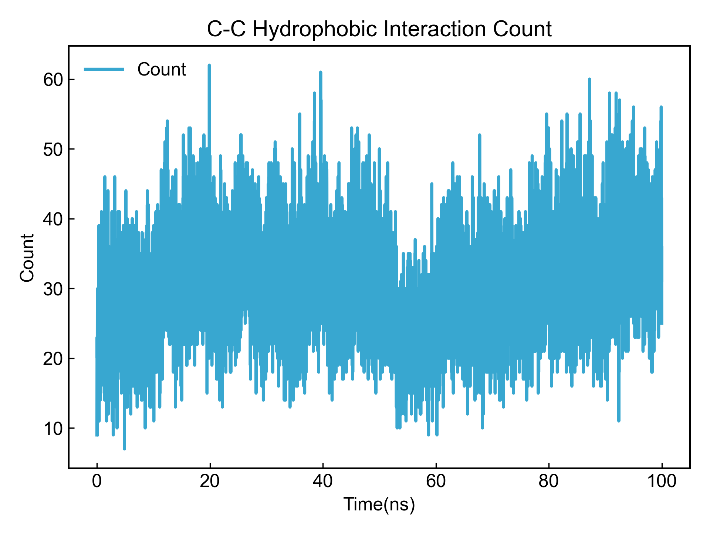
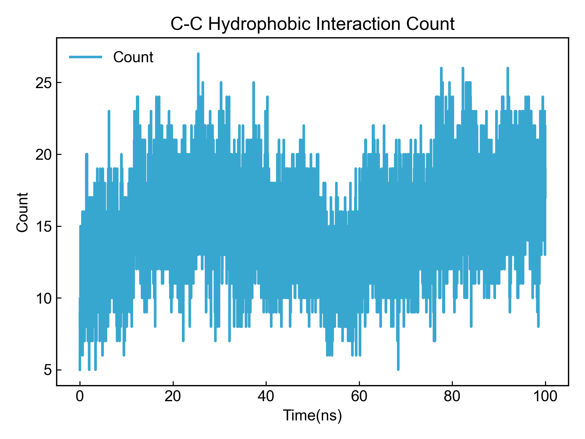

# Hydrophobic Contact

此模块计算两个组分之间的C-C接触数目。虽然分析模块名字写的是疏水相互作用，但是实际上疏水相互作用是一种熵的效应，因而这里采用碳-碳原子之间的接触来作为疏水相互作用的一种粗陋衡量。

使用本模块前请注意[前置处理](https://duivyprocedures-docs.readthedocs.io/en/latest/Framework.html#id7)已经完成！

## Input YAML

```yaml
- Hydrophobic:
    dist_max_cutoff: 0.40 # nm
    dist_min_cutoff: 0.05 # nm
    group1: protein
    group2: resname *ZIN
```

`dist_max_cutoff`和`dist_min_cutoff`：定义最大允许的和最小允许的距离阈值，单位为nm。DIP会计算两两碳原子之间的距离，如果距离小于等于`dist_max_cutoff`且大于`dist_min_cutoff`，则认为两原子之间存在碳-碳接触。

`group1`：定义第一个原子组；`group2`：定义第二个组。这里的原子选择的语法完全遵从MDAnalysis的原子选择语法。请参考：https://userguide.mdanalysis.org/1.1.1/selections.html。DIP会从两个原子组中找出碳元素，并计算两组之间满足距离阈值的碳-碳接触的数量。


本模块还有三个隐藏参数可以对轨迹做帧的选择：

```yaml
      frame_start:  # start frame index
      frame_end:   # end frame index, None for all frames
      frame_step:  # frame index step, default=1
```

这些参数可以指定计算轨迹的起始帧、终止帧（不包含）以及帧的步长。默认情况下，用户不需要设置这些参数，模块会自动分析整个轨迹。

例如我们计算从1000帧开始，到5000帧结束，每隔10帧的DCCM：

```yaml
      frame_start: 1000 # start frame index
      frame_end:  5001 # end frame index, None for all frames
      frame_step: 10 # frame index step, default=1
```

如果三个参数中只需要设置一个或两个，其余的参数都可以省略。


## Output

DIP会根据用户的选组计算每一帧的C-C接触数目，并将结果保存到xvg文件中并可视化。



因为C-C接触数目本身是较多的，所以DIP还按照残基对对C-C接触数目做了减少，同一对残基对之间有多个接触的，只考虑一个接触，并保留结果到`_reduced.xvg`文件中。



同时DIP还会将`reduced`的C-C接触的时间占有率保存到txt文件中。

```txt
CC_name, Occupancy, frames/total_frames
PHE_3-2ZIN_132, 23.41%, 2341/10001
MET_71-1ZIN_131, 41.55%, 4155/10001
ALA_5-2ZIN_132, 23.59%, 2359/10001
VAL_20-2ZIN_132, 45.62%, 4562/10001
VAL_34-3ZIN_133, 2.92%, 292/10001
MET_19-1ZIN_131, 35.84%, 3584/10001
MET_45-1ZIN_131, 34.85%, 3485/10001
PHE_107-6ZIN_136, 17.97%, 1797/10001
```

## References

如果您使用了DIP的本分析模块，请一定引用MDAnalysis、DuIvyTools(https://zenodo.org/doi/10.5281/zenodo.6339993)，以及合理引用本文档(https://zenodo.org/doi/10.5281/zenodo.10646113)。