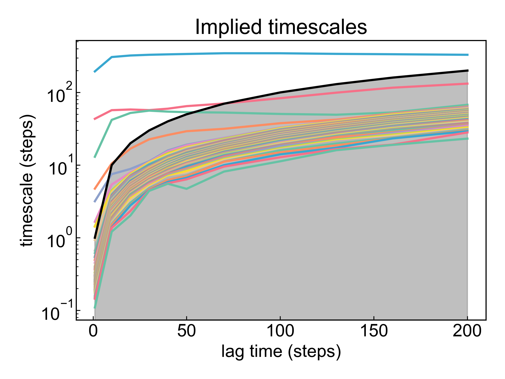

# MSM

此模块是一个基于模拟轨迹构建马尔科夫状态模型MSM的模块。由于构建MSM需要大量的数理知识、经验判断，因此本模块仅提供一个demo，并**不可不加审慎地用于实际研究**。

使用本模块前请注意[前置处理](https://duivyprocedures-docs.readthedocs.io/en/latest/Framework.html#id7)已经完成！

另外，请按照构建MSM的需求妥善处理您的轨迹采样等事项。

构建MSM的一般步骤如下：
1. 对研究对象和CV进行充分采样
2. 选择合适的用于构建MSM的features，例如坐标、二面角、蛋白质二级结构等
3. 对features进行tICA降维，得到低维特征；对降维效果进行表征
4. 对降维之后的数据进行聚类，得到一系列子状态
5. 分析不同lag参数下的implied timescales变化
6. 选取合适的lag参数，构建合适的MSM
7. 使用ck_test检验MSM的有效性
8. 使用PCCA方法分析meta states数量和相关性质
9. 绘制状态转移网络图


请阅读以下参考资料以获取更多关于如何合理构建MSM的信息：

1. http://www.emma-project.org/latest/tutorials/notebooks/00-pentapeptide-showcase.html
2. https://ambermd.org/tutorials/advanced/tutorial41/index.php#3.%20tICA%20Analysis%20and%20MSM%20Construction
3. http://www.emma-project.org/latest/index.html
4. https://deeptime-ml.github.io/trunk/index.html


## Input YAML

```yaml
- MSM:
    atom_selection: protein
    byType: atom  # atom, res_com, res_cog, res_coc
    target: coordinates # dihedrals, coordinates
    coordinate_fit: no
    dimension: 3
    lag4tica: 20
    number_clusters: 100
    transition_count_mode: "effective" #"sliding","sample","effective","sliding-effective"
    lag4ITS_range: [1, 10, 20, 30, 40, 50, 70, 100, 130, 160, 200]
    lag4MSM: 20
    meta_number: 3
```

`atom_selection`：原子选择，用于指定需要进行tICA的原子组。如果进行二面角分析的话，则所选的原子组必须包含形成骨架二面角的原子。这里的原子选择的语法完全遵从MDAnalysis的原子选择语法。请参考：https://userguide.mdanalysis.org/1.1.1/selections.html

`byType`：指定计算基于坐标的降维的方式，只有`target`为`coordinates`时有效。有四种选择：`atom`、`res_com`、`res_cog`、`res_coc`。`atom`计算选中的所有原子坐标的降维；常见的，可以选择CA原子`protein and name CA`来计算蛋白质的降维；`res_com`计算每个残基的质心的降维；`res_cog`计算每个残基的几何中心的降维；`res_coc`计算每个残基的电荷中心的降维。当为`res_com`、`res_cog`或`res_coc`时，原子选择器应当包含选中的残基的所有原子，否则只会计算某一残基中选中原子的质心、几何中心或者电荷中心的降维。

`coordinate_fit`：是否对原子坐标进行点云fit。如果选择`yes`，则会对原子坐标进行fit，以消除坐标的扰动。

`target`：tICA的目标，可以是`coordinates`或`dihedrals`。如果选择`coordinates`，则tICA将基于原子的坐标进行分析；如果选择`dihedrals`，则tICA将基于二面角进行分析。

**需要注意的是**：dPCA的文献中讨论到二面角与坐标不同，二面角具有周期性；因而dPCA的文章中是对角度进行了三角变换再将之应用于PCA分析，而此模块同样将二面角转换成sin和cos值再进行降维分析。**用户在利用此模块进行二面角的降维分析的时候，需要妥善对照文献分析计算过程是否合适！如果不确定，请不要使用此模块的二面角降维分析** 有任何问题或者改进的建议，请联系杜若，杜若和杜艾维非常欢迎任何的建议和argue，非常感谢！。

`dimension`：tICA降维后的维度。

`lag4tica`：tICA的lag参数。

`number_clusters`：指定聚类后的子状态数量。

`transition_count_mode`：指定计算转移矩阵的方法。有四种选择：`sliding`、`sample`、`effective`、`sliding-effective`。请参考：https://deeptime-ml.github.io/trunk/api/generated/deeptime.markov.TransitionCountEstimator.html

`lag4ITS_range`：指定计算implied timescales的lag参数列表。

`lag4MSM`：指定构建MSM的lag参数。

`meta_number`：指定meta states的数量。


本模块还有三个隐藏参数可以对轨迹做帧的选择：

```yaml
      frame_start:  # start frame index
      frame_end:   # end frame index, None for all frames
      frame_step:  # frame index step, default=1
```

这些参数可以指定计算轨迹的起始帧、终止帧（不包含）以及帧的步长。默认情况下，用户不需要设置这些参数，模块会自动分析整个轨迹。

例如我们计算从1000帧开始，到5000帧结束，每隔10帧的DCCM：

```yaml
      frame_start: 1000 # start frame index
      frame_end:  5001 # end frame index, None for all frames
      frame_step: 10 # frame index step, default=1
```

如果三个参数中只需要设置一个或两个，其余的参数都可以省略。


## Output

本模块支持提取蛋白质的phi和psi二面角、分子坐标（包括残基质心等）作为features。DIP会输出每一帧的时间间隔，以及初始数据的shape：

```bash
>> dt == 100 ps
>> data shape == (125025, 282)
```

之后，对数据进行tICA降维，得到低维特征；DIP会输出降维之后的数据shape，前几个维度的cumulative variance ratio，以及该降维的VAMP2分数：

```bash
>> data shape after TICA == (125025, 3)
>> cumulative variance of TICA : 
[0.33380842 0.51576476 0.65434328]
vamp2 score == 3.5134687005728185
```

同时输出tICA之后的散点分布图：


然后，对降维之后的数据进行聚类，得到一系列子状态。DIP会输出聚类结果图：


请注意，虽然图片上呈现的只有tICA的前两个成分，但是聚类以及后面的所有步骤都是基于用户指定的`dimension`维度执行的，仅仅在绘图时才只使用前两个成分。


接下来，分析不同lag参数下的implied timescales变化。DIP会输出相应的图：



此图的含义，请仔细阅读上面提供的参考资料。如果注意到图上的彩色线没有跑平，可能意味着采样不充分等问题。
根据此图选择合适的lag参数，要在彩色线平稳的区域选取，并且应当选择稍微小一些的lag。用户可以将选择的参数写入输入的`lag4MSM`参数中。因而，此模块可能是需要多次运行，依据用户经验不停调整参数以获得合适的结果。

接下来基于用户在`lag4MSM`中指定的lag参数，构建MSM。DIP会输出相应的timescales的图，以及ck_test的图：


并且会输出MSM的state_fraction和count_fraction:

```bash
>> MSM.state_fraction == 1.0
>> MSM.count_fraction == 1.0
```

如果注意到这里的两个fraction不为1，则说明MSM的有效性不佳，需要重新调整参数。
如果注意到ck_test图上预测线和测量线不重合，则说明MSM的有效性不佳，需要重新调整参数。

最后，使用PCCA方法分析meta states数量和相关性质，DIP会输出PCCA的meta states数量、transition matrix、stationay probability等数据：

```bash
>> PCCA number of metastable states == 3
>> PCCA coarse_grained_transition_matrix :
[[ 7.16712706e-01  4.34185669e-03  2.78945437e-01]
 [-3.38570767e-05  9.47672177e-01  5.23616798e-02]
 [ 7.28889883e-03  7.90986766e-03  9.84801234e-01]]
>> PCCA coarse_grained_stationary_probability :
[0.0218077  0.13001922 0.84817308]
```

之后DIP会计算`mean first passage time`（MFPT）矩阵，以及`inverse MFPT`矩阵，以及每个cluster归属于哪一个meta state的PCCA assignments。为了绘图，DIP还会计算并输出meta state在tICA12散点图上的中心位置，以及每一个状态的帧数。

```bash
>> MFPT (mean first passage time) matrix in unit ns: 
[[ 0.         17.72568248 15.80442747]
 [12.94413854  0.         12.7871243 ]
 [ 0.3822845   1.91078191  0.        ]]
>> Inverse MFPT: 
[[0.         0.05641532 0.06327341]
 [0.07725504 0.         0.07820367]
 [2.61585286 0.52334596 0.        ]]
>> PCCA assignments: 
[2 1 0 2 2 2 1 2 2 2 2 2 0 2 2 2 2 1 0 1 2 1 2 0 0 1 2 2 2 2 2 2 0 2 1 2 2
 1 2 2 2 2 1 1 2 2 2 2 2 2 2 0 2 0 1 2 2 2 0 2 2 2 2 2 1 1 2 2 2 1 2 2 0 0
 0 2 0 2 2 2 2 1 2 2 2 2 2 0 2 1 2 2 2 2 2 2 1 1 2 2]
>> meta state centers: [[ 0.4222979   4.50020021]
 [-2.56564652  0.02993246]
 [ 0.31564055 -0.10868268]]
>> meta state sizes: [  2533  13788 108704]
```

最后，绘制状态转移网络图。


请注意，如果参数不合适，本模块是会报错终止，这是正常现象；请仔细阅读相关资料并调整参数。


## References

如果您使用了DIP的本分析模块，请一定引用MDAnalysis、deeptime(http://dx.doi.org/10.1088/2632-2153/ac3de0)、DuIvyTools(https://zenodo.org/doi/10.5281/zenodo.6339993)，以及合理引用本文档(https://zenodo.org/doi/10.5281/zenodo.10646113)。
