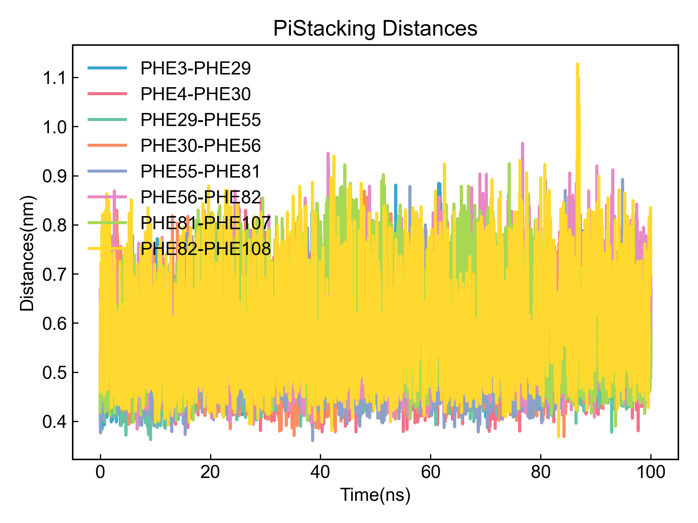
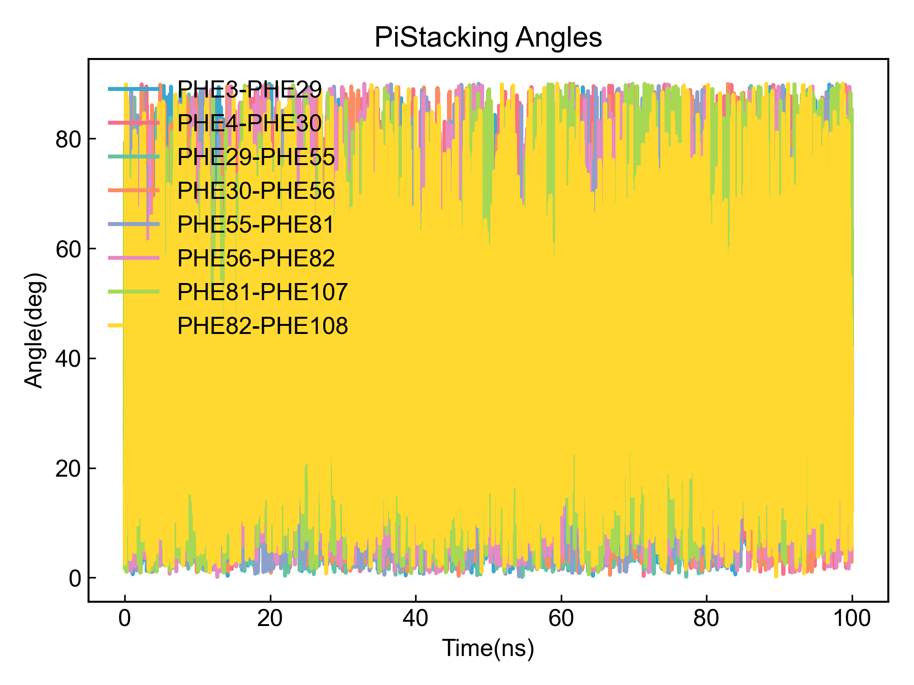
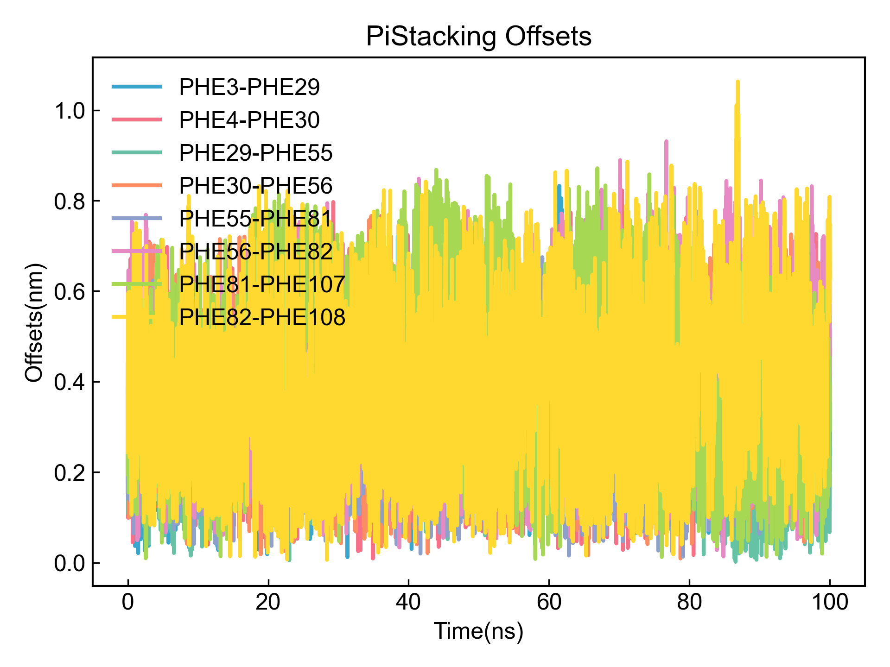
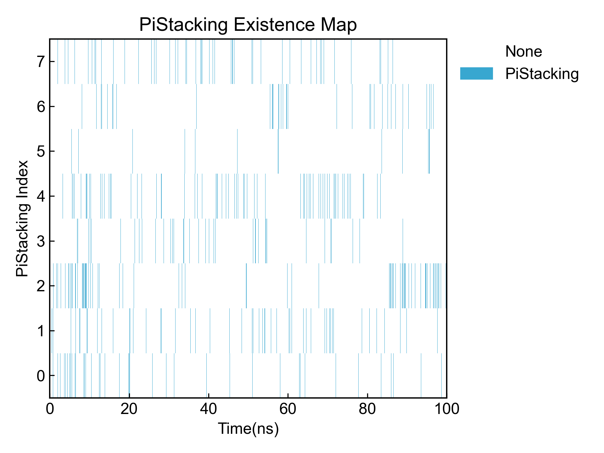
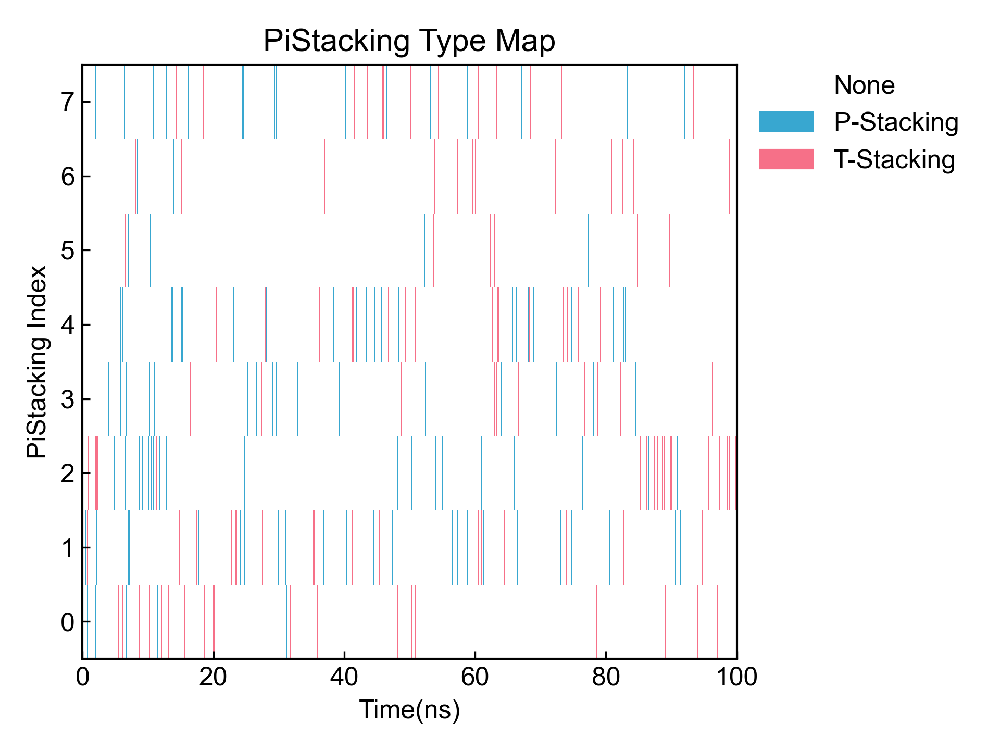

# PiStacking

此模块用于分析Pi-Pi相互作用。

使用本模块前请注意[前置处理](https://duivyprocedures-docs.readthedocs.io/en/latest/Framework.html#id7)已经完成！

## Input YAML

```yaml
- PiStacking:
    distance_max_cutoff: 0.55 # nm
    distance_min_cutoff: 0.05
    ring_center_offset: 0.20
    angle4T_stacking: [60, 90]
    angle4P_stacking: [0, 30]
    byIndex: no
    group1: protein
    group2: resname *ZIN
    only_aromatic_rings: yes
    other_ring_max_atom_num: 7
    planarity_cutoff: 5  ## degree, 5 deg for planar
    Pi_rings_Index: [
[ 24,  25,  27,  29,  31,  33],
[249, 250, 252, 254, 256, 258],
[474, 475, 477, 479, 481, 483], 
[699, 700, 702, 704, 706, 708],
[924, 925, 927, 929, 931, 933],
[ 41,  42,  44,  46,  48,  50],
[266, 267, 269, 271, 273, 275],
[491, 492, 494, 496, 498, 500], 
[716, 717, 719, 721, 723, 725],
[941, 942, 944, 946, 948, 950]]
    calc_lifetime: no
    tau_max: 50  # frame
    window_step: 1 # frame
    intermittency: 0  # allow 0 frame intermittency
```

同前面的盐桥分析模块一样，这里也提供了两种方式去定义可形成PiStacking的环。第一种是通过索引，第二种是DIP通过rdkit去判别。

`distance_max_cutoff`：定义Pi-Pi相互作用距离的最大值，单位为纳米。

`distance_min_cutoff`：定义Pi-Pi相互作用距离的最小值，单位为纳米。

`ring_center_offset`：定义环中心偏移量，单位为纳米。offset定义为一个环的质心在另一个环的平面上的投影，与另一个环的质心的距离。

`angle4T_stacking`：定义T-stacking的角度范围，单位为度。

`angle4P_stacking`：定义P-stacking的角度范围，单位为度。

`byIndex`：是否通过索引定义可形成PiStacking的环。如果`yes`，则`Pi_rings_Index`必须提供。如果`no`, 则DIP自行寻找。

`group1`和`group2`：定义两个原子组，用于从中寻找环结构。这两个参数只有当`byIndex`为`no`时才有效。上面的示例中，两个原子组分别是蛋白质和配体，如此，DIP会自动从这两个组中寻找芳香环，并计算组间的PiStacking；如果需要计算组内的PiStacking，则只需将`group1`和`group2`设置为相同的原子组即可。这里的原子选择的语法完全遵从MDAnalysis的原子选择语法。请参考：https://userguide.mdanalysis.org/2.7.0/selections.html

`only_aromatic_rings`：当DIP自动寻找可形成PiStacking的环时，是否只考虑芳香环（环上每一根键都是芳香键），还是考虑所有环。**非芳香环极有可能存在误判，因而需要用户对结果进行检查！**

`other_ring_max_atom_num`：当DIP自动寻找可形成PiStacking的环时，对于没有被判别为芳香环的环，其最大允许的原子数量。其最小允许的原子数量为5。

`planarity_cutoff`：当DIP自动寻找可形成PiStacking的环时，对于没有被判别为芳香环的环，其允许的平面度；DIP会计算环上所有原子与其邻居原子的法向，任意两个法向之间的夹角需要小于这里设定的值才会被判别为平面环，并被DIP当作可形成PiStacking的环加以计算。**请注意，平面环并不等于芳香环，还请自行根据输出的环的pdb文件加以检查！**

`calc_lifetime`：是否计算PiStacking的生命周期。

`tau_max`：生命周期的最大时间，单位为帧。计算生命周期的过程中会计算从t0时刻开始，`tau_max`帧内，PiStacking继续存在的概率。此值设置越大，则计算的窗口越大。

`window_step`：生命周期的窗口平移步长，单位为帧。

`intermittency`：允许的帧间隔，即允许多少帧没有发生PiStacking仍旧视为PiStacking；默认为0，即必须连续发生才被视为PiStacking。

本模块还有三个隐藏参数可以对轨迹做帧的选择：

```yaml
      frame_start:  # start frame index
      frame_end:   # end frame index, None for all frames
      frame_step:  # frame index step, default=1
```

这些参数可以指定计算轨迹的起始帧、终止帧（不包含）以及帧的步长。默认情况下，用户不需要设置这些参数，模块会自动分析整个轨迹。

例如我们计算从1000帧开始，到5000帧结束，每隔10帧的数据：

```yaml
      frame_start: 1000 # start frame index
      frame_end:  5001 # end frame index, None for all frames
      frame_step: 10 # frame index step, default=1
```

如果三个参数中只需要设置一个或两个，其余的参数都可以省略。

## Output

首先是输出DIP判定的可形成PiStacking的环，以供用户判断正确性。DIP会将之输出成pdb文件，用户可以自行检查。同时DIP还会输出各个环及其对应的原子索引到txt文件，供用户进一步确认和重复利用：

```txt
PiStacking_Names, Indexs
PHE3, [24, 25, 27, 29, 31, 33]
PHE4, [41, 42, 44, 46, 48, 50]
PHE29, [249, 250, 252, 254, 256, 258]
PHE30, [266, 267, 269, 271, 273, 275]
PHE55, [474, 475, 477, 479, 481, 483]
PHE56, [491, 492, 494, 496, 498, 500]
PHE81, [699, 700, 702, 704, 706, 708]
PHE82, [716, 717, 719, 721, 723, 725]
PHE107, [924, 925, 927, 929, 931, 933]
PHE108, [941, 942, 944, 946, 948, 950]
```

之后会输出所有PiStacking的质心距离、角度、偏移量等数据到xvg文件，并可视化：







之后会输出所有PiStacking的占有率图，以及不同种类的PiStacking的占有率图：





所有PiStacking的汇总信息可以在输出的csv文件中找到：

```csv
id,Name,Occupancy,Distance(nm),Offset(nm),P-Stacking_Occupancy,T-Stacking_Occupancy,P-Angle(deg),T-Angle(deg)
0,PHE3-PHE29,2.92%,0.487346,0.144246,0.96%,1.96%,20.77,71.73
1,PHE4-PHE30,4.39%,0.460136,0.151688,2.76%,1.63%,20.31,70.24
2,PHE29-PHE55,6.55%,0.467393,0.146599,3.84%,2.71%,20.22,68.43
3,PHE30-PHE56,3.02%,0.457942,0.153642,1.93%,1.09%,21.12,69.49
4,PHE55-PHE81,5.46%,0.466521,0.154699,3.42%,2.04%,20.36,70.58
5,PHE56-PHE82,1.53%,0.478098,0.151367,0.60%,0.93%,22.09,69.23
6,PHE81-PHE107,2.00%,0.491143,0.141269,0.49%,1.51%,21.59,70.73
7,PHE82-PHE108,3.65%,0.482846,0.147029,1.59%,2.06%,21.05,68.96
```

如果计算生命周期，则自相关函数会被输出并可视化；同时自相关函数的积分，也即生命周期，也会被输出到csv文件中。请注意，这里的生命周期是直接对自相关函数数据进行simpson积分得到的，准确度一般。

如果观察到在自相关函数的自变量范围内函数值还没有降到0，说明应当适当调大`tau_max`参数以获得更准确的生命周期积分。

## References

如果您使用了DIP的本分析模块，请一定引用MDAnalysis、rdkit，DuIvyTools(https://zenodo.org/doi/10.5281/zenodo.6339993)，以及合理引用本文档(https://zenodo.org/doi/10.5281/zenodo.10646113)。