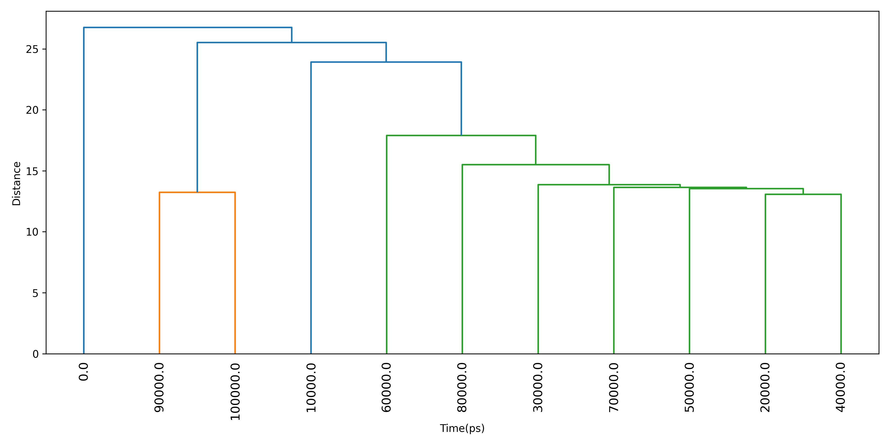

# RDCM

本模块主要用于残基距离接触矩阵的分析。基于残基间距离可以拓展出很多有意思的分析，可用于观察蛋白质结构的变化、基于残基距离接触矩阵计算RMSD、RMSF、DCCM、PCA、聚类等，还可计算残基间距离与其它变量的相关性等。同时此模块还支持定义contact并计算contact形成的时间占有率等数据、以及自定义encounter并计算基于encounter的时间占有率、互相关等信息。

可参考：https://zhuanlan.zhihu.com/p/578885815

使用本模块前请注意[前置处理](https://duivyprocedures-docs.readthedocs.io/en/latest/Framework.html#id7)已经完成！

## Input YAML

```yaml
- RDCM:
    type_select: center # atom # min
    atom_selection: protein
    frames_output_step: -1 # -1 for no output
    calc_RMSD: no
    RMSD_Matrix_step: -1 # -1 for no output
    calc_RMSF: no
    calc_DCCM: no
    Pearson_Observe: "" # ../RMSD.xvg
    calc_PCA: no
    clustering_step: -1 # -1 for no clustering
    calc_contact: yes
    contact_cutoff: 1.5
    calc_encounter: yes
    encounter_low_cutoff: 0.8
    encounter_high_cutoff: 1.0
    calc_encounter_DCCM: no
```

以上是RDCM模块的输入YAML文件，下面逐一阐释参数含义：

`type_select`: 选择用于计算残基接触距离矩阵的类型。`center`表示使用残基质心，`atom`表示使用原子坐标、`min`表示使用残基间的最小距离。当为`center`或者`min`时，原子选择请包含残基的所有原子，否则只会计算残基中被选中原子的质心距离或者最小距离。

**请注意，如果选择`min`类型，则计算会非常慢！** 可结合后面的帧选择参数来减少要计算的帧数。

如果蛋白质较大且帧数较多，建议结合后面的帧选择参数来减少计算量，否则有内存不够的可能。

`atom_selection`: 选择用于计算残基接触距离矩阵的原子组。如果`type_select`为`center`，则会直接按照残基计算质心；如果`type_select`为`atom`，则会按照此原子的坐标计算残基距离，因而不建议同时选择一个残基的多个原子；如果`type_select`为`min`，则会按照残基计算。

`frames_output_step`: 输出接触矩阵的步长，即每隔多少帧输出一次接触矩阵。`-1`表示不输出接触矩阵。假设轨迹有n帧，则RDCM也有n帧，全部输出的话会比较耗时，因而建议可以设置较大的输出步长，以节省时间。在输出的帧中，DIP也会计算两帧矩阵的差，表征的是两帧之间RDCM矩阵的变化。

`calc_RMSD`: 是否基于RDCM计算RMSD。

`RMSD_Matrix_step`: `-1`表示不基于RDCM计算RMSD矩阵；当值为正的时候，DIP会按照设置的帧步长去计算RMSD矩阵并输出。当步长太小的时候，计算RMSD矩阵的耗时会明显增加！

`calc_RMSF`: 是否基于RDCM计算RMSF。

`calc_DCCM`: 是否基于RDCM计算DCCM。

`Pearson_Observe`: 此模块默认会计算两两残基距离与时间的pearson相关系数，用以表征残基距离与时间的协同变化趋势。同样的，用户可以自定义用以计算pearson相关系数的变量，例如可以设置某个关键的距离，或者RMSD值等。自定义变量的输入需要以xvg文件的形式，第一列是时间、第二列是随时间变化的变量的值；同时请注意，这个变量的维度（随时间变化的数据个数）需要与轨迹的帧数一致！

`calc_PCA`: 是否基于RDCM计算PCA。

`clustering_step`: `-1`表示不基于RDCM进行残基和帧的聚类；当值为正的时候，此模块会按照设置的步长去进行帧聚类并输出，同时也会对残基进行聚类。当步长太小，可能导致有较多帧需要聚类，耗时会增加且最后可视化效果不好。

`calc_contact`: 是否基于RDCM计算contact。

`contact_cutoff`: 定义contact的距离阈值，即两残基间距离小于此阈值的两残基视为contact。

`calc_encounter`: 是否基于RDCM计算encounter。

`encounter_low_cutoff`和`encounter_high_cutoff`：encounter可以视为更加严格的contact；当残基间距离小于`encounter_low_cutoff`时，视为形成encounter；当距离大于`encounter_high_cutoff`时，视为encounter断裂。这两个阈值可以结合文献进行相应的设置！

`calc_encounter_DCCM`: 是否基于encounter矩阵计算DCCM。

本模块还有三个隐藏参数可以对轨迹做帧的选择：

```yaml
      frame_start:  # start frame index
      frame_end:   # end frame index, None for all frames
      frame_step:  # frame index step, default=1
```

这些参数可以指定计算轨迹的起始帧、终止帧（不包含）以及帧的步长。默认情况下，用户不需要设置这些参数，模块会自动分析整个轨迹。

例如我们计算从1000帧开始，到5000帧结束，每隔10帧的DCCM：

```yaml
      frame_start: 1000 # start frame index
      frame_end:  5001 # end frame index, None for all frames
      frame_step: 10 # frame index step, default=1
```

如果三个参数中只需要设置一个或两个，其余的参数都可以省略。

## Output

下面以一个具体的输入来阐述结果。这里我们对蛋白质的所有残基的质心进行了距离矩阵的计算，体系共有10001帧，130个残基：

```yaml
- RDCM:
    type_select: center
    atom_selection: protein
    type_min_spend: time # memory
    type_min_step: 1 # for step to calc min dist
    frames_output_step: 1000 # -1 for no output
    calc_RMSD: yes
    RMSD_Matrix_step: 100 # -1 for no output
    calc_RMSF: yes
    calc_DCCM: yes
    Pearson_Observe: "RDCM_RMSD.xvg" # ../RMSD.csv
    calc_PCA: yes
    clustering_step: 1000 # -1 for no clustering
    contact_cutoff: 1.5
    encounter_low_cutoff: 0.8
    encounter_high_cutoff: 1.0
    calc_encounter_DCCM: yes
```

首先DIP会输出RDCM的初始帧和结束帧，每隔1000帧输出一次的中间帧会被保存到RDCM_frames文件夹中。**矩阵会被同时输出成csv文件和xpm文件，并且可视化**。

初始帧：


结束帧：


中间输出的某一帧：


中间帧与其前一帧的差：


DIP还会计算RDCM所有帧的平均和标准偏差，并输出：

平均值：


标准偏差：


如果设置了`calc_RMSD`为`yes`，则会计算基于RDCM的RMSD曲线：


如果设置了输出RMSD矩阵，则会输出RMSD矩阵：


如果设置了`calc_RMSF`为`yes`，则会计算基于RDCM的RMSF曲线：


如果设置了`calc_DCCM`为`yes`，则会计算基于RDCM的DCCM矩阵：


DIP默认会计算残基距离与时间的pearson相关系数，并输出相关性矩阵：


由于计算Pearson相关系数可以得到p_value，因而也有对应的p_value矩阵：


如果设置了`Perason_Observe`，还会计算残基距离与自定义变量的pearson相关系数，这里案例中我们使用的是基于RDCM的RMSD数据，得到输出如下：


与RMSD的Pearson相关性计算的p_value矩阵：


如果设置了`calc_PCA`为`yes`，则会计算基于RDCM的PCA，得到三个主成分的散点图：


这里我们也设置了聚类的步长，因而会有对残基聚类和对帧聚类的图：



下面是contact的部分，包括contact的占有率矩阵：


以及将contact矩阵的占有率转换到一维，得到所谓的局部接触时间曲线，可以反映局部的接触稳定性：


contact部分还会计算几个无量纲数，例如C50即为：contact的时间占有率超过50%的残基对占总残基对的比例。结果可以在屏显的输出或log中看到：
```txt
>>> C50 of contact matrix: 0.6702317290552585
>>> C70 of contact matrix: 0.6292335115864528
>>> C90 of contact matrix: 0.5583778966131907
```

最后是Encounter的部分。

首先是Encounter第一次形成的时间矩阵：


最后一次形成的时间矩阵：


形成时间的平均时间矩阵：


Encounter的平均时间长度矩阵：


Encounter的时间占有率矩阵：


同样的局部Encounter曲线：


形成Encounter的次数的矩阵：


同样的有几个无量纲数，但含义稍有不同，例如C50指：时间占有率超过50%的encounter的总时间，占所有encounter的总时间的比例。结果可以在屏显的输出或log中看到：
```txt
>>> C50 of encounter matrix: 0.8080651265333009
>>> C70 of encounter matrix: 0.7812075139181635
>>> C90 of encounter matrix: 0.7155487165048366
```

最后是基于Encounter的DCCM矩阵：


## References

如果您使用了DIP的本分析模块，请一定引用MDAnalysis、CONAN(https://doi.org/10.1016/j.bpj.2018.01.033)、DuIvyTools(https://zenodo.org/doi/10.5281/zenodo.6339993)，以及合理引用本文档(https://zenodo.org/doi/10.5281/zenodo.10646113)。