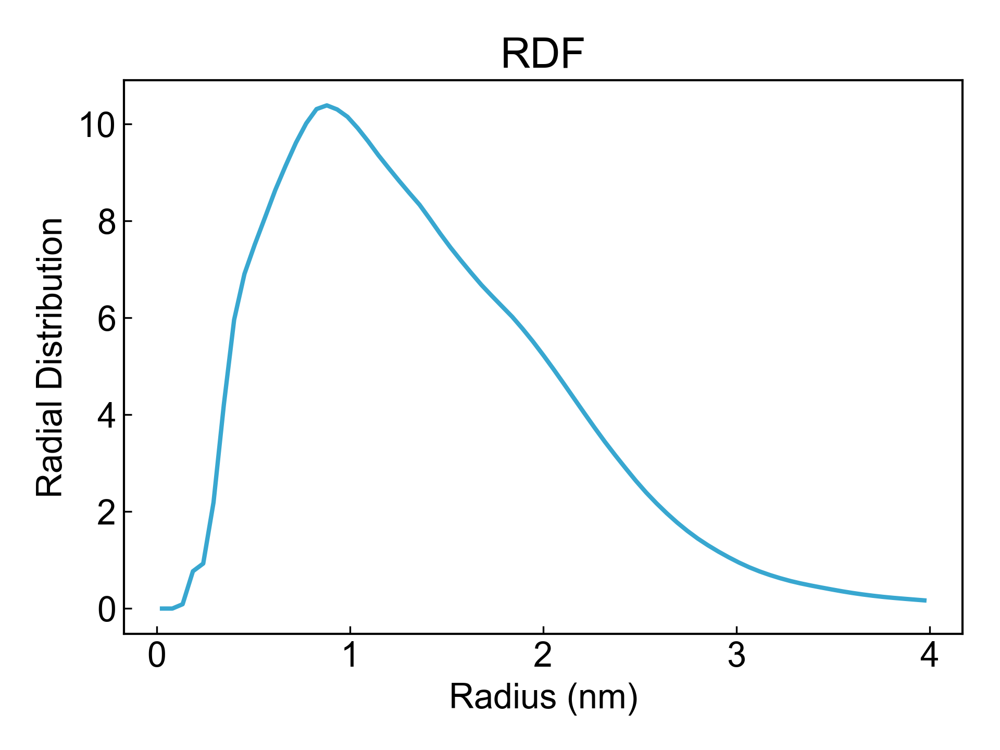

# RDF

本模块旨在计算径向分布函数(RDF)。


## Input YAML

```yaml
- RDF:
    calc_group: resname *ZIN
    center_group: protein
    range: 4 # nm
```

`center_group`：计算RDF的中心组，即RDF的中心。

`calc_group`：计算RDF的组，通常可以是连续的溶液相。

`range`：RDF计算的范围，即RDF计算的半径，单位为纳米。


## Output

DIP会输出数据到xvg文件，并可视化：




## References

如果您使用了DIP的本分析模块，请一定引用MDAnalysis、DuIvyTools(https://zenodo.org/doi/10.5281/zenodo.6339993)，以及合理引用本文档。