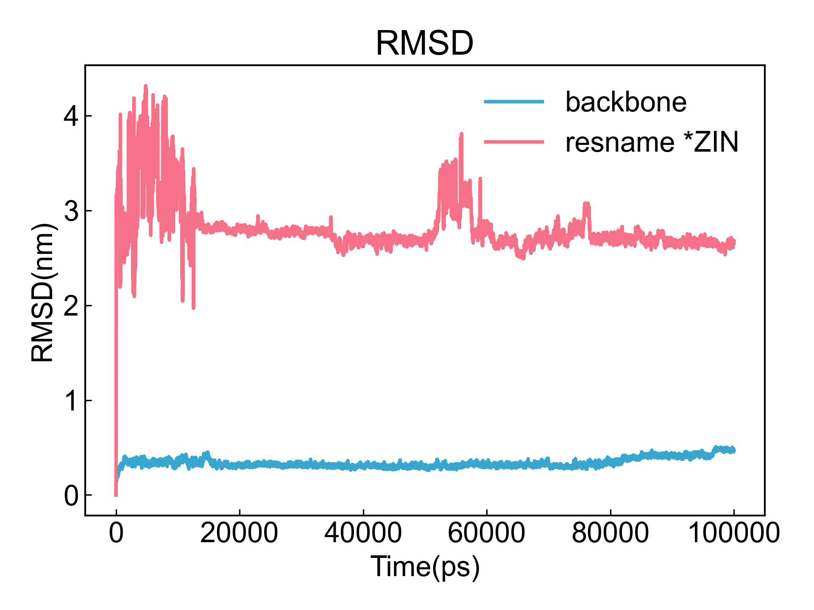

# RMSD

此模块计算均方根偏差（RMSD）。

## Input YAML

```yaml
- RMSD:
    fit_group: backbone
    calc_group: resname *ZIN
    mass_weight: yes
```

`fit_group`：用于对齐的组。这里的原子选择的语法完全遵从MDAnalysis的原子选择语法。请参考：https://userguide.mdanalysis.org/1.1.1/selections.html

`calc_group`：用于计算RMSD的组。这里的原子选择的语法完全遵从MDAnalysis的原子选择语法。请参考：https://userguide.mdanalysis.org/1.1.1/selections.html

`mass_weight`：是否对RMSD计算进行质量加权。


## Output

DIP会根据用户的选组计算RMSD，并将结果保存到xvg文件中并可视化。



## References

如果您使用了DIP的本分析模块，请一定引用MDAnalysis、DuIvyTools(https://zenodo.org/doi/10.5281/zenodo.6339993)，以及合理引用本文档。