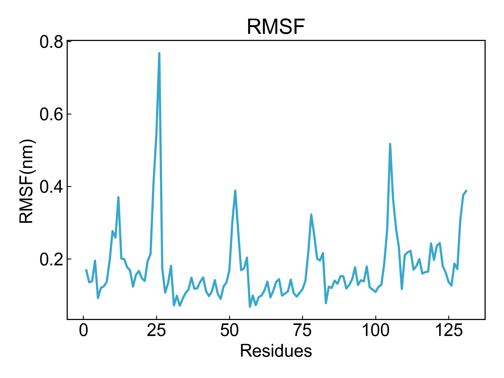
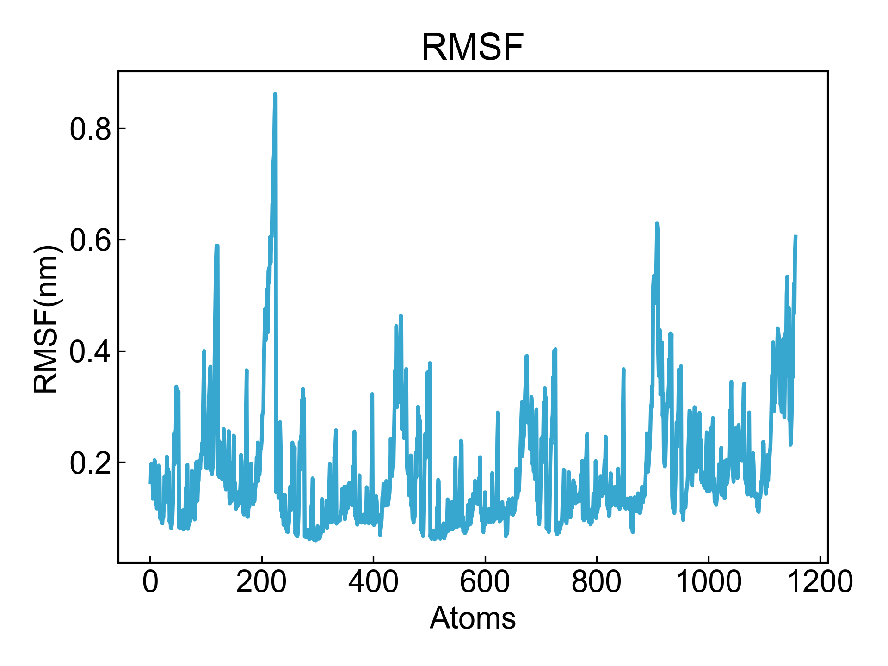

# RMSF

此模块计算分子的均方根波动（RMSF）。

## Input YAML

```yaml
- RMSF:
    calc_group: protein or resname 1ZIN
```

`calc_group`：选择计算分子的分组；语法遵从MDAnalysis的语法。


## Output

DIP会将计算结果保存到xvg文件并可视化数据。

以残基为单位计算：



以原子为单位计算：




## References

如果您使用了DIP的本分析模块，请一定引用MDAnalysis、DuIvyTools(https://zenodo.org/doi/10.5281/zenodo.6339993)，以及合理引用本文档。