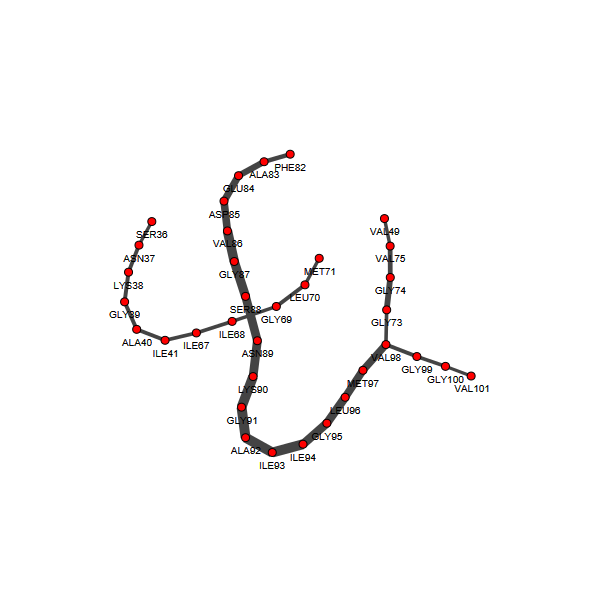
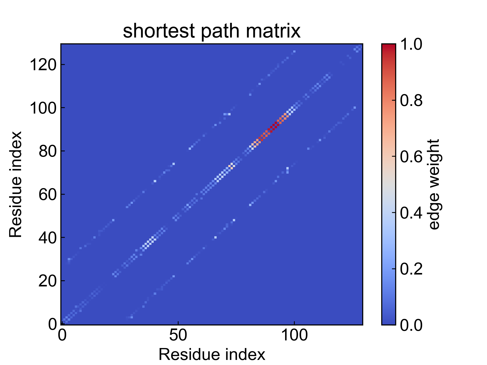
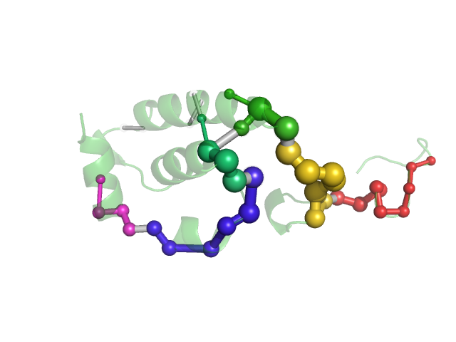

# SPM

Shortest Path Map (SPM)是一种分析蛋白质等大分子别构作用和残基的远程联系的有力工具。本模块依照Sílvia Osuna文章（http://dx.doi.org/10.1021/acscatal.7b02954）进行部分复现。

目前本模块可用于计算最短路径图、次短路径图。

**对此模块有任何建议和意见，欢迎联系杜艾维！非常感谢**

使用本模块前请注意[前置处理](https://duivyprocedures-docs.readthedocs.io/en/latest/Framework.html#id7)已经完成！

## Input YAML

```yaml
- SPM:
    DCCM: "" # DCCM.csv
    Distance_matrix: "" #distance_matrix_average.csv
    type_select: C-alpha # center
    distance_cutoff: 0.6 # nm
    sp_weight_cutoff: 0.3
```

`type_select`: 选择用于计算残基间DCCM和距离矩阵的原子组，可以选择`C-alpha`，或者`center`（残基质心）。

此模块自身具备计算残基间DCCM和距离矩阵的功能，但是用户也可以自定义输入DCCM矩阵和距离矩阵。只需要将`DCCM`和`Distance_matrix`参数写入对应的矩阵csv文件即可；请注意两个矩阵的残基顺序要保持一致，且不要保存header和index。

`distance_cutoff`: 距离矩阵的距离阈值，单位为nm。高于阈值的残基对将不会被graph视作通过edge相连的顶点。

`sp_weight_cutoff`: 最短路径权重的阈值，低于阈值的最短路径将被忽略。

本模块还有三个隐藏参数可以对轨迹做帧的选择：

```yaml
      frame_start:  # start frame index
      frame_end:   # end frame index, None for all frames
      frame_step:  # frame index step, default=1
```

这些参数可以指定计算轨迹的起始帧、终止帧（不包含）以及帧的步长。默认情况下，用户不需要设置这些参数，模块会自动分析整个轨迹。

例如我们计算从1000帧开始，到5000帧结束，每隔10帧的数据：

```yaml
      frame_start: 1000 # start frame index
      frame_end:  5001 # end frame index, None for all frames
      frame_step: 10 # frame index step, default=1
```

如果三个参数中只需要设置一个或两个，其余的参数都可以省略。

## Output

DIP会输出计算得到的DCCM矩阵、距离矩阵，以及可视化的最短路径图，以及用于pymol的SPM的pml脚本。



SPM也会输出最短路径的权重矩阵，数值越大，表明残基对之间对动态信息的传递越强。



其中最短路径图相关的图片和数据输出，文件名字都以`1_`开头；次短路径图则以`2_`开头。

pml脚本可以通过pymol进行可视化：



图上的圆球和键表示最短路径图的网络，圆球大小和键的粗细表示通量或者重要性；圆球和键的颜色表示不同的community。


## Details

首先使用距离矩阵和DCCM构建动态信息网络，每一个氨基酸被视为graph的一个顶点，如果两个氨基酸之间的距离小于距离截断，则认为这两个氨基酸的顶点之间存在graph的一条边，而边的权重则由相应的DCCM值得到。DCCM值的绝对值越大，边的权重越小（两个顶点的距离越短），说明两个氨基酸之间的动态信息传递越强。

得到动态信息网络之后，对其执行community分析，使用fastgreedy算法，得到不同community的集合（类似于聚类分析）。

对动态信息网络计算最短路径图，对于graph上任意两个顶点，计算其最短的路径和次短的路径；对于某一条边，统计其在最短路径、次短路径中被经过的次数；构建最短路径的graph和次短路径的graph，边的权重由该边的经过次数除以图上边的最大经过次数得到。当权重小于用户设定的阈值，该边舍弃。如此，得到最短路径图和次短路径图。

最后，将最短路径图和次短路径图可视化，并输出pymol脚本。在可视化的图上，边的粗细表示重要性，颜色表示community。


## References

如果您使用了DIP的本分析模块，请一定引用Sílvia Osuna文章（http://dx.doi.org/10.1021/acscatal.7b02954）、MDAnalysis、DuIvyTools(https://zenodo.org/doi/10.5281/zenodo.6339993)，以及合理引用本文档(https://zenodo.org/doi/10.5281/zenodo.10646113)。
