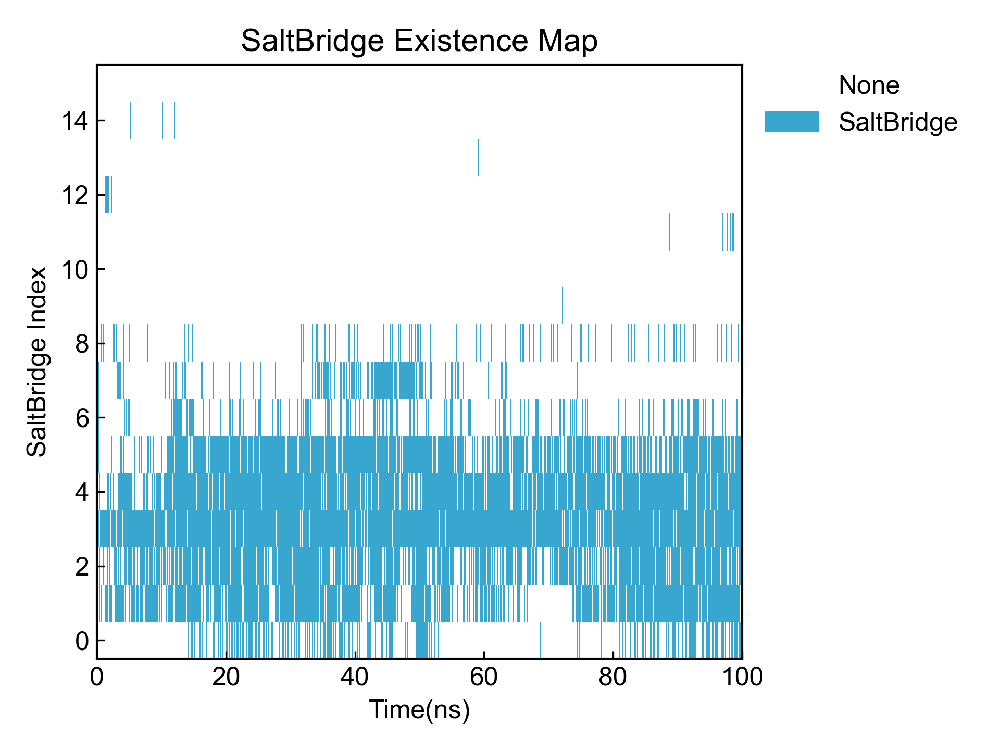
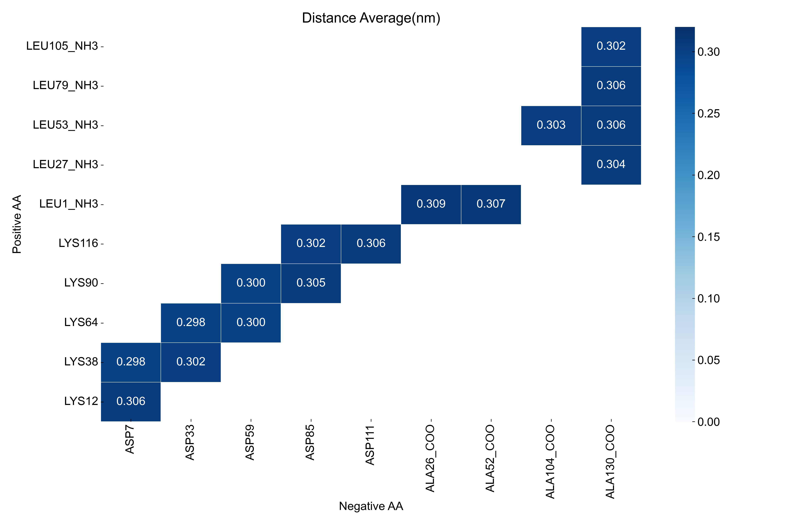
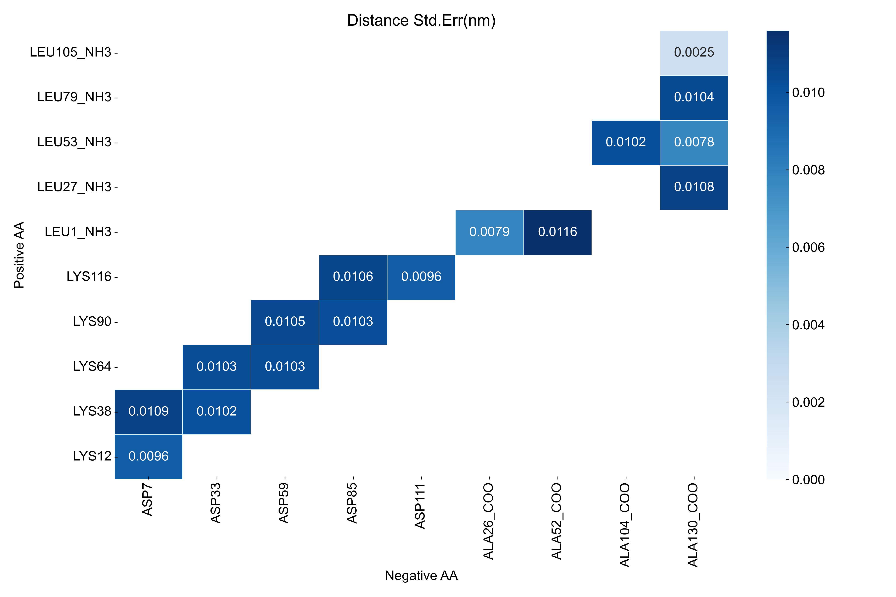

# SaltBridge

本模块负责分析盐桥，并输出盐桥占有率、距离等信息。

使用本模块前请注意[前置处理](https://duivyprocedures-docs.readthedocs.io/en/latest/Framework.html#id7)已经完成！

## Input YAML

```yaml
- SaltBridge:
    dist_cutoff: 0.32 # nm
    NH3_atomnames: ["N", "H1", "H2", "H3"]
    COO_atomnames: ["C", "O1", "O2"]
    Backbone_atomnames: ["H", "N", "CA", "C", "O"]
    ignore_chain_end: no
    byIndex: yes
    positive_Index: [[118,119,120,121], [343,344,345,346], [568,569,570,571], [793,794,795,796], [1018,1019,1020,1021]]
    negative_Index: [[74,75,76], [299,300,301], [524,525,526], [749,750,751], [974,975,976]]
```

要计算盐桥，需要先**找到可以形成盐桥的原子组**。此模块提供了两种定义原子组的方式，第一种是通过索引，第二种是通过电荷。

`dist_cutoff`：盐桥的距离阈值，单位为nm。

`byIndex`：是否通过原子索引定义形成盐桥的原子组。如果设置为`yes`，则DIP会读取后面的`positive_Index`和`negative_Index`参数；如果设置为`no`，DIP会自行根据体系里面的电荷去寻找可能的能形成盐桥的原子组。

`positive_Index`和`negative_Index`: 这两个参数都需要以列表的形式编写，列表的每一个元素都是一个可供形成盐桥的基团的原子编号（从1开始）。这里示例中定义了五个带正电的基团和五个带负电的基团。

如果`byIndex`为`no`的话，则DIP会根据体系的电荷去寻找可能形成盐桥的原子组。但是考虑到不同的力场条件下原子的名称可能不同，并且未形成肽键的C或者N端也有可能形成盐桥。因而这里需要用户根据使用的力场去填写一下COO-和NH3+的原子名称，以帮助程序正确判断所有带电基团。

`ignore_chain_end`：是否忽略链端残基，设置为`yes`则程序会忽略链端残基，，只计算链中段的带电基团。

本模块还有三个隐藏参数可以对轨迹做帧的选择：

```yaml
      frame_start:  # start frame index
      frame_end:   # end frame index, None for all frames
      frame_step:  # frame index step, default=1
```

这些参数可以指定计算轨迹的起始帧、终止帧（不包含）以及帧的步长。默认情况下，用户不需要设置这些参数，模块会自动分析整个轨迹。

例如我们计算从1000帧开始，到5000帧结束，每隔10帧的DCCM：

```yaml
      frame_start: 1000 # start frame index
      frame_end:  5001 # end frame index, None for all frames
      frame_step: 10 # frame index step, default=1
```

如果三个参数中只需要设置一个或两个，其余的参数都可以省略。


## Output

首先是最重要的，**确定选中的原子组真的是可供形成盐桥的原子组**。为此，此模块会输出选中的所有原子到pdb文件中，用户可以自行查看和确认；另外也会输出基团和相应的原子index到txt文件中，方便确认和再次利用。

这里列举由DIP确定的原子组：
```txt
PositiveGroups, Indexs
LYS12, [114, 115, 116, 117, 118, 119, 120, 121]
LYS38, [339, 340, 341, 342, 343, 344, 345, 346]
LYS64, [564, 565, 566, 567, 568, 569, 570, 571]
LYS90, [789, 790, 791, 792, 793, 794, 795, 796]
LYS116, [1014, 1015, 1016, 1017, 1018, 1019, 1020, 1021]
LEU1_NH3, [1, 2, 3, 4, 5]
LEU27_NH3, [226, 227, 228, 229, 230]
LEU53_NH3, [451, 452, 453, 454, 455]
LEU79_NH3, [676, 677, 678, 679, 680]
LEU105_NH3, [901, 902, 903, 904, 905]

NegativeGroups, Indexs
GLU6, [63, 64, 65, 66, 67]
ASP7, [73, 74, 75, 76]
GLU32, [288, 289, 290, 291, 292]
ASP33, [298, 299, 300, 301]
GLU58, [513, 514, 515, 516, 517]
ASP59, [523, 524, 525, 526]
GLU84, [738, 739, 740, 741, 742]
ASP85, [748, 749, 750, 751]
GLU110, [963, 964, 965, 966, 967]
ASP111, [973, 974, 975, 976]
ALA26_COO, [221, 223, 224, 225]
ALA52_COO, [446, 448, 449, 450]
ALA78_COO, [671, 673, 674, 675]
ALA104_COO, [896, 898, 899, 900]
ALA130_COO, [1121, 1123, 1124, 1125]
```

可以看到其中包含了侧链带电的残基，也包括链端的C和N端。其中原子可能是有多余的，但是没关系，计算的时候会以**电荷中心**的方式去计算盐桥距离，这样计算得到的电荷中心的距离是比较接近真正的形成盐桥的电荷中心的距离的。

当然，用户也可以根据DIP猜测的原子组，自行编写更细致的原子索引去计算盐桥。

请注意，对于用户自定义的索引组，**DIP不会去检验电荷**，因此请确保索引组的正确性。

之后，DIP会计算带相反电荷的索引组之间的距离，并将距离输出到xvg文件并可视化：


之后DIP会根据截断计算所有盐桥的占有率、平均距离等信息，并输出到csv文件中：

```csv
Index,sltbr_name,occupancy(%),Distance(nm)±std.err
0,LYS12-ASP7,24.73%,0.30571183429452803±0.009553231152500079
1,LYS38-ASP7,69.71%,0.29772617816150043±0.010851423343587338
2,LYS38-ASP33,72.60%,0.3020706309117198±0.010160353824107429
3,LYS64-ASP33,91.26%,0.29765932770459613±0.010301294758891728
4,LYS64-ASP59,82.37%,0.29951145689395864±0.010291409591773314
5,LYS90-ASP59,72.43%,0.29980956453438923±0.010493702050064405
6,LYS90-ASP85,23.49%,0.3047599846811428±0.010253587095869455
7,LYS116-ASP85,17.53%,0.30184458300902944±0.010634682623728912
8,LYS116-ASP111,13.74%,0.30592094272894466±0.009563325085837068
9,LEU1_NH3-ALA26_COO,0.09%,0.30902033039109056±0.007861225076848553
10,LEU1_NH3-ALA52_COO,0.11%,0.30721548234549534±0.011591678186110664
11,LEU27_NH3-ALA130_COO,0.83%,0.30404896827304223±0.010835959927730244
12,LEU53_NH3-ALA104_COO,1.00%,0.30281800231986666±0.01019922732848695
13,LEU53_NH3-ALA130_COO,0.11%,0.30573336553168645±0.007787598893830004
14,LEU79_NH3-ALA130_COO,0.83%,0.30617189932657385±0.01041757395335554
15,LEU105_NH3-ALA130_COO,0.02%,0.30225286587195854±0.002515915241203581
```

DIP还会输出所有盐桥的占有率矩阵到xpm文件并可视化：



最后，DIP还会根据盐桥索引组的顺序，生成矩阵图，包括占有率矩阵图和距离矩阵图：







## References

如果您使用了DIP的本分析模块，请一定引用MDAnalysis、DuIvyTools(https://zenodo.org/doi/10.5281/zenodo.6339993)，以及合理引用本文档(https://zenodo.org/doi/10.5281/zenodo.10646113)。
