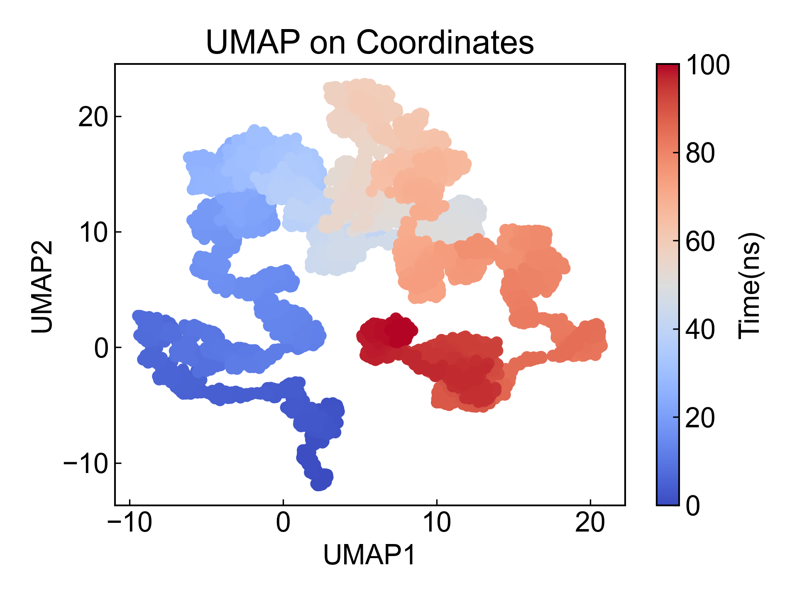
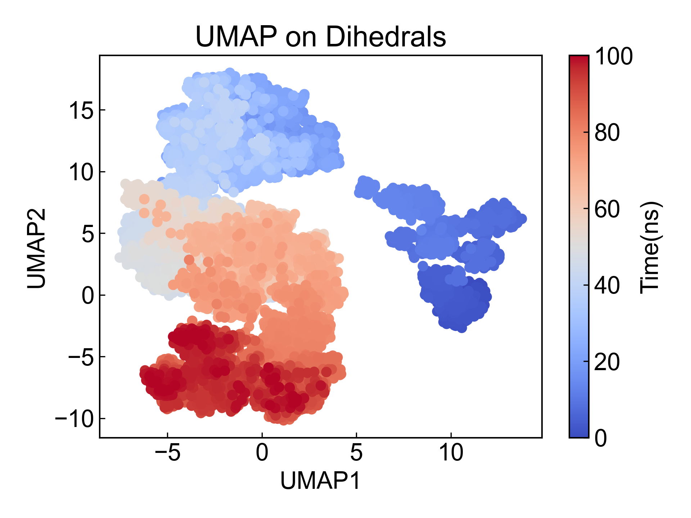

# UMAP

UMAP是一种降维方法，此模块实现了基于坐标的和基于二面角的UMAP降维。

使用本模块前请注意[前置处理](https://duivyprocedures-docs.readthedocs.io/en/latest/Framework.html#id7)已经完成！

## Input YAML

```yaml
- UMAP:
    atom_selection: protein and name CA  # protein for dihedrals 
    n_neighbors: [50, 100, 200, 1000]
    min_dist: [1]
    target: coordinates  # dihedrals
- UMAP:
    mkdir: UMAP2
    atom_selection: protein # protein for dihedrals 
    n_neighbors: [50]
    min_dist: [1, 2, 5, 10]
    target: dihedrals
```

这里同时列举了基于坐标和基于二面角的UMAP分析所需要的参数。

`atom_selection`：原子选择，用于指定需要进行UMAP的原子组。如果进行二面角分析的话，则所选的原子组必须包含形成骨架二面角的原子。这里的原子选择的语法完全遵从MDAnalysis的原子选择语法。请参考：https://userguide.mdanalysis.org/1.1.1/selections.html

`target`：UMAP的目标，可以是`coordinates`或`dihedrals`。如果选择`coordinates`，则UMAP将基于原子的坐标进行分析；如果选择`dihedrals`，则UMAP将基于二面角进行分析。

**需要注意的是**：二面角与坐标不同，二面角具有周期性；本模块直接对角度值继续了降维的计算。**用户在利用此模块进行二面角的降维分析的时候，需要妥善对照文献分析计算过程是否合适！如果不确定，请不要使用此模块的二面角降维分析** 有任何问题或者改进的建议，请联系杜若，杜若和杜艾维非常欢迎任何的建议和argue，非常感谢！。

`n_neighbors`：近邻数量，用于指定UMAP算法中每个点的近邻数量, 通常可能无法先验的知道参数设置成多少比较合适，因而这里可以在一个列表中写入多个可能的参数，DIP会遍历每种参数生成结果供选择。

`min_dist`: 控制点堆积的紧密程度。

关于具体的参数的设置，可以参考UMAP的官方文档，以及 https://doi.org/10.1063/5.0099094

本模块还有三个隐藏参数可以对轨迹做帧的选择：

```yaml
      frame_start:  # start frame index
      frame_end:   # end frame index, None for all frames
      frame_step:  # frame index step, default=1
```

这些参数可以指定计算轨迹的起始帧、终止帧（不包含）以及帧的步长。默认情况下，用户不需要设置这些参数，模块会自动分析整个轨迹。

例如我们计算从1000帧开始，到5000帧结束，每隔10帧的DCCM：

```yaml
      frame_start: 1000 # start frame index
      frame_end:  5001 # end frame index, None for all frames
      frame_step: 10 # frame index step, default=1
```

如果三个参数中只需要设置一个或两个，其余的参数都可以省略。


## Output

此模块会将降维得到的2维数据绘制成散点图，这里列举了基于坐标和基于二面角的UMAP的结果，其中参数为`n_neighbors=50, min_dist=1`：






## References

如果您使用了DIP的本分析模块，请一定引用MDAnalysis、UMAP(https://doi.org/10.1162/neco_a_01434)、DuIvyTools(https://zenodo.org/doi/10.5281/zenodo.6339993)，以及合理引用本文档(https://zenodo.org/doi/10.5281/zenodo.10646113)。