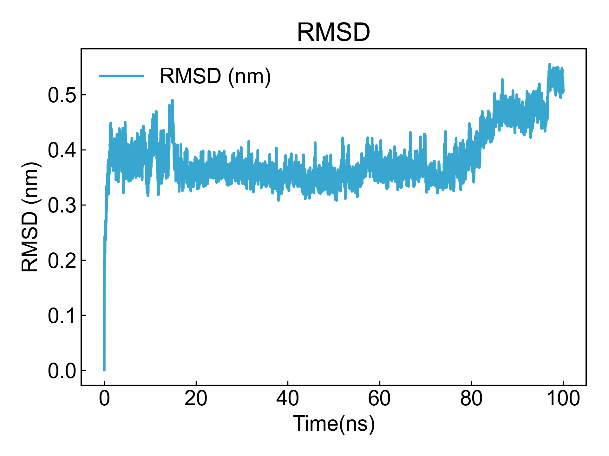

# User_Mod

此模块可以帮助用户自定义一些简单的分析手段。

## Input YAML

```yaml
- User_Mod:
    user_commands: []  # file could be copied by bash cmd
```

`user_commands`字段可以以列表的形式保存一系列的bash或者cmd命令，这些命令会在运行DIP的过程中执行。

需要注意的是，DIP会首先进去需要分析的目录，例如包含了轨迹文件的MD1目录，然后创建分析路径`User_Mod`或者自定义的文件名；之后在分析路径下执行用户输入的一系列命令。

## Output

以下面的yaml输入文件计算轨迹的RMSD：

```yaml
- User_Mod:
    user_commands: [
        "echo Backbone Protein | gmx rms -f ../md.xtc -s ../md.tpr -o rmsd.xvg",
        "dit xvg_show -f rmsd.xvg -xs 0.001 -x Time(ns) -ns -o rmsd.png"
    ]
```

之后执行DIP，可以看到屏显或者log里显示：

```txt
[Info] 2024-02-04 10:43:47
>>> run User_Mod module in \test\MD1
[Info] 2024-02-04 10:43:47
Pid 13640 >>> echo Backbone Protein | gmx rms -f ../md.xtc -s ../md.tpr -o rmsd.xvg
[Info] 2024-02-04 10:43:52
Pid 13532 >>> dit xvg_show -f rmsd.xvg -xs 0.001 -x Time(ns) -ns -o rmsd.png
[Info] 2024-02-04 10:43:55
>>> User_Mod module finished !
[Info] 2024-02-04 10:43:55
DIP may you good day ! The run costs 8.98 seconds.
```

然后可以看到分析目录下已经出现了rmsd.xvg和rmsd.png文件。



其它的简单分析也可以以这样的方式自定义，包括距离计算、角度计算等等。用户也可以在这里运行自定义的一些脚本文件等。DIP会将这些命令在不同的分析目录下执行，帮助用户快速完成分析任务。

## References

如果您使用了DIP的本分析模块，请合理引用本文档。