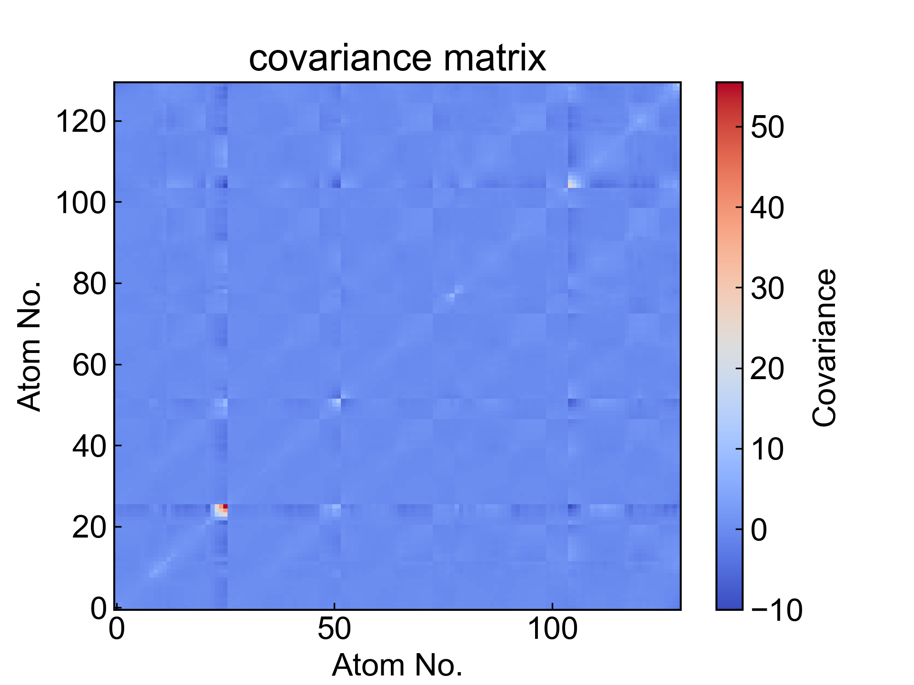
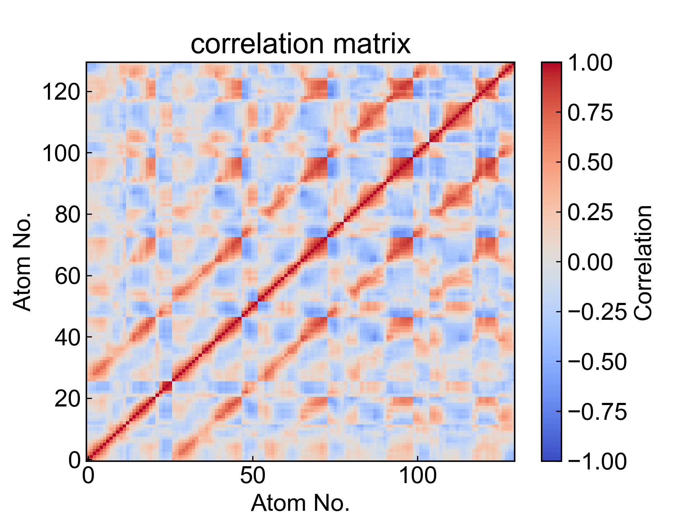

# DCCM

This module calculates the Dynamic Cross-Correlation Matrix (DCCM) between user-selected atoms.

For more information, please refer to: https://zhuanlan.zhihu.com/p/578891660, and https://mp.weixin.qq.com/s/Lz_I9zmzxbO_Kc5uzDjsfw

Before using this module, please ensure that the [preprocessing](https://duivyprocedures-docs.readthedocs.io/en/latest/Framework.html#id7) has been completed!

## Input YAML

```yaml
- DCCM:
    atom_selection: protein and name CA
    byType: atom # res_com, res_cog, res_coc # have to select all residues atoms
    save_xpm: yes
```

`atom_selection`: Atom selector for specifying atoms for DCCM calculation. The atom selection syntax here follows MDAnalysis atom selection syntax. Please refer to: https://userguide.mdanalysis.org/2.7.0/selections.html

`byType`: Specifies the method for DCCM calculation. There are four options: `atom`, `res_com`, `res_cog`, `res_coc`. `atom` calculates DCCM between all selected atoms; commonly, you can select CA atoms in `atom_selection` with `protein and name CA` to calculate protein DCCM; `res_com` calculates DCCM between centers of mass of each residue; `res_cog` calculates DCCM between geometric centers of each residue; `res_coc` calculates DCCM between charge centers of each residue. When using `res_com`, `res_cog` or `res_coc`, the atom selector should contain all atoms of the selected residues, otherwise only DCCM between centers of mass, geometric centers, or charge centers of selected atoms within residues will be calculated.

`save_xpm`: Whether to save xpm files. If set to `yes`, the covariance matrix and cross-correlation matrix of DCCM will be saved as xpm files; otherwise, only csv files will be saved.

This module also has three hidden parameters for frame selection:

```yaml
      frame_start:  # start frame index
      frame_end:   # end frame index, None for all frames
      frame_step:  # frame index step, default=1
```

These parameters can specify the start frame, end frame (exclusive), and frame step for trajectory calculation. By default, users do not need to set these parameters, and the module will automatically analyze the entire trajectory.

For example, to calculate DCCM from frame 1000 to frame 5000, every 10 frames:

```yaml
      frame_start: 1000 # start frame index
      frame_end:  5001 # end frame index, None for all frames
      frame_step: 10 # frame index step, default=1
```

If only one or two of the three parameters need to be set, the others can be omitted.

This module has improved the DCCM calculation process so that the computation time does not increase significantly with the number of atoms and frames. However, a larger number of atoms will result in very large xpm files, and saving xpm files can be time-consuming. Therefore, you can save time by not saving xpm files.

If XPM files are saved, you can also re-visualize DCCM using DuIvyTools (DIT, one of DIP's dependencies) and fine-tune the figure style.

## Output

The DCCM module outputs the calculated covariance matrix and cross-correlation matrix, saved as xpm files and csv files, and also visualizes these files.





## References

If you use this analysis module from DIP, please cite MDAnalysis, DuIvyTools (https://zenodo.org/doi/10.5281/zenodo.6339993), and properly cite this documentation (https://zenodo.org/doi/10.5281/zenodo.10646113).