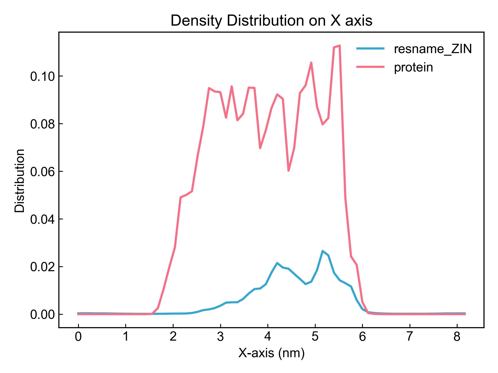
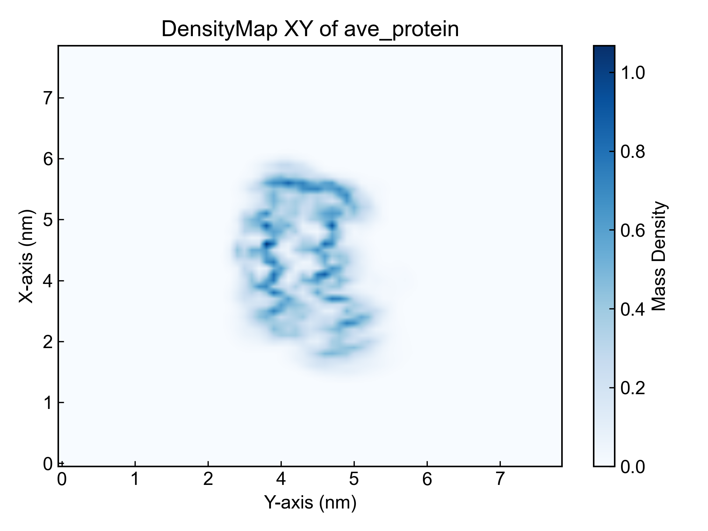
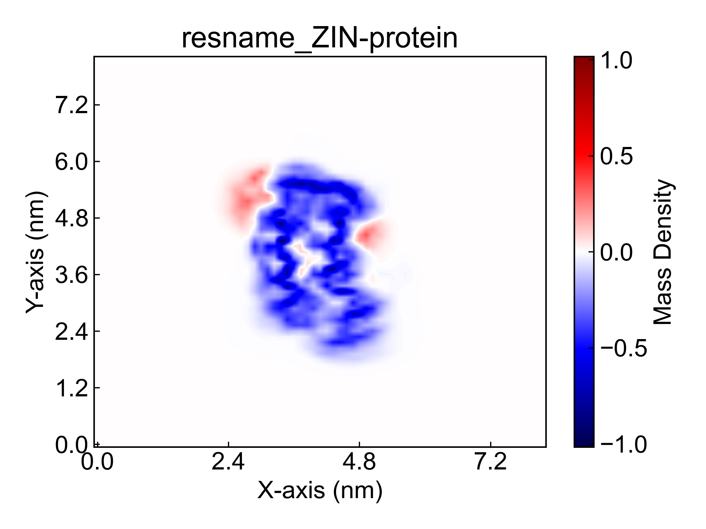
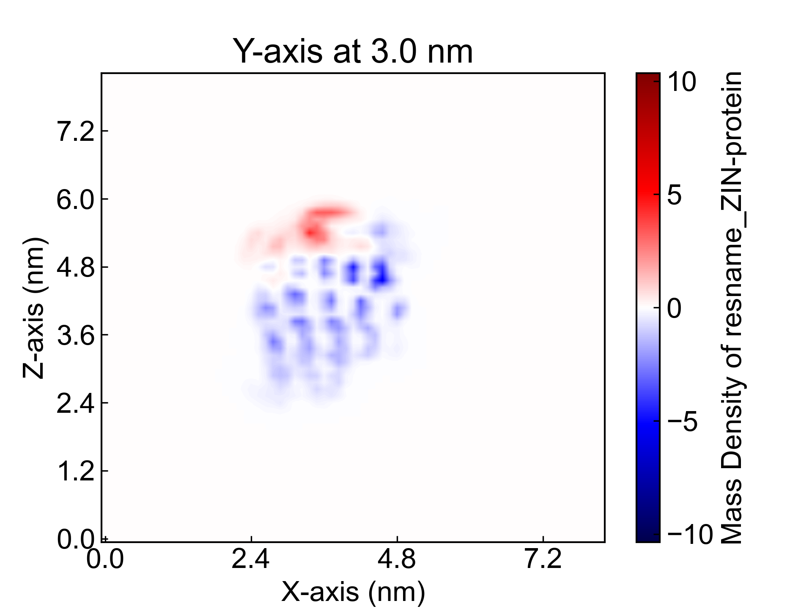
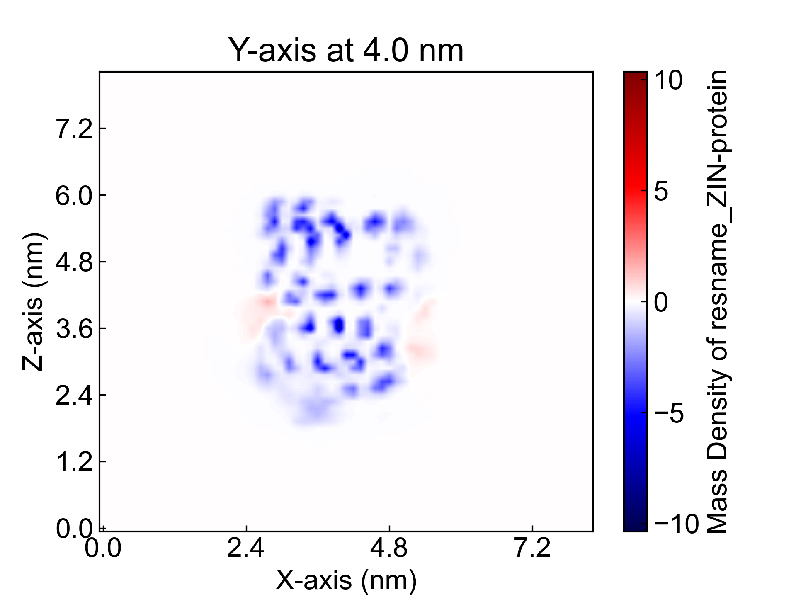
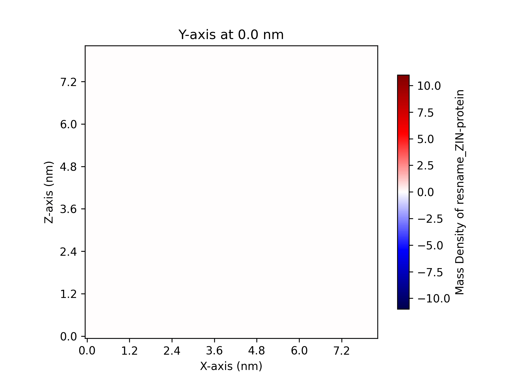

# DensityMap

This module uses grid technology to characterize molecular spatial positions, obtaining mass density, charge density, and number density distributions on different axes and planes. It can characterize not only single component distributions but also the relationship between two components in density distribution. It also supports slicing along a certain axis to observe density distribution on slices.

Currently this module is still relatively rough. Based on grid technology, many interesting functions can be extended. Welcome your suggestions and feedback~

Before using this module, please ensure that the [preprocessing](https://duivyprocedures-docs.readthedocs.io/en/latest/Framework.html#id7) has been completed!

## Input YAML

```yaml
- DensityMap:
    byType: Mass # Number # Mass # Charge
    byIndex: no  # use gmx index or MDA selections
    groups: [resname *ZIN, protein] #[Protein, Ligands]
    grid_bin: 1.2  # vdw radius: H 1.20 C 1.70 N 1.55 O 1.52
    doSplit_axis: "Y" # "", X, Y, Z
    doSplit_saveXPM: no
```

`byType`: Select the calculation type, options are `Mass`, `Number`, `Charge`.

`byIndex`: Choose whether to use GROMACS index or MDAnalysis selection statements. If set to "no", the `groups` parameter values below will be treated as MDAnalysis selection statements (the atom selection syntax here follows MDAnalysis atom selection syntax. Please refer to: https://userguide.mdanalysis.org/2.7.0/selections.html). If set to "yes", the groups parameter values will be treated as GROMACS index group names, which need to correspond to the index file. Please do not start group names with numbers.

`groups`: Select atom groups for calculation, multiple groups can be declared simultaneously, separated by commas.

`grid_bin`: Grid size, in Angstroms. 1.2 Angstroms is approximately the van der Waals radius of a hydrogen atom. Users can adjust the grid size to obtain the best characterization effect.

`doSplit_axis`: Choose which axis to slice along, options are `X`, `Y`, `Z`, or multiple axes simultaneously like `XY`. If no slice is selected, no slice calculation will be performed.

`doSplit_saveXPM`: Choose whether to save XPM files of slices. If "yes", each slice will be saved in xpm file format, which can be time-consuming.

This module also has three hidden parameters for frame selection:

```yaml
      frame_start:  # start frame index
      frame_end:   # end frame index, None for all frames
      frame_step:  # frame index step, default=1
```

These parameters can specify the start frame, end frame (exclusive), and frame step for trajectory calculation. By default, users do not need to set these parameters, and the module will automatically analyze the entire trajectory.

For example, to calculate data from frame 1000 to frame 5000, every 10 frames:

```yaml
      frame_start: 1000 # start frame index
      frame_end:  5001 # end frame index, None for all frames
      frame_step: 10 # frame index step, default=1
```

If only one or two of the three parameters need to be set, the others can be omitted.


## Output

This module outputs many figures.

First, the average density distribution line plots of all components on three axes. Here is an example for the X-axis:



For certain material science fields, you may need to calculate the number density distribution of certain atoms along axes. This can be achieved by setting `byType` to `Number` and `groups` parameter to the atoms to be calculated, such as `name C`.

Next, the average density distribution plots of each component on different planes. Here is an example of protein density plot on the XY plane:



Then, the average density distribution plots of any two components on different planes. Since it's difficult to overlay two heatmaps well, the distribution plot here is actually the **difference obtained by subtracting one density distribution plot from another**. For positions with vertical overlap, this visualization method may introduce some errors.

Here is an example of protein and ligand density distribution plot on the XY plane:



If slice calculation is selected, density distribution plots for each slice will be output. Here are two random examples of protein and ligand slice plots along the Y-axis:





Users can also combine the sliced image files into videos or gif files, which looks interesting. For example:



## References

If you use this analysis module from DIP, please cite MDAnalysis, DuIvyTools (https://zenodo.org/doi/10.5281/zenodo.6339993), and properly cite this documentation (https://zenodo.org/doi/10.5281/zenodo.10646113).
