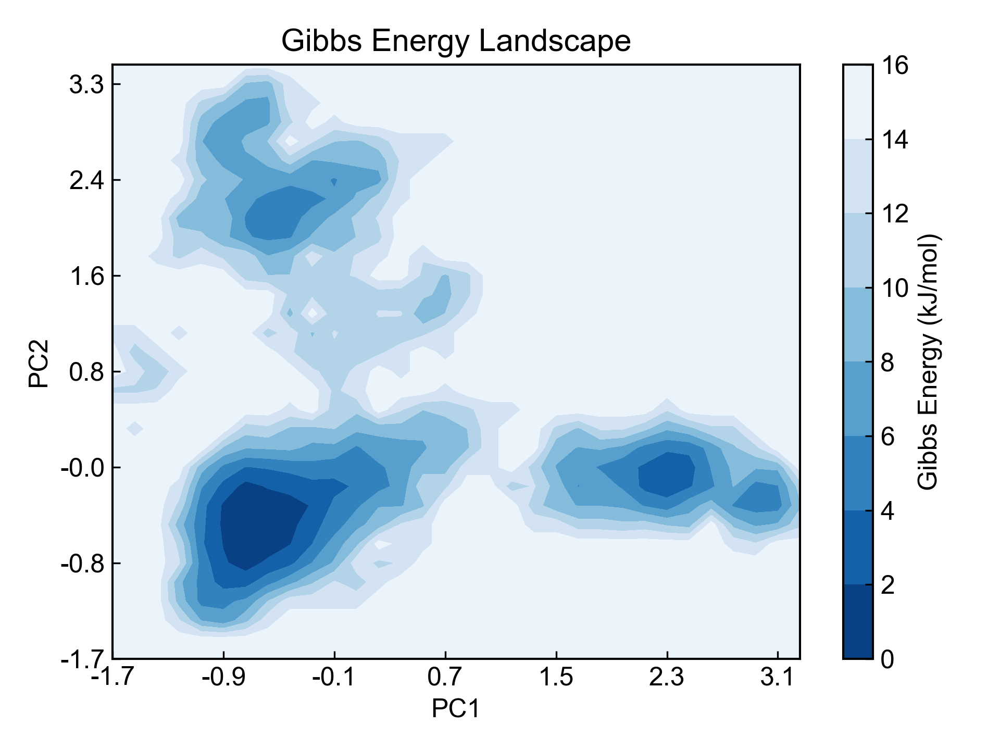
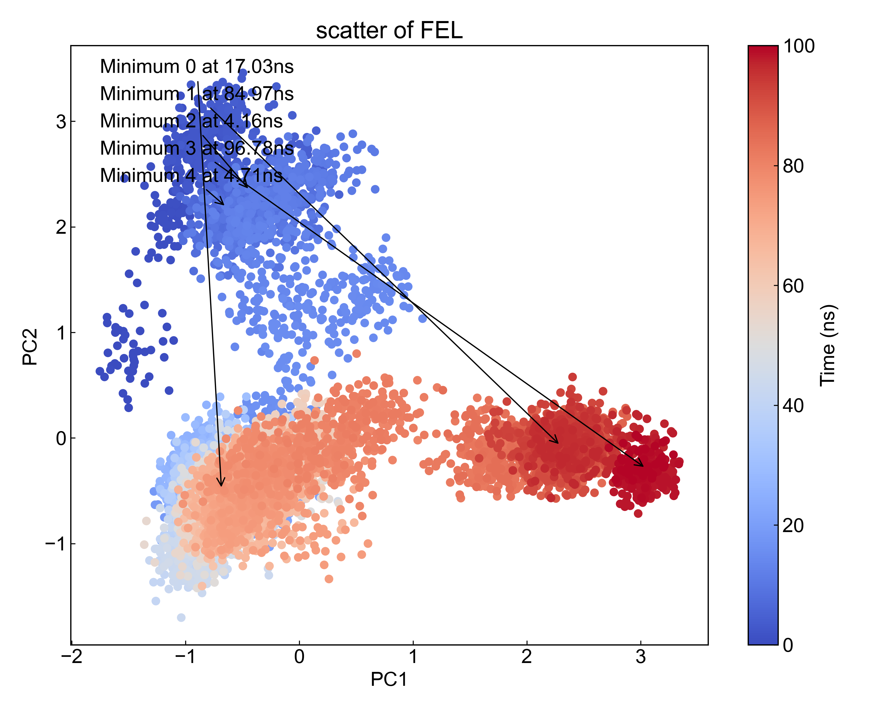

# FEL

This module uses the Boltzmann distribution (Gibbs distribution) to plot the Free Energy Landscape (FEL) from a three-column data file (time, first column data, second column data).

## Input YAML

```yaml
  - FEL:
      inputfile: ../gmx_PCA/pc12.xvg  # input file, xvg format, [time, data1, data2]
      temperature: 300
      ngrid: 32
      find_minimum: true
      minimum_num: 5
```

`inputfile`: Input file path, requires three columns of data (time, first column data, second column data). Here we use the results from the previous module as input. Since the results from the previous module are saved in the gmx_PCA folder, and our analysis module runs in the `FEL` directory by default, which is at the same level as `gmx_PCA`, the file path here is written as `../gmx_PCA/pc12.xvg`.

`temperature`: Set the system temperature. Converting probability distribution to Gibbs energy requires setting the temperature value. Please set the same temperature as the MD simulation temperature.

`ngrid`: Number of grids for FEL, i.e., the number of pixels in the horizontal and vertical directions of FEL.

`find_minimum`: Whether to find local minima. If set to `true`, the program will automatically find local minima in the FEL, mark them, and output the trajectory time frames corresponding to these minima, i.e., pdb files.

`minimum_num`: The number of local minima to find. Users can set how many minima to find, but this value cannot exceed the number of local minima present in the FEL.

This module also has three hidden parameters for frame selection:

```yaml
      frame_start:  # start frame index
      frame_end:   # end frame index, None for all frames
      frame_step:  # frame index step, default=1
```

These parameters can specify the start frame, end frame (exclusive), and frame step for trajectory calculation. By default, users do not need to set these parameters, and the module will automatically analyze the entire trajectory.

For example, to calculate data from frame 1000 to frame 5000, every 10 frames:

```yaml
      frame_start: 1000 # start frame index
      frame_end:  5001 # end frame index, None for all frames
      frame_step: 10 # frame index step, default=1
```

If only one or two of the three parameters need to be set, the others can be omitted.

## Output

DIP will calculate and visualize gibbs.xpm. Here only gibbs.xpm is shown:



The gibbs.xpm here uses the `dit -m contour` mode by default. Users can also use `dit` to plot in other styles.

If the user has set to find minima, DIP will find the corresponding trajectory frames and output them to pdb files:

```txt
Minimum_0_Protein_17030ps.pdb
Minimum_1_Protein_84970ps.pdb
```

And will mark the minimum points in the data scatter plot:



Due to different grid settings, the output from `gmx_FEL` and this module may differ for the same input file, but both results are reasonable.


## References

If you use this analysis module from DIP, please cite MDAnalysis, DuIvyTools (https://zenodo.org/doi/10.5281/zenodo.6339993), and properly cite this documentation (https://zenodo.org/doi/10.5281/zenodo.10646113).
