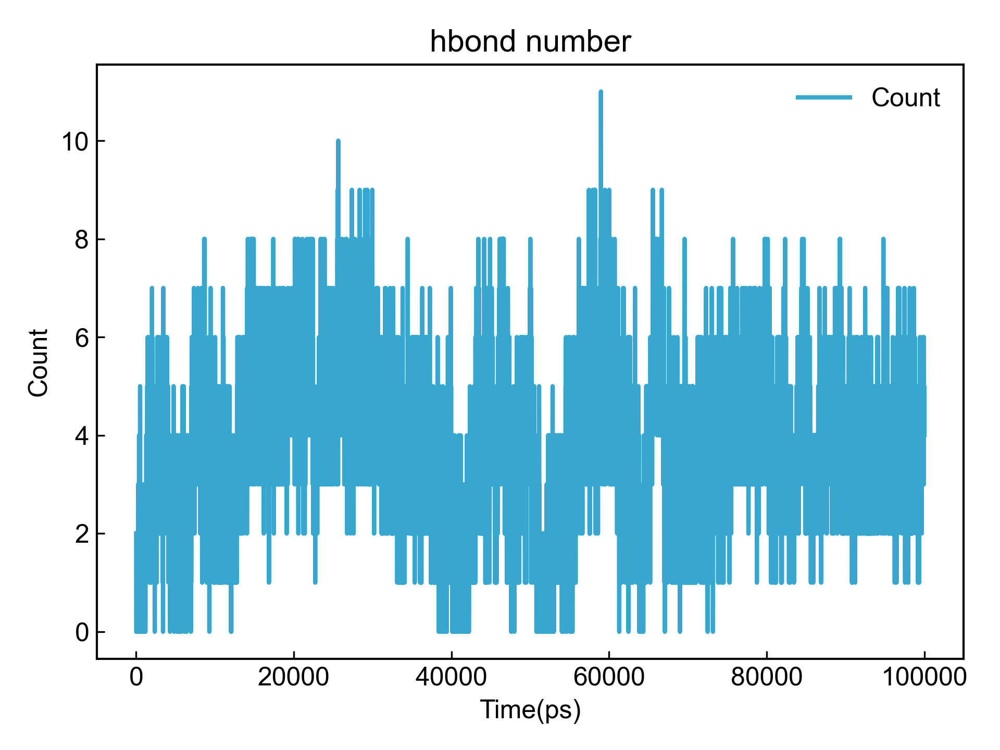
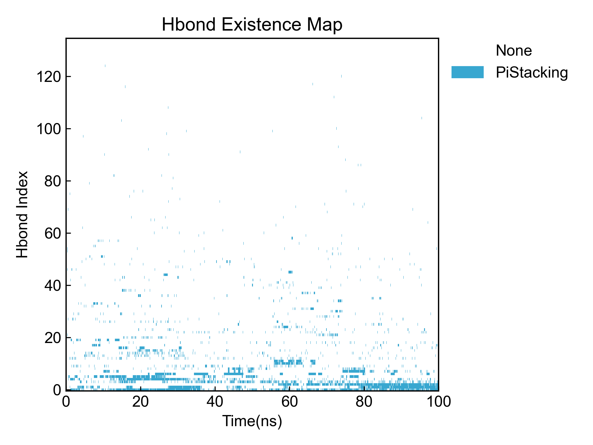
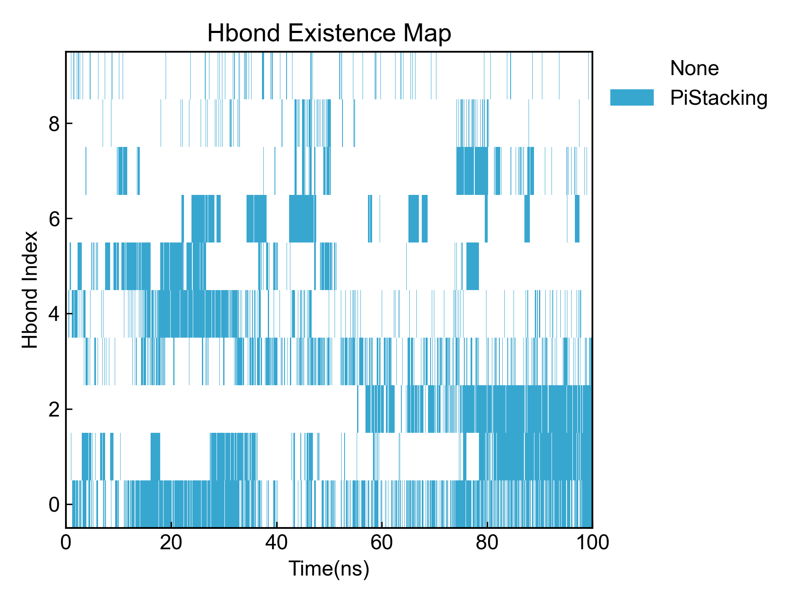
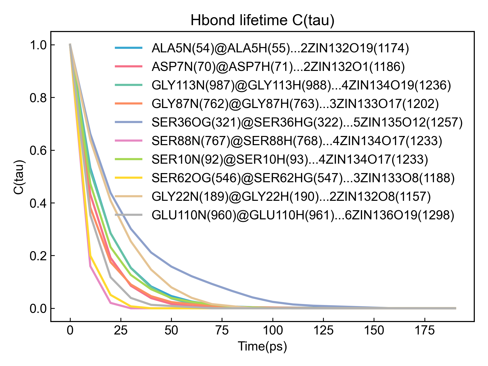

# Hbond

This module performs hydrogen bond calculations, including the number of hydrogen bonds, time occupancy, average distance and angle of hydrogen bond formation, etc.

Before using this module, please ensure that the [preprocessing](https://duivyprocedures-docs.readthedocs.io/en/latest/Framework.html#id7) has been completed!

## Input YAML

```yaml
  - Hbond:
      donor_group: protein
      acceptor_group: protein  ## the group name can't be started with number
      update_selection: no # update atom selection for each frame, no will be fast
      d_h_cutoff: 0.12 # nm
      d_a_cutoff: 0.30 # nm
      d_h_a_angle_cutoff: 150
      only_calc_number: no
      top2show: 10
      calc_lifetime: no # only for the top2show, and NO for dynamic atom selection
      tau_max: 20  # frame
      window_step: 1 # frame
      intermittency: 0  # allow 0 frame intermittency
```

`donor_group` and `acceptor_group` specify the donor and acceptor atom groups for hydrogen bonds respectively. You can directly specify atoms involved in hydrogen bonds, or write overall atom groups as shown in the example. The atom selection syntax here follows MDAnalysis atom selection syntax. Please refer to: https://userguide.mdanalysis.org/2.7.0/selections.html

`update_selection` specifies whether to refresh the set atom group for each frame. If the atom group selection statement contains dynamic selection statements like `around`, this option should be set to `yes`. In cases not involving dynamic selection, it is recommended to set this option to `no` to significantly improve calculation speed.

`d_h_cutoff`: The system will select donor-hydrogen atoms from `donor_group` that meet this threshold for hydrogen bond calculation.

`d_a_cutoff`: One of the hydrogen bond determination criteria, the distance threshold between donor and acceptor atoms. If less than this threshold, a hydrogen bond is formed.

`d_h_a_angle_cutoff`: One of the hydrogen bond determination criteria, the donor-hydrogen-acceptor angle threshold. If greater than this threshold, a hydrogen bond is formed.

`top2show` specifies how many hydrogen bonds with the highest occupancy to display, default is 10, can be adjusted as needed.

If you only need to calculate the number of hydrogen bonds, or when the estimated number of hydrogen bonds is very large (e.g., calculating hydrogen bonds between protein and water), you can set `only_calc_number` to `yes`, which means only calculating the number of hydrogen bonds without calculating other parameters.

`calc_lifetime`: Whether to calculate the lifetime of hydrogen bonds. If set to `yes`, the lifetime of the top `top2show` hydrogen bonds with highest occupancy will be calculated.

`tau_max`: Maximum time for lifetime calculation, in frames. During lifetime calculation, the probability that the hydrogen bond continues to exist within `tau_max` frames from time t0 will be calculated. The larger this value, the larger the calculation window.

`window_step`: Window translation step for lifetime, in frames.

`intermittency`: Allowed frame intermittency, i.e., how many frames without hydrogen bond formation are still considered as hydrogen bond; default is 0, meaning hydrogen bond must be continuous to be counted.

This module also has three hidden parameters for frame selection:

```yaml
      frame_start:  # start frame index
      frame_end:   # end frame index, None for all frames
      frame_step:  # frame index step, default=1
```

These parameters can specify the start frame, end frame (exclusive), and frame step for trajectory calculation. By default, users do not need to set these parameters, and the module will automatically analyze the entire trajectory.

For example, to calculate from frame 1000 to frame 5000, every 10 frames:

```yaml
      frame_start: 1000 # start frame index
      frame_end:  5001 # end frame index, None for all frames
      frame_step: 10 # frame index step, default=1
```

If only one or two of the three parameters need to be set, the others can be omitted.

## Output

DIP will calculate and visualize the hydrogen bond count plot and hydrogen bond occupancy plot output by this module:





It will also visualize the occupancy of the top hydrogen bonds:



DIP will count the time occupancy, average distance and average angle of all hydrogen bonds, and output to a CSV file:

```csv
id,donor@hydrogen...acceptor,occupancy(%),Present/Frames,Distance Ave(nm),Distance Std.err(nm),Angle Ave(deg),Angle Std.err(deg)
0,GLY35N(312)@GLY35H(313)...ASP33OD2(301),62.49,6250/10001,0.3013,0.0162,147.63,12.51 
1,GLY9N(87)@GLY9H(88)...ASP7OD2(76),36.83,3683/10001,0.3050,0.0176,157.13,11.11 
2,LEU122N(1058)@LEU122H(1059)...ASP85OD1(750),35.42,3542/10001,0.3039,0.0177,154.75,12.04 
3,ASN115N(1000)@ASN115H(1001)...SER114OG(996),31.99,3199/10001,0.2863,0.0147,130.56,6.46  
4,GLY61N(537)@GLY61H(538)...ASP59OD2(526),27.64,2764/10001,0.3024,0.0170,144.69,13.23 
5,GLY9N(87)@GLY9H(88)...ASP7OD1(75),23.92,2392/10001,0.3039,0.0178,157.33,11.05 
6,SER62OG(546)@SER62HG(547)...SER36OG(321),20.95,2095/10001,0.2692,0.0153,163.43,9.16  
7,ASN37N(325)@ASN37H(326)...SER10OG(96),15.05,1505/10001,0.2987,0.0200,157.07,12.61 
8,ASN11N(100)@ASN11H(101)...SER10OG(96),8.96,896/10001,0.2871,0.0149,129.49,6.58  
9,ASP7N(70)@ASP7H(71)...GLU6OE1(66),6.90,690/10001,0.3123,0.0203,148.82,13.48 
```

The hydrogen bond name consists of [donor@hydrogen...acceptor]. Each part has the following meaning: residue name, residue number, atom, with atom number in parentheses.

If hydrogen bond lifetime is calculated, the autocorrelation function will be output and visualized:



The integral of the autocorrelation function, i.e., the lifetime, will also be output to a CSV file. Note that the lifetime here is obtained by direct Simpson integration of the autocorrelation function data, with moderate accuracy.

If you observe that the function value has not dropped to 0 within the range of the autocorrelation function's independent variable, it indicates that you should appropriately increase the `tau_max` parameter to obtain a more accurate lifetime integral.

## References

If you use this analysis module from DIP, please cite MDAnalysis, DuIvyTools (https://zenodo.org/doi/10.5281/zenodo.6339993), and properly cite this documentation (https://zenodo.org/doi/10.5281/zenodo.10646113).