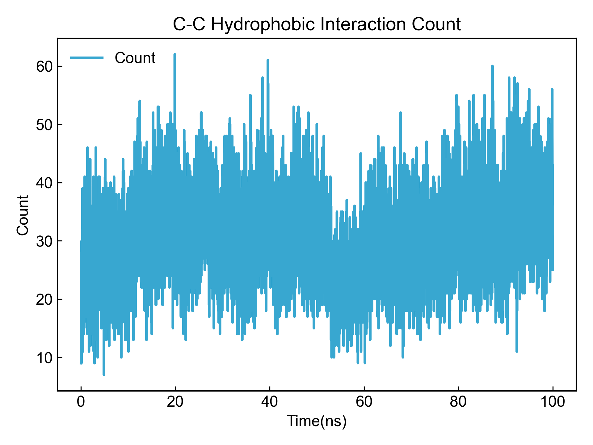
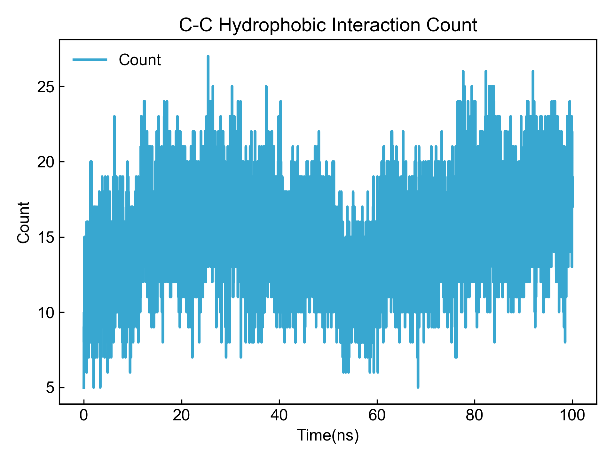

# Hydrophobic Contact

This module calculates the number of C-C contacts between two components. Although the analysis module is named hydrophobic interaction, hydrophobic interaction is actually an entropy effect. Therefore, here we use carbon-carbon atom contacts as a rough measure of hydrophobic interaction.

Before using this module, please ensure that the [preprocessing](https://duivyprocedures-docs.readthedocs.io/en/latest/Framework.html#id7) has been completed!

## Input YAML

```yaml
- Hydrophobic:
    dist_max_cutoff: 0.40 # nm
    dist_min_cutoff: 0.05 # nm
    group1: protein
    group2: resname *ZIN
```

`dist_max_cutoff` and `dist_min_cutoff`: Define the maximum and minimum allowed distance thresholds, in nm. DIP will calculate distances between pairs of carbon atoms. If the distance is less than or equal to `dist_max_cutoff` and greater than `dist_min_cutoff`, a carbon-carbon contact is considered to exist between the two atoms.

`group1`: Define the first atom group; `group2`: Define the second group. The atom selection syntax here follows MDAnalysis atom selection syntax. Please refer to: https://userguide.mdanalysis.org/2.7.0/selections.html. DIP will find carbon elements from both atom groups and calculate the number of carbon-carbon contacts between the two groups that meet the distance threshold.


This module also has three hidden parameters for frame selection:

```yaml
      frame_start:  # start frame index
      frame_end:   # end frame index, None for all frames
      frame_step:  # frame index step, default=1
```

These parameters can specify the start frame, end frame (exclusive), and frame step for trajectory calculation. By default, users do not need to set these parameters, and the module will automatically analyze the entire trajectory.

For example, to calculate data from frame 1000 to frame 5000, every 10 frames:

```yaml
      frame_start: 1000 # start frame index
      frame_end:  5001 # end frame index, None for all frames
      frame_step: 10 # frame index step, default=1
```

If only one or two of the three parameters need to be set, the others can be omitted.


## Output

DIP will calculate the C-C contact count for each frame based on user selection, save results to xvg file and visualize.



Since C-C contact count itself is relatively large, DIP also reduces C-C contact count by residue pair. Multiple contacts between the same residue pair are counted as one contact, and results are saved to `_reduced.xvg` file.



DIP also saves the time occupancy of `reduced` C-C contacts to a txt file.

```txt
CC_name, Occupancy, frames/total_frames
PHE_3-2ZIN_132, 23.41%, 2341/10001
MET_71-1ZIN_131, 41.55%, 4155/10001
ALA_5-2ZIN_132, 23.59%, 2359/10001
VAL_20-2ZIN_132, 45.62%, 4562/10001
VAL_34-3ZIN_133, 2.92%, 292/10001
MET_19-1ZIN_131, 35.84%, 3584/10001
MET_45-1ZIN_131, 34.85%, 3485/10001
PHE_107-6ZIN_136, 17.97%, 1797/10001
```

## References

If you use this analysis module from DIP, please cite MDAnalysis, DuIvyTools (https://zenodo.org/doi/10.5281/zenodo.6339993), and properly cite this documentation (https://zenodo.org/doi/10.5281/zenodo.10646113).
