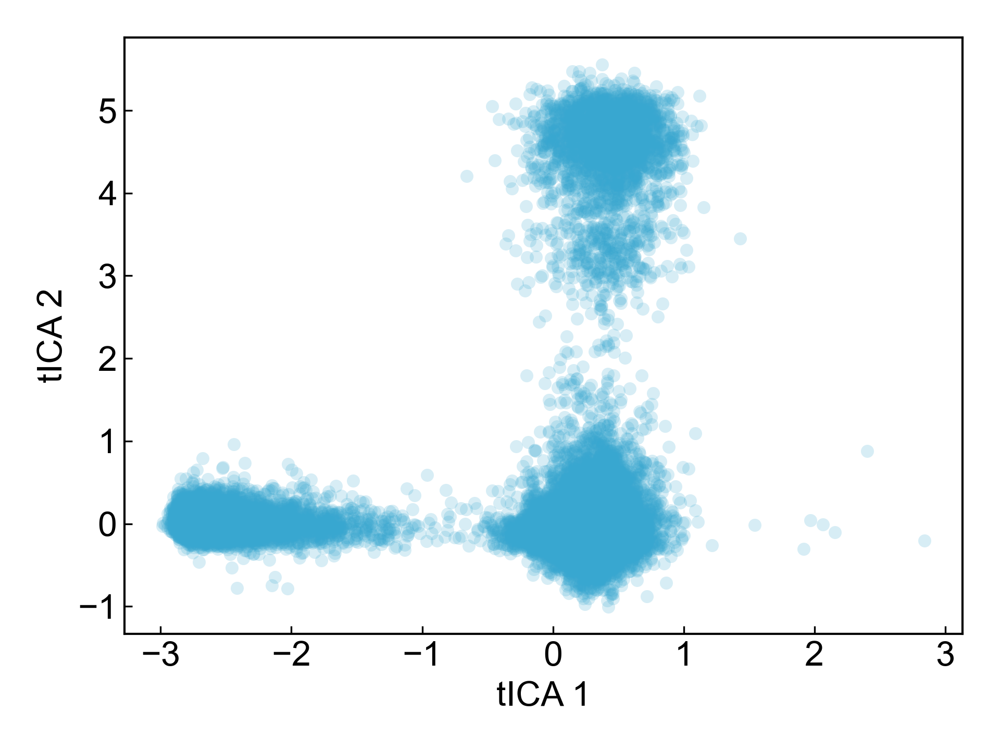
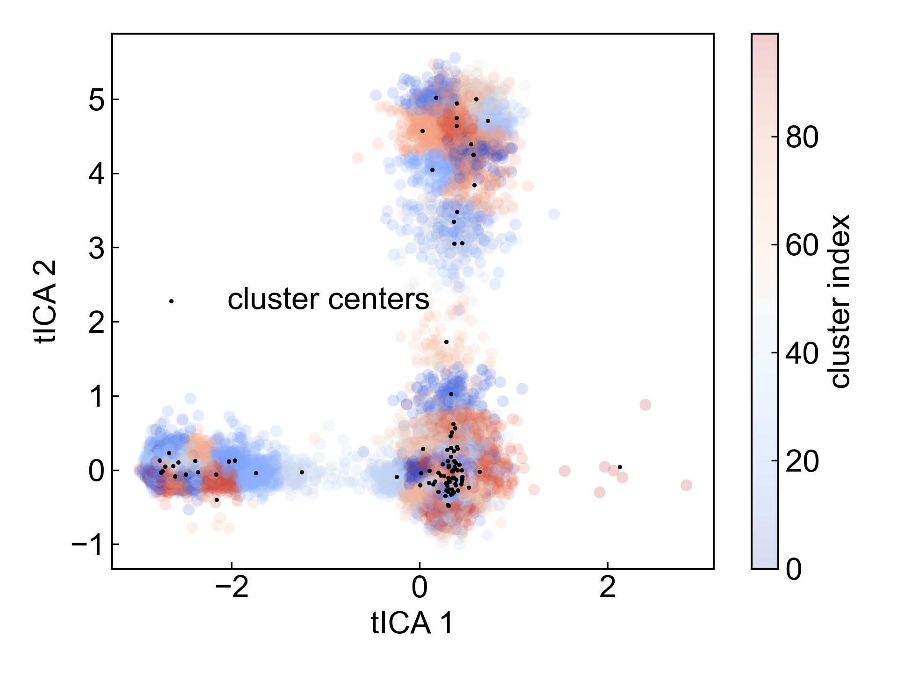
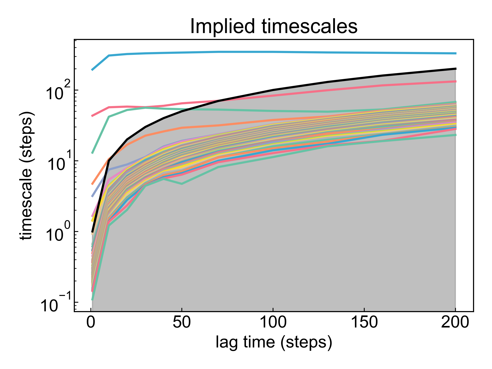
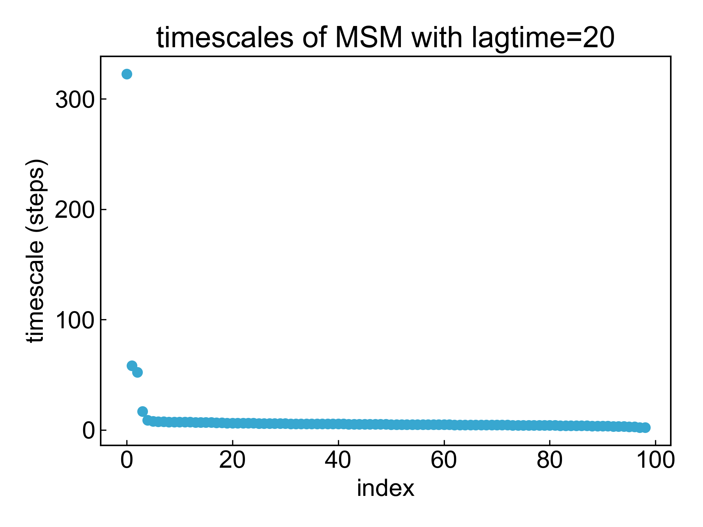
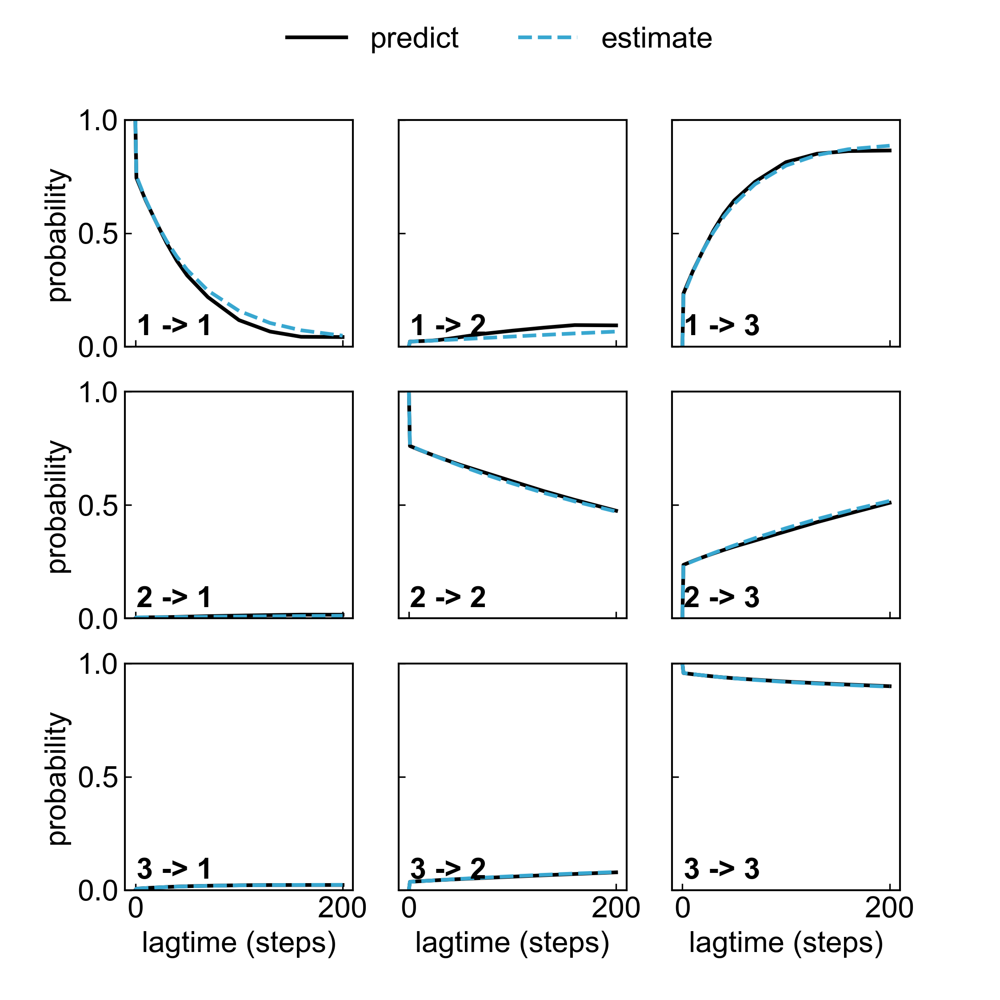
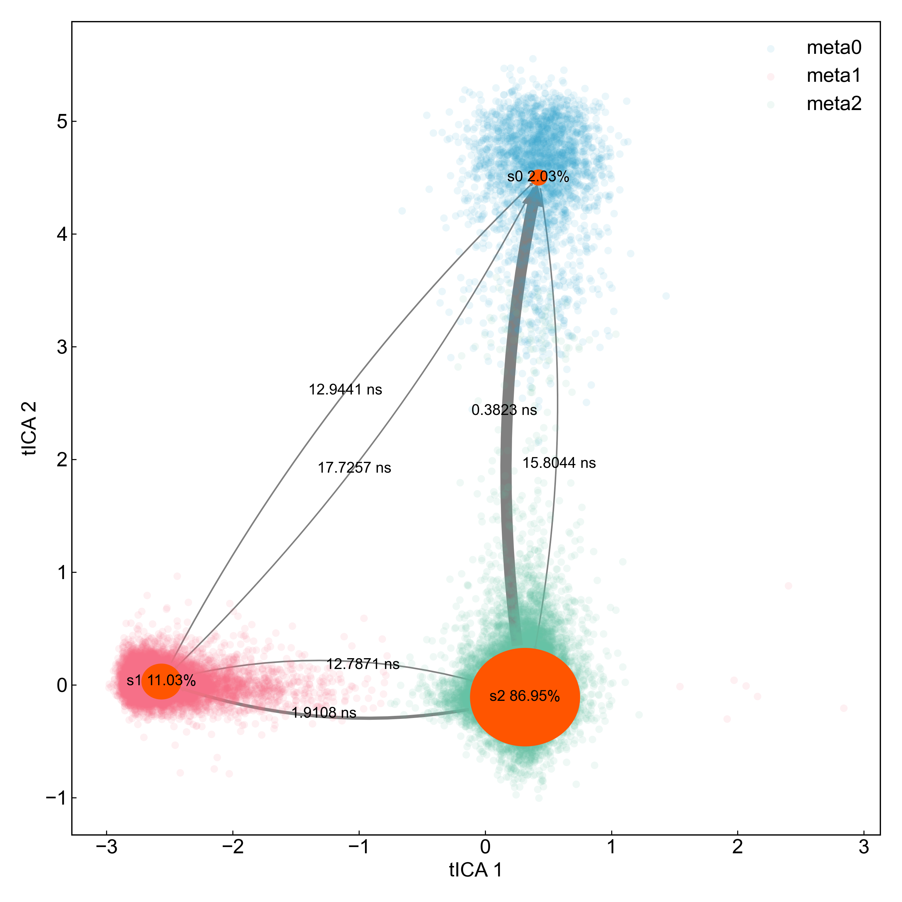

# MSM

This module builds Markov State Models (MSM) based on simulation trajectories. Since building MSM requires extensive mathematical knowledge and empirical judgment, this module only provides a demo and **should not be used for actual research without careful scrutiny**.

Before using this module, please ensure that the [preprocessing](https://duivyprocedures-docs.readthedocs.io/en/latest/Framework.html#id7) has been completed!

Also, please properly handle your trajectory sampling according to the requirements for building MSM.

The general steps for building MSM are:
1. Sufficiently sample the research object and CV
2. Choose appropriate features for building MSM, such as coordinates, dihedral angles, protein secondary structure, etc.
3. Perform tICA dimensionality reduction on features to obtain low-dimensional features; characterize the dimensionality reduction effect
4. Cluster the dimensionally reduced data to obtain a series of substates
5. Analyze implied timescales changes under different lag parameters
6. Select appropriate lag parameters and build suitable MSM
7. Use ck_test to validate MSM effectiveness
8. Use PCCA method to analyze meta states quantity and related properties
9. Plot state transition network diagram


Please read the following reference materials for more information on how to properly build MSM:

1. http://www.emma-project.org/latest/tutorials/notebooks/00-pentapeptide-showcase.html
2. https://ambermd.org/tutorials/advanced/tutorial41/index.php#3.%20tICA%20Analysis%20and%20MSM%20Construction
3. http://www.emma-project.org/latest/index.html
4. https://deeptime-ml.github.io/trunk/index.html


## Input YAML

```yaml
- MSM:
    atom_selection: protein
    byType: atom  # atom, res_com, res_cog, res_coc
    target: coordinates # dihedrals, coordinates
    coordinate_fit: no
    dimension: 3
    lag4tica: 20
    number_clusters: 100
    transition_count_mode: "effective" #"sliding","sample","effective","sliding-effective"
    lag4ITS_range: [1, 10, 20, 30, 40, 50, 70, 100, 130, 160, 200]
    lag4MSM: 20
    meta_number: 3
```

`atom_selection`: Atom selection for specifying the atom group for tICA. If performing dihedral analysis, the selected atom group must contain atoms that form backbone dihedral angles. The atom selection syntax here follows MDAnalysis atom selection syntax. Please refer to: https://userguide.mdanalysis.org/1.1.1/selections.html

`byType`: Specifies the method for coordinate-based dimensionality reduction, only effective when `target` is `coordinates`. There are four options: `atom`, `res_com`, `res_cog`, `res_coc`. `atom` calculates dimensionality reduction of all selected atom coordinates; commonly, you can select CA atoms in `atom_selection` with `protein and name CA` to calculate protein dimensionality reduction; `res_com` calculates dimensionality reduction of each residue's center of mass; `res_cog` calculates dimensionality reduction of each residue's geometric center; `res_coc` calculates dimensionality reduction of each residue's charge center. When using `res_com`, `res_cog` or `res_coc`, the atom selector should contain all atoms of the selected residues, otherwise only the center of mass, geometric center, or charge center of selected atoms within a residue will be calculated.

`coordinate_fit`: Whether to perform point cloud fitting on atom coordinates. If `yes` is selected, atom coordinates will be fitted to eliminate coordinate perturbation.

`target`: The target for tICA, can be `coordinates` or `dihedrals`. If `coordinates` is selected, tICA will be based on atom coordinates; if `dihedrals` is selected, tICA will be based on dihedral angles.

**Note**: The dPCA literature discusses that dihedral angles differ from coordinates - dihedral angles are periodic. Therefore, dPCA articles apply trigonometric transformation to angles before PCA analysis. This module also converts dihedral angles to sin and cos values before dimensionality reduction analysis. **Users performing dihedral angle dimensionality reduction analysis with this module should carefully compare with the literature to verify if the calculation process is appropriate! If uncertain, please do not use this module's dihedral angle dimensionality reduction analysis** For any questions or improvement suggestions, please contact Du Ruo. Du Ruo and Du Ivy welcome any suggestions and arguments. Thank you very much!

`dimension`: The dimension after tICA dimensionality reduction.

`lag4tica`: The lag parameter for tICA.

`number_clusters`: Specifies the number of substates after clustering.

`transition_count_mode`: Specifies the method for calculating transition matrix. Four options: `sliding`, `sample`, `effective`, `sliding-effective`. Please refer to: https://deeptime-ml.github.io/trunk/api/generated/deeptime.markov.TransitionCountEstimator.html

`lag4ITS_range`: Specifies the list of lag parameters for calculating implied timescales.

`lag4MSM`: Specifies the lag parameter for building MSM.

`meta_number`: Specifies the number of meta states.


This module also has three hidden parameters for frame selection:

```yaml
      frame_start:  # start frame index
      frame_end:   # end frame index, None for all frames
      frame_step:  # frame index step, default=1
```

These parameters can specify the start frame, end frame (exclusive), and frame step for trajectory calculation. By default, users do not need to set these parameters, and the module will automatically analyze the entire trajectory.

For example, to calculate from frame 1000 to frame 5000, every 10 frames:

```yaml
      frame_start: 1000 # start frame index
      frame_end:  5001 # end frame index, None for all frames
      frame_step: 10 # frame index step, default=1
```

If only one or two of the three parameters need to be set, the others can be omitted.


## Output

This module supports extracting protein phi and psi dihedral angles, molecular coordinates (including residue centroids, etc.) as features. DIP will output the time interval for each frame and the shape of initial data:

```bash
>> dt == 100 ps
>> data shape == (125025, 282)
```

Then, perform tICA dimensionality reduction on the data to obtain low-dimensional features. DIP will output the data shape after dimensionality reduction, cumulative variance ratio of the first few dimensions, and VAMP2 score for this dimensionality reduction:

```bash
>> data shape after TICA == (125025, 3)
>> cumulative variance of TICA : 
[0.33380842 0.51576476 0.65434328]
vamp2 score == 3.5134687005728185
```

It will also output the scatter distribution after tICA:




Then, cluster the dimensionally reduced data to obtain a series of substates. DIP will output the clustering result plot:



Please note that although only the first two tICA components are shown in the plot, clustering and all subsequent steps are executed based on the user-specified `dimension`, and only the first two components are used during plotting.


Next, analyze implied timescales changes under different lag parameters. DIP will output the corresponding plot:



Please carefully read the reference materials above for the meaning of this plot. If you notice that the colored lines on the plot haven't flattened, it may indicate insufficient sampling or other issues.
Based on this plot, select appropriate lag parameters. Choose from regions where colored lines are stable, and should choose slightly smaller lag values. Users can write the selected parameters into the `lag4MSM` parameter in the input. Therefore, this module may need to be run multiple times, adjusting parameters according to user experience to obtain appropriate results.

Next, build MSM based on the lag parameter specified by the user in `lag4MSM`. DIP will output the timescales plot and ck_test plot:





And will output MSM's state_fraction and count_fraction:

```bash
>> MSM.state_fraction == 1.0
>> MSM.count_fraction == 1.0
```

If you notice that these two fractions are not 1, it indicates poor MSM validity and parameters need to be readjusted.
If you notice that the predicted lines and measured lines in the ck_test plot don't overlap, it indicates poor MSM validity and parameters need to be readjusted.

Finally, use PCCA method to analyze meta states quantity and related properties. DIP will output PCCA's number of meta states, transition matrix, stationary probability and other data:

```bash
>> PCCA number of metastable states == 3
>> PCCA coarse_grained_transition_matrix :
[[ 7.16712706e-01  4.34185669e-03  2.78945437e-01]
 [-3.38570767e-05  9.47672177e-01  5.23616798e-02]
 [ 7.28889883e-03  7.90986766e-03  9.84801234e-01]]
>> PCCA coarse_grained_stationary_probability :
[0.0218077  0.13001922 0.84817308]
```

Then DIP will calculate the `mean first passage time` (MFPT) matrix, `inverse MFPT` matrix, and PCCA assignments for which meta state each cluster belongs to. For plotting, DIP will also calculate and output the center positions of meta states on the tICA12 scatter plot, and the frame count for each state.

```bash
>> MFPT (mean first passage time) matrix in unit ns: 
[[ 0.         17.72568248 15.80442747]
 [12.94413854  0.         12.7871243 ]
 [ 0.3822845   1.91078191  0.        ]]
>> Inverse MFPT: 
[[0.         0.05641532 0.06327341]
 [0.07725504 0.         0.07820367]
 [2.61585286 0.52334596 0.        ]]
>> PCCA assignments: 
[2 1 0 2 2 2 1 2 2 2 2 2 0 2 2 2 2 1 0 1 2 1 2 0 0 1 2 2 2 2 2 2 0 2 1 2 2
 1 2 2 2 2 1 1 2 2 2 2 2 2 2 0 2 0 1 2 2 2 0 2 2 2 2 2 1 1 2 2 2 1 2 2 0 0
 0 2 0 2 2 2 2 1 2 2 2 2 2 0 2 1 2 2 2 2 2 2 1 1 2 2]
>> meta state centers: [[ 0.4222979   4.50020021]
 [-2.56564652  0.02993246]
 [ 0.31564055 -0.10868268]]
>> meta state sizes: [  2533  13788 108704]
```

Finally, plot the state transition network diagram:




**Note: If parameters are inappropriate or other conditions prevent successful construction of a valid MSM, this module will report an error and terminate. This is normal. Please carefully read relevant materials and adjust parameters.**


## References

If you use this analysis module from DIP, please cite MDAnalysis, deeptime (http://dx.doi.org/10.1088/2632-2153/ac3de0), DuIvyTools (https://zenodo.org/doi/10.5281/zenodo.6339993), and properly cite this documentation (https://zenodo.org/doi/10.5281/zenodo.10646113).