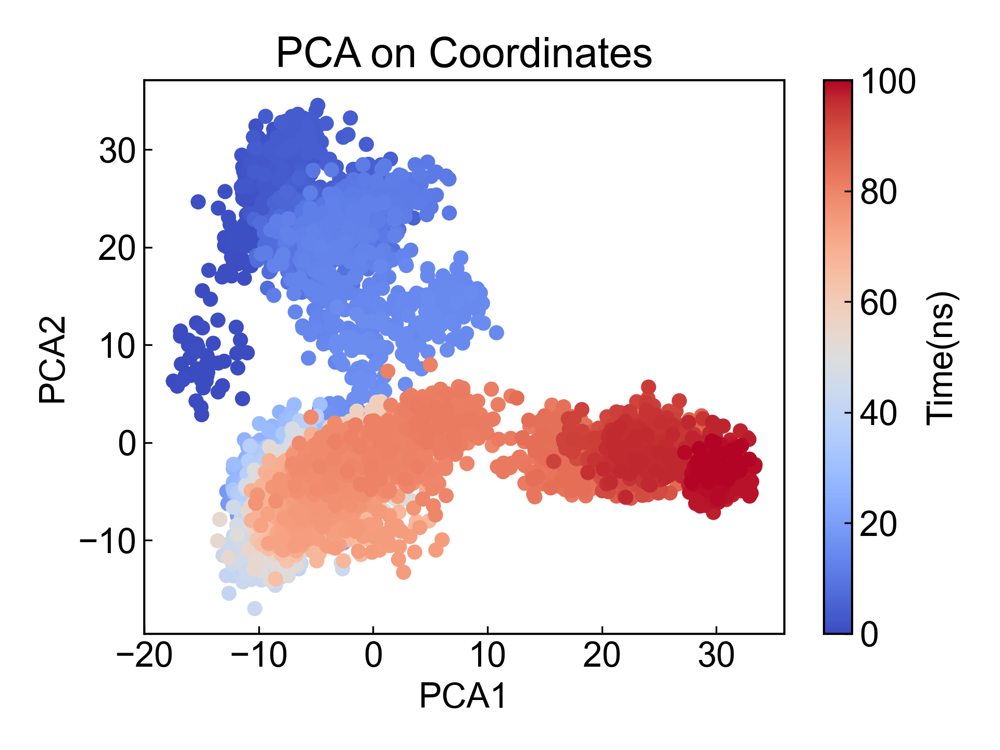
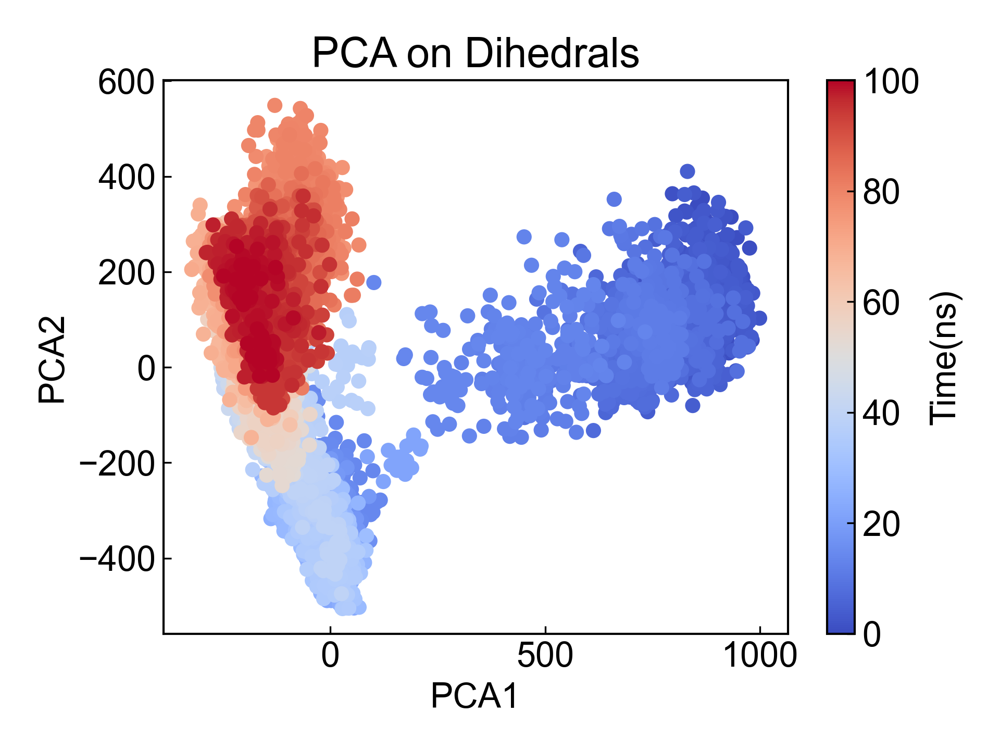

# PCA

This module can be used to perform principal component analysis (PCA) on selected atom groups. PCA can be performed on coordinates or on protein backbone dihedral angles.

Before using this module, please ensure that the [preprocessing](https://duivyprocedures-docs.readthedocs.io/en/latest/Framework.html#id7) has been completed!


## Input YAML

```yaml
- PCA:
    atom_selection: protein and name CA
    byType: atom # res_com, res_cog, res_coc
    target: coordinates # dihedrals
- PCA:
    mkdir: PCA_d
    atom_selection: protein
    byType: atom # res_com, res_cog, res_coc
    target: dihedrals
```

Here we list the parameters for both coordinate-based and dihedral-based PCA analysis.

`atom_selection`: Atom selection for specifying the atom group for PCA. If performing dihedral analysis, the selected atom group must contain atoms that form backbone dihedral angles. The atom selection syntax here follows MDAnalysis atom selection syntax. Please refer to: https://userguide.mdanalysis.org/2.7.0/selections.html

`byType`: Specifies the method for coordinate-based PCA calculation, only effective when `target` is `coordinates`. There are four options: `atom`, `res_com`, `res_cog`, `res_coc`. `atom` calculates PCA of all selected atom coordinates; commonly, you can select CA atoms in `atom_selection` with `protein and name CA` to calculate protein PCA; `res_com` calculates PCA of each residue's center of mass; `res_cog` calculates PCA of each residue's geometric center; `res_coc` calculates PCA of each residue's charge center. When using `res_com`, `res_cog` or `res_coc`, the atom selector should contain all atoms of the selected residues, otherwise only the center of mass, geometric center, or charge center of the selected atoms within a residue will be calculated.

`target`: The target for PCA, can be `coordinates` or `dihedrals`. If `coordinates` is selected, PCA will be based on atom coordinates; if `dihedrals` is selected, PCA will be based on dihedral angles.

**Note**: The dPCA literature discusses that dihedral angles differ from coordinates - dihedral angles are periodic. Therefore, dPCA articles apply trigonometric transformation to angles before PCA analysis. This module also converts dihedral angles to sin and cos values before PCA analysis. **Users performing dPCA analysis should carefully compare with the literature to verify if the calculation process is appropriate!** For any questions or improvement suggestions, please contact Du Ruo. Du Ruo and Du Ivy welcome any suggestions and arguments. Thank you very much!

This module also has three hidden parameters for frame selection:

```yaml
      frame_start:  # start frame index
      frame_end:   # end frame index, None for all frames
      frame_step:  # frame index step, default=1
```

These parameters can specify the start frame, end frame (exclusive), and frame step for trajectory calculation. By default, users do not need to set these parameters, and the module will automatically analyze the entire trajectory.

For example, to calculate DCCM from frame 1000 to frame 5000, every 10 frames:

```yaml
      frame_start: 1000 # start frame index
      frame_end:  5001 # end frame index, None for all frames
      frame_step: 10 # frame index step, default=1
```

If only one or two of the three parameters need to be set, the others can be omitted.

## Output

After performing PCA analysis on the system, DIP will save the first three principal component values to xvg files and create pairwise scatter plots for visualization.

First two principal components from coordinate-based PCA:



First two principal components from dihedral-based PCA:




**Note that the proportion of the first three principal components is output in the screen display or log:**

```txt
The ratio of eigenvalues -> [0.35126355 0.25190672 0.049121  ]
```

The calculation of principal component cosine content is also a check for PCA. DIP will calculate and output the cosine content for each PC. When the cosine content of the first few components is close to 1, it indicates that the PC may correspond to random diffusion, meaning the simulation has not converged and sampling is poor. For more information about cosine content, please refer to Berk Hess. Convergence of sampling in protein simulations. Phys. Rev. E 65, 031910 (2002).

The projections of the extreme values of the first three principal components on the trajectory will also be output to pdb files, such as `pc1_proj.pdb`, which can be visualized using PyMOL or other tools to observe structural changes along the PC direction.

## References

If you use this analysis module from DIP, please cite MDAnalysis, scikit-learn (https://scikit-learn.org/stable/about.html#citing-scikit-learn), DuIvyTools (https://zenodo.org/doi/10.5281/zenodo.6339993), and properly cite this documentation (https://zenodo.org/doi/10.5281/zenodo.10646113).