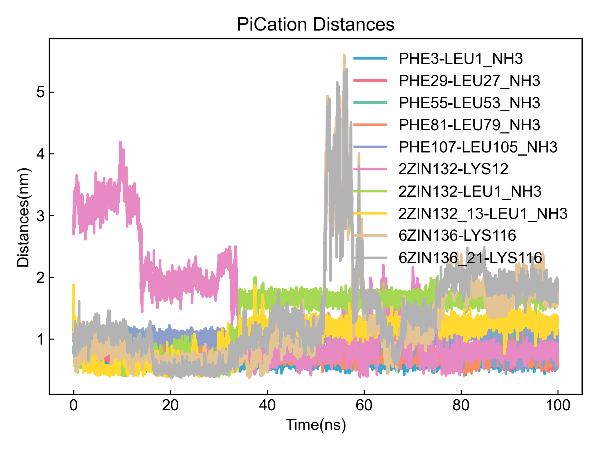
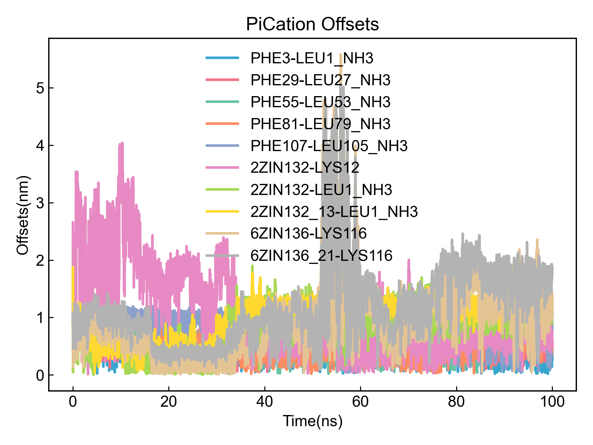
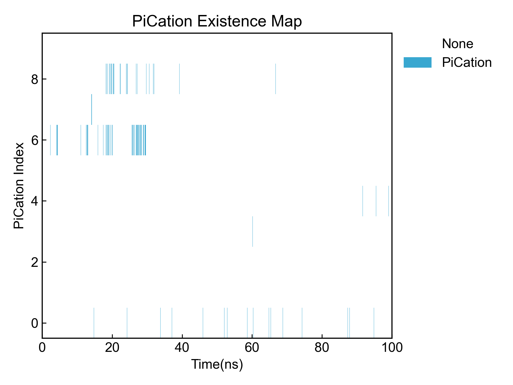

# PiCation

This module is used to analyze Pi-cation interactions.

Before using this module, please ensure that the [preprocessing](https://duivyprocedures-docs.readthedocs.io/en/latest/Framework.html#id7) has been completed!

## Input YAML

```yaml
- PiCation:
    distance_max_cutoff: 0.60
    distance_min_cutoff: 0.05
    ring_center_offset: 0.20
    byIndex: no 
    group4PiRing: protein
    group4Cation: protein
    only_aromatic_rings: no
    other_ring_max_atom_num: 7
    planarity_cutoff: 5  ## degree, 5 deg for planar
    ## ## below atomnames should be adopted to GORMOS forcefield
    ## ## modification need for application !!!
    ## NH3_atomnames: ["N", "H1", "H2", "H3"]
    ## COO_atomnames: ["C", "O1", "O2"]
    ## Backbone_atomnames: ["H", "N", "CA", "C", "O"]
    ## ## below atomnames should be adopted to AMBER forcefield
    ## ## modification need for application !!!
    NH3_atomnames: ["N", "H1", "H2", "H3"]
    COO_atomnames: ["C", "OC1", "OC2"]
    Backbone_atomnames: ["H", "N", "CA", "HA", "C", "O"]
    ## ## below atomnames should be adopted to CHARMM forcefield
    ## ## modification need for application !!!
    ## NH3_atomnames: ["N", "H1", "H2", "H3"]
    ## COO_atomnames: ["C", "OT1", "OT2"]
    ## Backbone_atomnames: ["HN", "N", "CA", "HA", "C", "O"]
    ignore_chain_end: no
    Pi_rings_Index: [[ 24,  25,  27,  29,  31,  33], 
      [249, 250, 252, 254, 256, 258],
      [474, 475, 477, 479, 481, 483], 
      [699, 700, 702, 704, 706, 708],
      [924, 925, 927, 929, 931, 933],
      [ 41,  42,  44,  46,  48,  50],
      [266, 267, 269, 271, 273, 275],
      [491, 492, 494, 496, 498, 500], 
      [716, 717, 719, 721, 723, 725],
      [941, 942, 944, 946, 948, 950]]
    cation_Index: [[118,119,120,121], [343,344,345,346], 
      [568,569,570,571], [793,794,795,796], [1018,1019,1020,1021]]
    calc_lifetime: no
    tau_max: 50  # frame
    window_step: 1 # frame
    intermittency: 0  # allow 0 frame intermittency
```

Like the salt bridge analysis module above, this module also provides two ways to define rings and Cation groups that can form PiCation. The first is through index, the second is through DIP using rdkit for identification.

`distance_max_cutoff`: Defines the maximum distance for PiCation interaction, in nanometers.

`distance_min_cutoff`: Defines the minimum distance for PiCation interaction, in nanometers.

`ring_center_offset`: Defines the ring center offset, in nanometers. Offset is defined as the distance between the projection of the Cation's charge center onto the ring's plane and the ring's centroid.

`byIndex`: Whether to define rings and Cation groups that can form PiCation through index. If `yes`, `Pi_rings_Index` and `cation_Index` must provide corresponding atom indices. If `no`, DIP will search automatically.

`group4PiRing` and `group4Cation`: Define two atom groups for finding aromatic rings and Cation structures. These two parameters are only valid when `byIndex` is `no`. DIP will automatically detect aromatic ring structures from the first group and Cation structures from the second group, and calculate PiCation between them. If you need to calculate PiCation within a group, both groups can be set to the same atom group. The atom selection syntax here follows MDAnalysis atom selection syntax. Please refer to: https://userguide.mdanalysis.org/2.7.0/selections.html

`only_aromatic_rings`: When DIP automatically searches for rings that can form PiStacking, whether to only consider aromatic rings (every bond in the ring is an aromatic bond), or consider all rings. **Non-aromatic rings are very likely to be misidentified, so users need to check the results!**

`other_ring_max_atom_num`: When DIP automatically searches for rings that can form PiStacking, the maximum allowed number of atoms for rings not identified as aromatic rings. The minimum allowed number of atoms is 5.

`planarity_cutoff`: When DIP automatically searches for rings that can form PiStacking, the allowed planarity for rings not identified as aromatic rings. DIP will calculate the normal vectors of all atoms in the ring with their neighbor atoms. The angle between any two normal vectors needs to be less than the value set here for the ring to be identified as a planar ring and be calculated by DIP as a ring that can form PiStacking. **Note that planar rings do not equal aromatic rings. Please check according to the output ring pdb file!**

If `byIndex` is `no`, DIP will search for possible atom groups that can form salt bridges based on system charges. However, considering that atom names may differ under different force fields, and C or N terminals that haven't formed peptide bonds may also form salt bridges, **users may need to fill in the atom names for COO- and NH3+ according to the force field used to help the program correctly identify all charged groups.** Here we provide atom names that roughly apply to three major force fields by default, but they may not be accurate and need to be modified according to specific system atom naming.

`ignore_chain_end`: Whether to ignore chain end residues. If set to `yes`, the program will ignore chain end residues and only calculate charged groups in the middle of the chain.

`calc_lifetime`: Whether to calculate the lifetime of PiCation.

`tau_max`: Maximum time for lifetime calculation, in frames. During lifetime calculation, the probability that the PiCation continues to exist within `tau_max` frames from time t0 will be calculated. The larger this value, the larger the calculation window.

`window_step`: Window translation step for lifetime, in frames.

`intermittency`: Allowed frame intermittency, i.e., how many frames without PiCation formation are still considered as PiCation; default is 0, meaning PiCation must be continuous to be counted.

This module also has three hidden parameters for frame selection:

```yaml
      frame_start:  # start frame index
      frame_end:   # end frame index, None for all frames
      frame_step:  # frame index step, default=1
```

These parameters can specify the start frame, end frame (exclusive), and frame step for trajectory calculation. By default, users do not need to set these parameters, and the module will automatically analyze the entire trajectory.

For example, to calculate from frame 1000 to frame 5000, every 10 frames:

```yaml
      frame_start: 1000 # start frame index
      frame_end:  5001 # end frame index, None for all frames
      frame_step: 10 # frame index step, default=1
```

If only one or two of the three parameters need to be set, the others can be omitted.

## Output

First, output the rings and Cation groups that DIP identified as capable of forming PiCation for users to judge correctness. DIP will output them to pdb files for users to check. DIP will also output each ring and Cation group and their corresponding atom indices to txt files for further confirmation and reuse:

```txt
PiStacking_Names, Indexs
PHE3, [24, 25, 27, 29, 31, 33]
PHE4, [41, 42, 44, 46, 48, 50]
PHE29, [249, 250, 252, 254, 256, 258]
PHE30, [266, 267, 269, 271, 273, 275]
PHE55, [474, 475, 477, 479, 481, 483]
PHE56, [491, 492, 494, 496, 498, 500]
PHE81, [699, 700, 702, 704, 706, 708]
PHE82, [716, 717, 719, 721, 723, 725]
PHE107, [924, 925, 927, 929, 931, 933]
PHE108, [941, 942, 944, 946, 948, 950]
Cations_Names, Indexs
LYS12, [118, 119, 120, 121]
LYS38, [343, 344, 345, 346]
LYS64, [568, 569, 570, 571]
LYS90, [793, 794, 795, 796]
LYS116, [1018, 1019, 1020, 1021]
```

Then output distance from Pi centroid to Cation charge center, offset and other data for all PiCation to xvg files and visualize:





Then output occupancy plots for all PiCation:



Summary information for all PiCation can be found in the output CSV file:

```csv
id,Name,Occupancy,Frames/Total,Distance(nm),Offset(nm)
0,PHE3-LEU1_NH3,1.11%,111/10001,0.556403,0.145827
1,PHE29-LEU27_NH3,0.01%,1/10001,0.581956,0.158579
2,PHE55-LEU53_NH3,0.01%,1/10001,0.599074,0.190308
3,PHE81-LEU79_NH3,0.11%,11/10001,0.535019,0.159096
4,PHE107-LEU105_NH3,0.06%,6/10001,0.564249,0.136644
5,2ZIN132-LYS12,0.24%,24/10001,0.529427,0.146480
6,2ZIN132-LEU1_NH3,3.48%,348/10001,0.564333,0.119180
7,2ZIN132_13-LEU1_NH3,0.24%,24/10001,0.557451,0.147649
8,6ZIN136-LYS116,1.82%,182/10001,0.563790,0.137136
9,6ZIN136_21-LYS116,0.11%,11/10001,0.440715,0.171171
```

If lifetime is calculated, the autocorrelation function will be output and visualized; the integral of the autocorrelation function, i.e., the lifetime, will also be output to a CSV file. Note that the lifetime here is obtained by direct Simpson integration of the autocorrelation function data, with moderate accuracy.

If you observe that the function value has not dropped to 0 within the range of the autocorrelation function's independent variable, it indicates that you should appropriately increase the `tau_max` parameter to obtain a more accurate lifetime integral.

## References

If you use this analysis module from DIP, please cite MDAnalysis, rdkit, DuIvyTools (https://zenodo.org/doi/10.5281/zenodo.6339993), and properly cite this documentation (https://zenodo.org/doi/10.5281/zenodo.10646113).