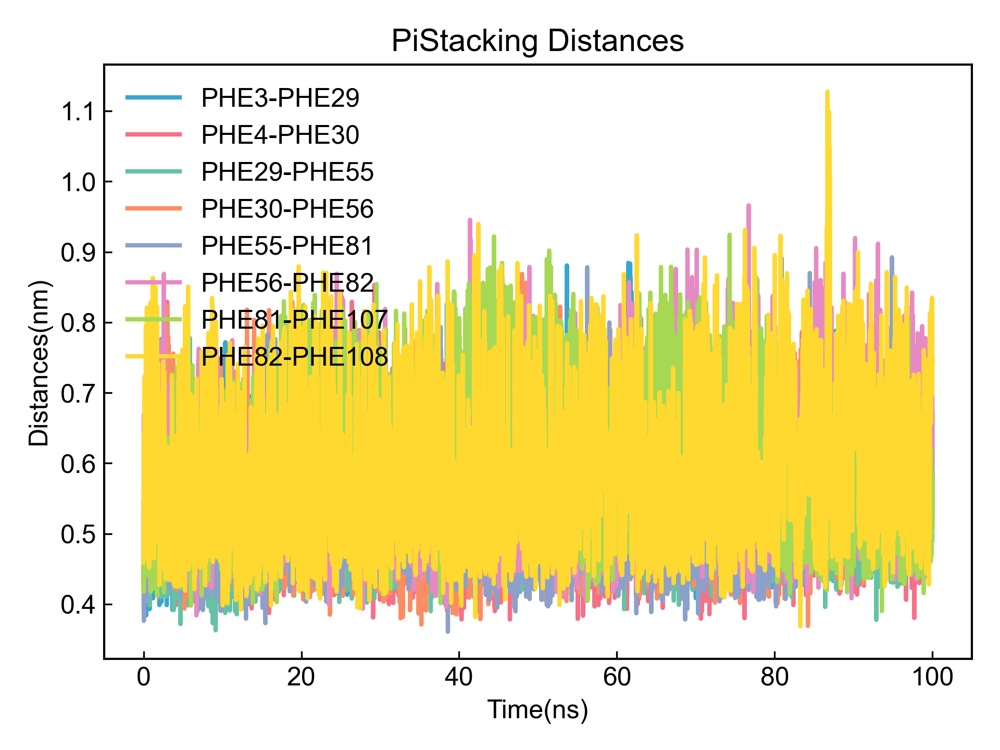
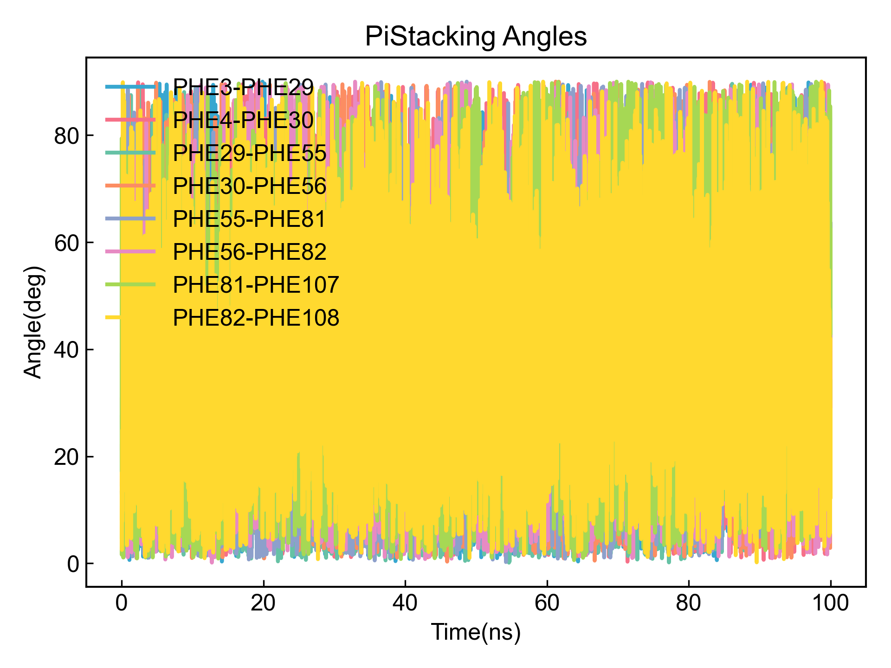
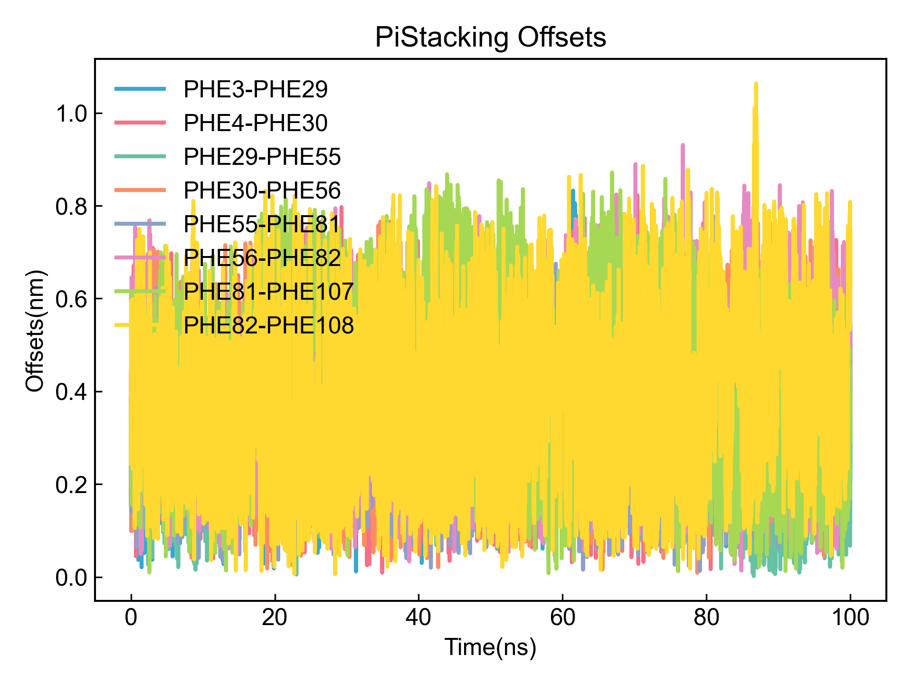
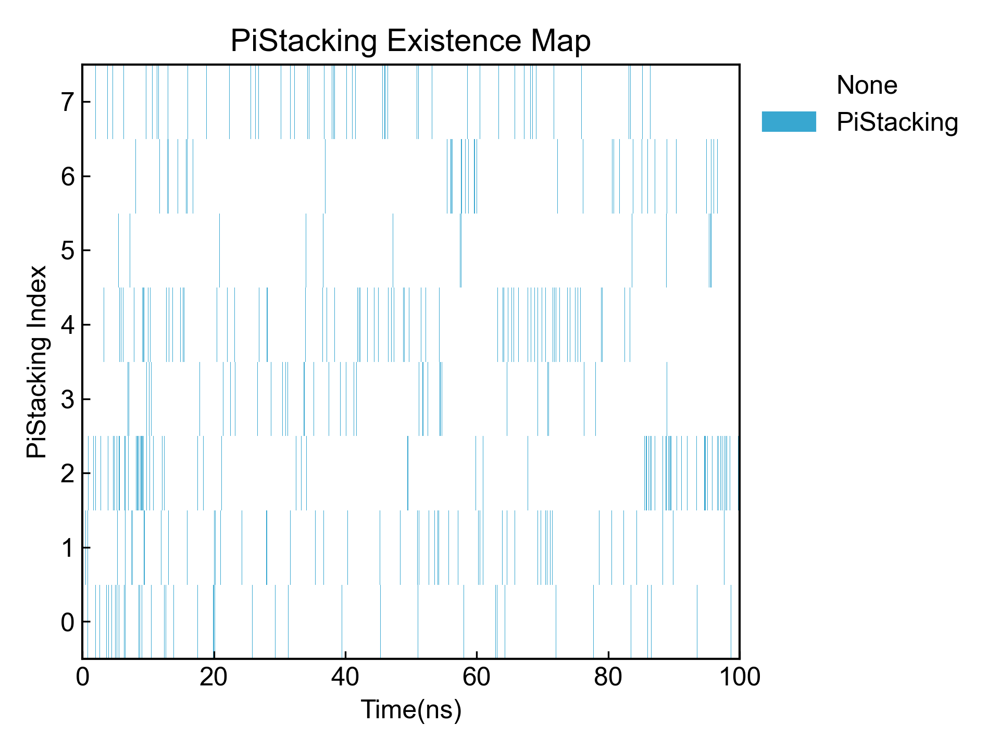
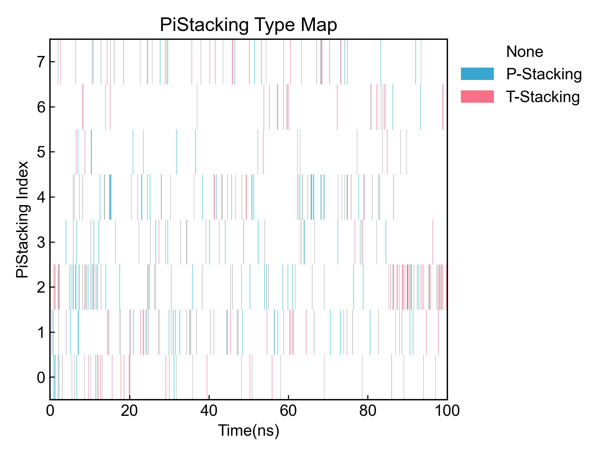

# PiStacking

This module is used to analyze Pi-Pi interactions.

Before using this module, please ensure that the [preprocessing](https://duivyprocedures-docs.readthedocs.io/en/latest/Framework.html#id7) has been completed!

## Input YAML

```yaml
- PiStacking:
    distance_max_cutoff: 0.55 # nm
    distance_min_cutoff: 0.05
    ring_center_offset: 0.20
    angle4T_stacking: [60, 90]
    angle4P_stacking: [0, 30]
    byIndex: no
    group1: protein
    group2: resname *ZIN
    only_aromatic_rings: yes
    other_ring_max_atom_num: 7
    planarity_cutoff: 5  ## degree, 5 deg for planar
    Pi_rings_Index: [
[ 24,  25,  27,  29,  31,  33],
[249, 250, 252, 254, 256, 258],
[474, 475, 477, 479, 481, 483], 
[699, 700, 702, 704, 706, 708],
[924, 925, 927, 929, 931, 933],
[ 41,  42,  44,  46,  48,  50],
[266, 267, 269, 271, 273, 275],
[491, 492, 494, 496, 498, 500], 
[716, 717, 719, 721, 723, 725],
[941, 942, 944, 946, 948, 950]]
    calc_lifetime: no
    tau_max: 50  # frame
    window_step: 1 # frame
    intermittency: 0  # allow 0 frame intermittency
```

Like the salt bridge analysis module above, this module also provides two ways to define rings that can form PiStacking. The first is through index, the second is through DIP using rdkit for identification.

`distance_max_cutoff`: Defines the maximum distance for Pi-Pi interaction, in nanometers.

`distance_min_cutoff`: Defines the minimum distance for Pi-Pi interaction, in nanometers.

`ring_center_offset`: Defines the ring center offset, in nanometers. Offset is defined as the distance between the projection of one ring's centroid onto another ring's plane and that other ring's centroid.

`angle4T_stacking`: Defines the angle range for T-stacking, in degrees.

`angle4P_stacking`: Defines the angle range for P-stacking, in degrees.

`byIndex`: Whether to define rings that can form PiStacking through index. If `yes`, `Pi_rings_Index` must be provided. If `no`, DIP will search automatically.

`group1` and `group2`: Define two atom groups for finding ring structures. These two parameters are only valid when `byIndex` is `no`. In the example above, the two atom groups are protein and ligand, so DIP will automatically find aromatic rings from these two groups and calculate PiStacking between groups. If you need to calculate PiStacking within a group, just set `group1` and `group2` to the same atom group. The atom selection syntax here follows MDAnalysis atom selection syntax. Please refer to: https://userguide.mdanalysis.org/2.7.0/selections.html

`only_aromatic_rings`: When DIP automatically searches for rings that can form PiStacking, whether to only consider aromatic rings (every bond in the ring is an aromatic bond), or consider all rings. **Non-aromatic rings are very likely to be misidentified, so users need to check the results!**

`other_ring_max_atom_num`: When DIP automatically searches for rings that can form PiStacking, the maximum allowed number of atoms for rings not identified as aromatic rings. The minimum allowed number of atoms is 5.

`planarity_cutoff`: When DIP automatically searches for rings that can form PiStacking, the allowed planarity for rings not identified as aromatic rings. DIP will calculate the normal vectors of all atoms in the ring with their neighbor atoms. The angle between any two normal vectors needs to be less than the value set here for the ring to be identified as a planar ring and be calculated by DIP as a ring that can form PiStacking. **Note that planar rings do not equal aromatic rings. Please check according to the output ring pdb file!**

`calc_lifetime`: Whether to calculate the lifetime of PiStacking.

`tau_max`: Maximum time for lifetime calculation, in frames. During lifetime calculation, the probability that the PiStacking continues to exist within `tau_max` frames from time t0 will be calculated. The larger this value, the larger the calculation window.

`window_step`: Window translation step for lifetime, in frames.

`intermittency`: Allowed frame intermittency, i.e., how many frames without PiStacking formation are still considered as PiStacking; default is 0, meaning PiStacking must be continuous to be counted.

This module also has three hidden parameters for frame selection:

```yaml
      frame_start:  # start frame index
      frame_end:   # end frame index, None for all frames
      frame_step:  # frame index step, default=1
```

These parameters can specify the start frame, end frame (exclusive), and frame step for trajectory calculation. By default, users do not need to set these parameters, and the module will automatically analyze the entire trajectory.

For example, to calculate from frame 1000 to frame 5000, every 10 frames:

```yaml
      frame_start: 1000 # start frame index
      frame_end:  5001 # end frame index, None for all frames
      frame_step: 10 # frame index step, default=1
```

If only one or two of the three parameters need to be set, the others can be omitted.

## Output

First, output the rings that DIP identified as capable of forming PiStacking for users to judge correctness. DIP will output them to pdb files for users to check. DIP will also output each ring and its corresponding atom indices to a txt file for further confirmation and reuse:

```txt
PiStacking_Names, Indexs
PHE3, [24, 25, 27, 29, 31, 33]
PHE4, [41, 42, 44, 46, 48, 50]
PHE29, [249, 250, 252, 254, 256, 258]
PHE30, [266, 267, 269, 271, 273, 275]
PHE55, [474, 475, 477, 479, 481, 483]
PHE56, [491, 492, 494, 496, 498, 500]
PHE81, [699, 700, 702, 704, 706, 708]
PHE82, [716, 717, 719, 721, 723, 725]
PHE107, [924, 925, 927, 929, 931, 933]
PHE108, [941, 942, 944, 946, 948, 950]
```

Then output centroid distance, angle, offset and other data for all PiStacking to xvg files and visualize:







Then output occupancy plots for all PiStacking and occupancy plots for different types of PiStacking:





Summary information for all PiStacking can be found in the output CSV file:

```csv
id,Name,Occupancy,Distance(nm),Offset(nm),P-Stacking_Occupancy,T-Stacking_Occupancy,P-Angle(deg),T-Angle(deg)
0,PHE3-PHE29,2.92%,0.487346,0.144246,0.96%,1.96%,20.77,71.73
1,PHE4-PHE30,4.39%,0.460136,0.151688,2.76%,1.63%,20.31,70.24
2,PHE29-PHE55,6.55%,0.467393,0.146599,3.84%,2.71%,20.22,68.43
3,PHE30-PHE56,3.02%,0.457942,0.153642,1.93%,1.09%,21.12,69.49
4,PHE55-PHE81,5.46%,0.466521,0.154699,3.42%,2.04%,20.36,70.58
5,PHE56-PHE82,1.53%,0.478098,0.151367,0.60%,0.93%,22.09,69.23
6,PHE81-PHE107,2.00%,0.491143,0.141269,0.49%,1.51%,21.59,70.73
7,PHE82-PHE108,3.65%,0.482846,0.147029,1.59%,2.06%,21.05,68.96
```

If lifetime is calculated, the autocorrelation function will be output and visualized; the integral of the autocorrelation function, i.e., the lifetime, will also be output to a CSV file. Note that the lifetime here is obtained by direct Simpson integration of the autocorrelation function data, with moderate accuracy.

If you observe that the function value has not dropped to 0 within the range of the autocorrelation function's independent variable, it indicates that you should appropriately increase the `tau_max` parameter to obtain a more accurate lifetime integral.

## References

If you use this analysis module from DIP, please cite MDAnalysis, rdkit, DuIvyTools (https://zenodo.org/doi/10.5281/zenodo.6339993), and properly cite this documentation (https://zenodo.org/doi/10.5281/zenodo.10646113).