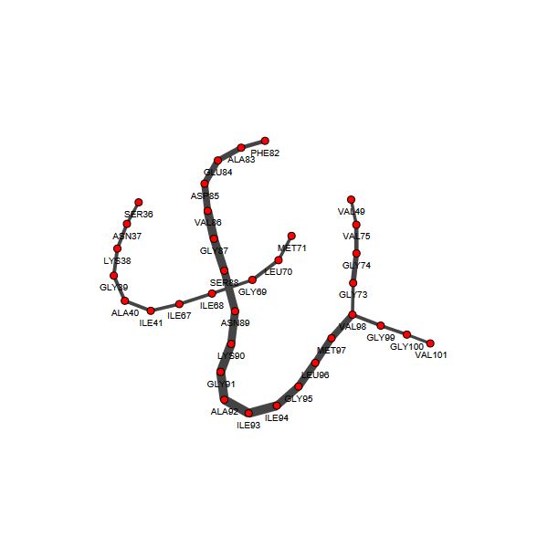
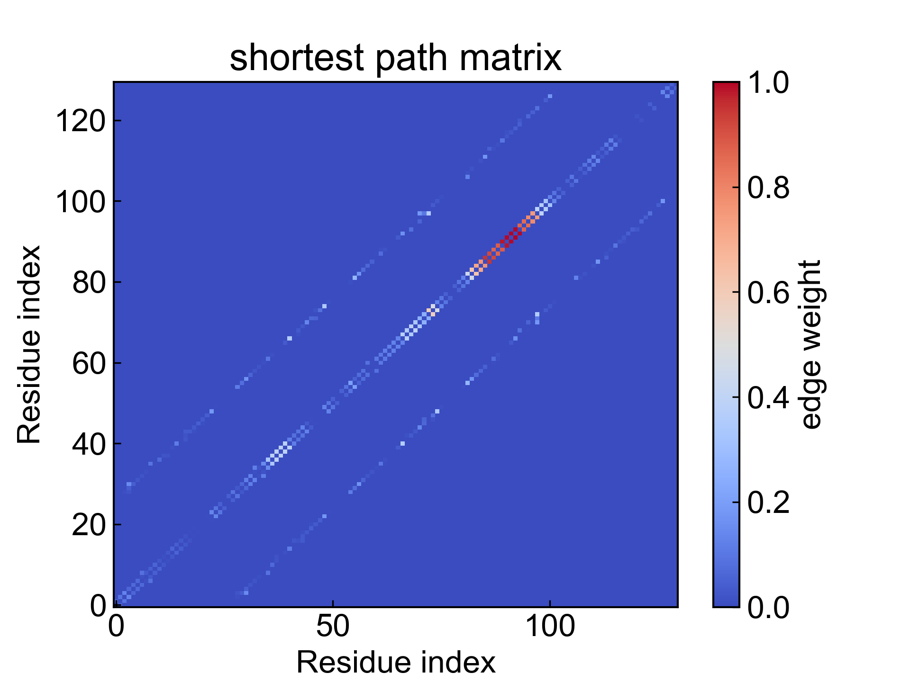
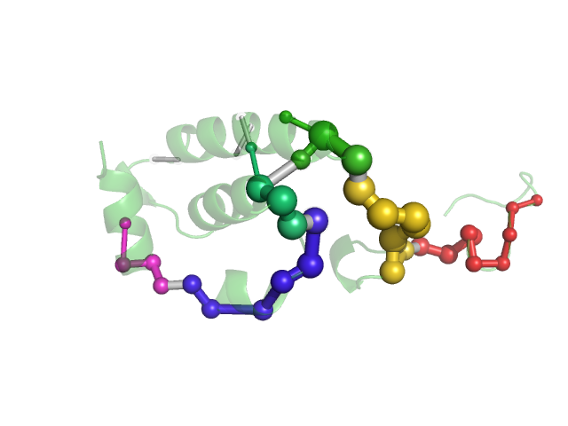

# SPM

Shortest Path Map (SPM) is a powerful tool for analyzing allosteric effects and long-range residue contacts in macromolecules like proteins. This module partially reproduces the work from Sílvia Osuna's article (http://dx.doi.org/10.1021/acscatal.7b02954).

Currently this module can calculate shortest path maps and second shortest path maps.

**Any suggestions and comments on this module are welcome! Please contact Du Ivy. Thank you very much!**

Before using this module, please ensure that the [preprocessing](https://duivyprocedures-docs.readthedocs.io/en/latest/Framework.html#id7) has been completed!

## Input YAML

```yaml
- SPM:
    DCCM: "" # DCCM.csv
    Distance_matrix: "" #distance_matrix_average.csv
    type_select: C-alpha # center
    distance_cutoff: 0.6 # nm
    sp_weight_cutoff: 0.3
```

`type_select`: Select the atom group for calculating residue DCCM and distance matrix. Can choose `C-alpha` or `center` (residue centroid).

This module itself has the capability to calculate residue DCCM and distance matrix, but users can also customize input DCCM matrix and distance matrix. Just write the corresponding matrix csv files to `DCCM` and `Distance_matrix` parameters. Please note that the residue order of both matrices must be consistent, and do not save header and index.

`distance_cutoff`: Distance threshold for the distance matrix, in nm. Residue pairs with distances above the threshold will not be considered as vertices connected by edges in the graph.

`sp_weight_cutoff`: Threshold for shortest path weight. Shortest paths below this threshold will be ignored.

This module also has three hidden parameters for frame selection:

```yaml
      frame_start:  # start frame index
      frame_end:   # end frame index, None for all frames
      frame_step:  # frame index step, default=1
```

These parameters can specify the start frame, end frame (exclusive), and frame step for trajectory calculation. By default, users do not need to set these parameters, and the module will automatically analyze the entire trajectory.

For example, to calculate data from frame 1000 to frame 5000, every 10 frames:

```yaml
      frame_start: 1000 # start frame index
      frame_end:  5001 # end frame index, None for all frames
      frame_step: 10 # frame index step, default=1
```

If only one or two of the three parameters need to be set, the others can be omitted.

## Output

DIP will output the calculated DCCM matrix, distance matrix, visualized shortest path map, and PyMOL pml script for SPM.



SPM also outputs the shortest path weight matrix. Larger values indicate stronger dynamic information transfer between residue pairs.



The output files related to shortest path maps are prefixed with `1_`; second shortest path maps are prefixed with `2_`.

The pml script can be visualized through PyMOL:



The spheres and bonds in the figure represent the shortest path map network. Sphere size and bond thickness indicate flux or importance; sphere and bond colors represent different communities.


## Details

First, construct the dynamic information network using distance matrix and DCCM. Each amino acid is treated as a vertex in the graph. If the distance between two amino acids is less than the distance cutoff, an edge exists between the two vertices in the graph, and the edge weight is derived from the corresponding DCCM value. The larger the absolute value of DCCM, the smaller the edge weight (shorter distance between two vertices), indicating stronger dynamic information transfer between the two amino acids.

After obtaining the dynamic information network, perform community analysis on it using the fastgreedy algorithm to obtain sets of different communities (similar to clustering analysis).

Calculate the shortest path map for the dynamic information network. For any two vertices in the graph, calculate their shortest path and second shortest path. For a certain edge, count how many times it is passed in shortest paths and second shortest paths. Construct the shortest path graph and second shortest path graph, where edge weights are obtained by dividing the number of passes for that edge by the maximum number of passes for edges in the graph. When the weight is less than the user-set threshold, the edge is discarded. This yields the shortest path map and second shortest path map.

Finally, visualize the shortest path map and second shortest path map, and output PyMOL scripts. In the visualized graphs, edge thickness indicates importance, and color indicates community.


## References

If you use this analysis module from DIP, please cite Sílvia Osuna's article (http://dx.doi.org/10.1021/acscatal.7b02954), MDAnalysis, DuIvyTools (https://zenodo.org/doi/10.5281/zenodo.6339993), and properly cite this documentation (https://zenodo.org/doi/10.5281/zenodo.10646113).
