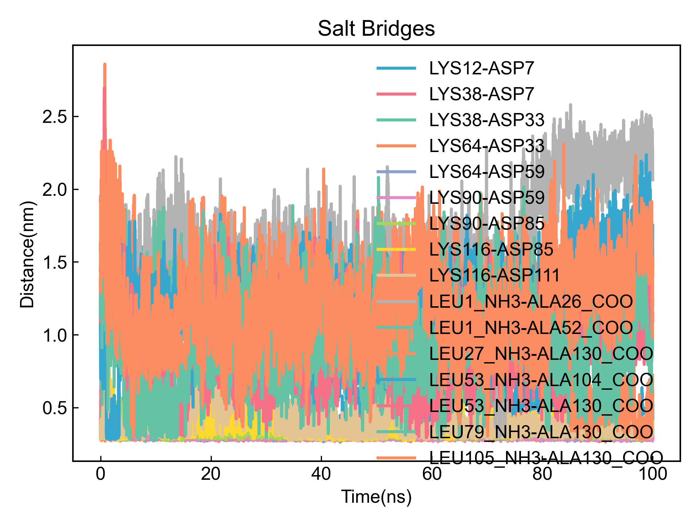
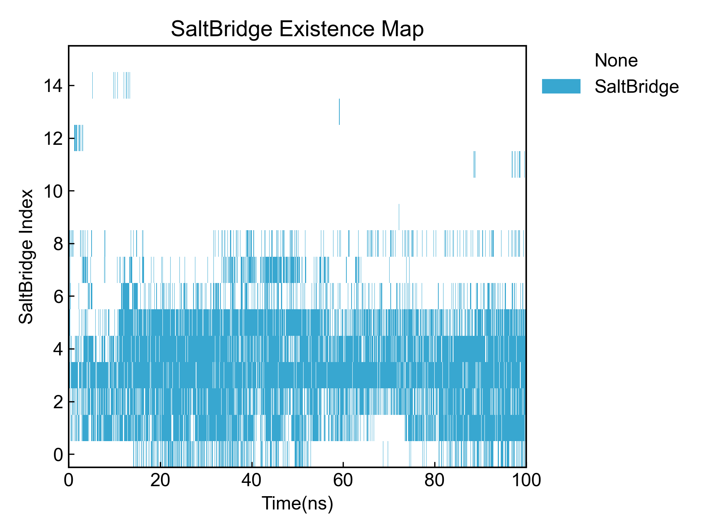
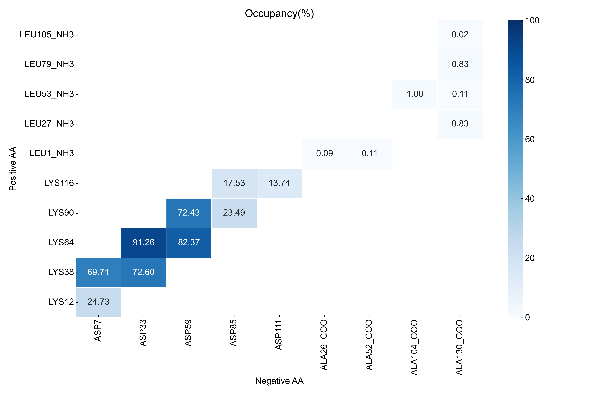
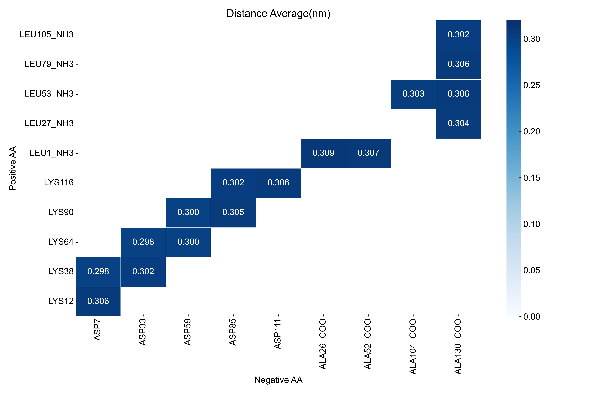
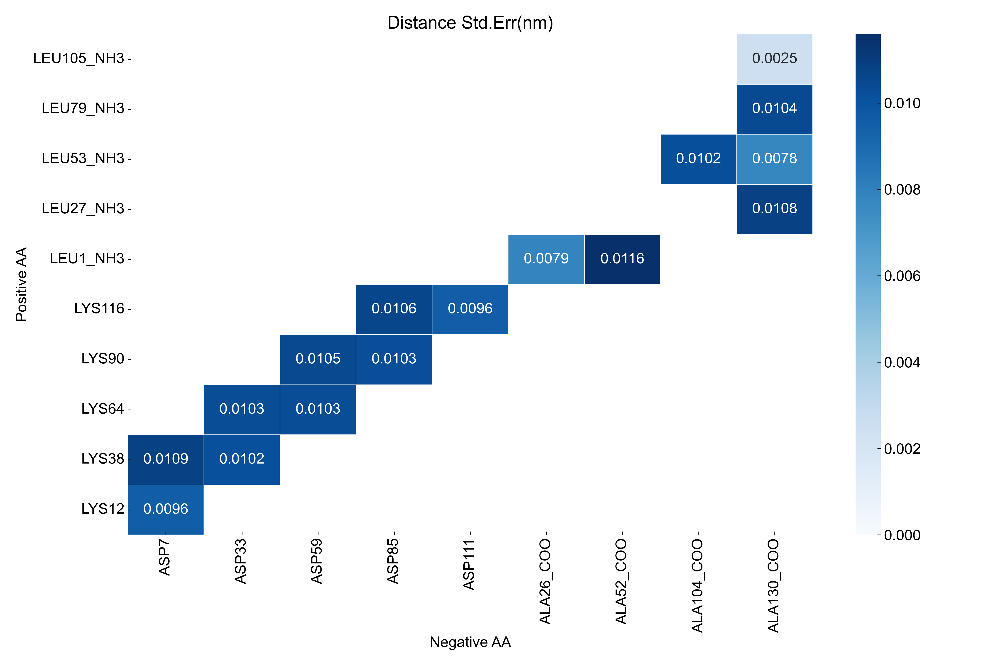

# SaltBridge

This module analyzes salt bridges and outputs salt bridge occupancy, distance, and other information.

Before using this module, please ensure that the [preprocessing](https://duivyprocedures-docs.readthedocs.io/en/latest/Framework.html#id7) has been completed!

## Input YAML

```yaml
- SaltBridge:
    dist_cutoff: 0.32 # nm
    ## ## below atomnames should be adopted to GORMOS forcefield
    ## ## modification need for application !!!
    ## NH3_atomnames: ["N", "H1", "H2", "H3"]
    ## COO_atomnames: ["C", "O1", "O2"]
    ## Backbone_atomnames: ["H", "N", "CA", "C", "O"]
    ## ## below atomnames should be adopted to AMBER forcefield
    ## ## modification need for application !!!
    NH3_atomnames: ["N", "H1", "H2", "H3"]
    COO_atomnames: ["C", "OC1", "OC2"]
    Backbone_atomnames: ["H", "N", "CA", "HA", "C", "O"]
    ## ## below atomnames should be adopted to CHARMM forcefield
    ## ## modification need for application !!!
    ## NH3_atomnames: ["N", "H1", "H2", "H3"]
    ## COO_atomnames: ["C", "OT1", "OT2"]
    ## Backbone_atomnames: ["HN", "N", "CA", "HA", "C", "O"]
    ignore_chain_end: no
    byIndex: yes
    group: protein
    positive_Index: [[118,119,120,121], [343,344,345,346], [568,569,570,571], [793,794,795,796], [1018,1019,1020,1021]]
    negative_Index: [[74,75,76], [299,300,301], [524,525,526], [749,750,751], [974,975,976]]
    calc_lifetime: no
    tau_max: 50  # frame
    window_step: 1 # frame
    intermittency: 0  # allow 0 frame intermittency
```

To calculate salt bridges, you first need to **find atom groups that can form salt bridges**. This module provides two ways to define atom groups: first through index, second through charge.

`dist_cutoff`: Distance threshold for salt bridges, in nm.

`byIndex`: Whether to define atom groups that can form salt bridges through atom indices. If set to `yes`, DIP will read the subsequent `positive_Index` and `negative_Index` parameters. If set to `no`, DIP will automatically search for possible atom groups that can form salt bridges based on the charges in the system.

`positive_Index` and `negative_Index`: Both parameters need to be written in list form. Each element of the list is an atom index (starting from 1) for a group that can form salt bridges. Here in the example, five positively charged groups and five negatively charged groups are defined.

If `byIndex` is `no`, DIP will search for possible atom groups that can form salt bridges based on system charges. However, considering that atom names may differ under different force fields, and C or N terminals that haven't formed peptide bonds may also form salt bridges, **users need to fill in the atom names for COO- and NH3+ according to the force field used to help the program correctly identify all charged groups.** Here we provide atom names that roughly apply to three major force fields by default, but they may not be accurate and need to be modified according to specific system atom naming.

`group`: If `byIndex` is `no`, a group name needs to be specified. DIP will search for possible salt bridge forming groups from this atom group. The default in the example is `protein`, meaning searching for possible salt bridge forming groups from the protein. The atom selection syntax here follows MDAnalysis atom selection syntax. Please refer to: https://userguide.mdanalysis.org/2.7.0/selections.html

`ignore_chain_end`: Whether to ignore chain end residues. If set to `yes`, the program will ignore chain end residues and only calculate charged groups in the middle of the chain.

`calc_lifetime`: Whether to calculate the lifetime of SaltBridge.

`tau_max`: Maximum time for lifetime calculation, in frames. During lifetime calculation, the probability that the SaltBridge continues to exist within `tau_max` frames from time t0 will be calculated. The larger this value, the larger the calculation window.

`window_step`: Window translation step for lifetime, in frames.

`intermittency`: Allowed frame intermittency, i.e., how many frames without SaltBridge formation are still considered as SaltBridge; default is 0, meaning SaltBridge must be continuous to be counted.

This module also has three hidden parameters for frame selection:

```yaml
      frame_start:  # start frame index
      frame_end:   # end frame index, None for all frames
      frame_step:  # frame index step, default=1
```

These parameters can specify the start frame, end frame (exclusive), and frame step for trajectory calculation. By default, users do not need to set these parameters, and the module will automatically analyze the entire trajectory.

For example, to calculate from frame 1000 to frame 5000, every 10 frames:

```yaml
      frame_start: 1000 # start frame index
      frame_end:  5001 # end frame index, None for all frames
      frame_step: 10 # frame index step, default=1
```

If only one or two of the three parameters need to be set, the others can be omitted.


## Output

First and most importantly, **confirm that the selected atom groups are truly atom groups that can form salt bridges**. For this purpose, this module outputs all selected atoms to a pdb file, which users can check themselves. It also outputs groups and corresponding atom indices to a txt file for confirmation and reuse.

Here is an example of atom groups determined by DIP:
```txt
PositiveGroups, Indexs
LYS12, [114, 115, 116, 117, 118, 119, 120, 121]
LYS38, [339, 340, 341, 342, 343, 344, 345, 346]
LYS64, [564, 565, 566, 567, 568, 569, 570, 571]
LYS90, [789, 790, 791, 792, 793, 794, 795, 796]
LYS116, [1014, 1015, 1016, 1017, 1018, 1019, 1020, 1021]
LEU1_NH3, [1, 2, 3, 4, 5]
LEU27_NH3, [226, 227, 228, 229, 230]
LEU53_NH3, [451, 452, 453, 454, 455]
LEU79_NH3, [676, 677, 678, 679, 680]
LEU105_NH3, [901, 902, 903, 904, 905]

NegativeGroups, Indexs
GLU6, [63, 64, 65, 66, 67]
ASP7, [73, 74, 75, 76]
GLU32, [288, 289, 290, 291, 292]
ASP33, [298, 299, 300, 301]
GLU58, [513, 514, 515, 516, 517]
ASP59, [523, 524, 525, 526]
GLU84, [738, 739, 740, 741, 742]
ASP85, [748, 749, 750, 751]
GLU110, [963, 964, 965, 966, 967]
ASP111, [973, 974, 975, 976]
ALA26_COO, [221, 223, 224, 225]
ALA52_COO, [446, 448, 449, 450]
ALA78_COO, [671, 673, 674, 675]
ALA104_COO, [896, 898, 899, 900]
ALA130_COO, [1121, 1123, 1124, 1125]
```

As you can see, it includes both side-chain charged residues and chain-end C and N terminals. There may be extra atoms, but it doesn't matter - the calculation uses the **charge center** method to calculate salt bridge distances, so the calculated charge center distance is quite close to the true charge center distance of the salt bridge.

Of course, users can also write more detailed atom indices based on DIP's guessed atom groups to calculate salt bridges.

Please note that for user-defined index groups, **DIP will not verify charges**, so please ensure the correctness of the index groups.

Then, DIP will calculate distances between oppositely charged index groups, output to xvg files and visualize:



Then DIP will calculate occupancy, average distance and other information for all salt bridges based on cutoff, and output to a CSV file:

```csv
Index,sltbr_name,occupancy(%),Distance(nm)±std.err
0,LYS12-ASP7,24.73%,0.30571183429452803±0.009553231152500079
1,LYS38-ASP7,69.71%,0.29772617816150043±0.010851423343587338
2,LYS38-ASP33,72.60%,0.3020706309117198±0.010160353824107429
3,LYS64-ASP33,91.26%,0.29765932770459613±0.010301294758891728
4,LYS64-ASP59,82.37%,0.29951145689395864±0.010291409591773314
5,LYS90-ASP59,72.43%,0.29980956453438923±0.010493702050064405
6,LYS90-ASP85,23.49%,0.3047599846811428±0.010253587095869455
7,LYS116-ASP85,17.53%,0.30184458300902944±0.010634682623728912
8,LYS116-ASP111,13.74%,0.30592094272894466±0.009563325085837068
9,LEU1_NH3-ALA26_COO,0.09%,0.30902033039109056±0.007861225076848553
10,LEU1_NH3-ALA52_COO,0.11%,0.30721548234549534±0.011591678186110664
11,LEU27_NH3-ALA130_COO,0.83%,0.30404896827304223±0.010835959927730244
12,LEU53_NH3-ALA104_COO,1.00%,0.30281800231986666±0.01019922732848695
13,LEU53_NH3-ALA130_COO,0.11%,0.30573336553168645±0.007787598893830004
14,LEU79_NH3-ALA130_COO,0.83%,0.30617189932657385±0.01041757395335554
15,LEU105_NH3-ALA130_COO,0.02%,0.30225286587195854±0.002515915241203581
```

DIP will also output an occupancy matrix for all salt bridges to xpm file and visualize:



Finally, DIP will generate matrix plots based on salt bridge index group order, including occupancy matrix plot and distance matrix plots:







If lifetime is calculated, the autocorrelation function will be output and visualized; the integral of the autocorrelation function, i.e., the lifetime, will also be output to a CSV file. Note that the lifetime here is obtained by direct Simpson integration of the autocorrelation function data, with moderate accuracy.

If you observe that the function value has not dropped to 0 within the range of the autocorrelation function's independent variable, it indicates that you should appropriately increase the `tau_max` parameter to obtain a more accurate lifetime integral.

## References

If you use this analysis module from DIP, please cite MDAnalysis, DuIvyTools (https://zenodo.org/doi/10.5281/zenodo.6339993), and properly cite this documentation (https://zenodo.org/doi/10.5281/zenodo.10646113).