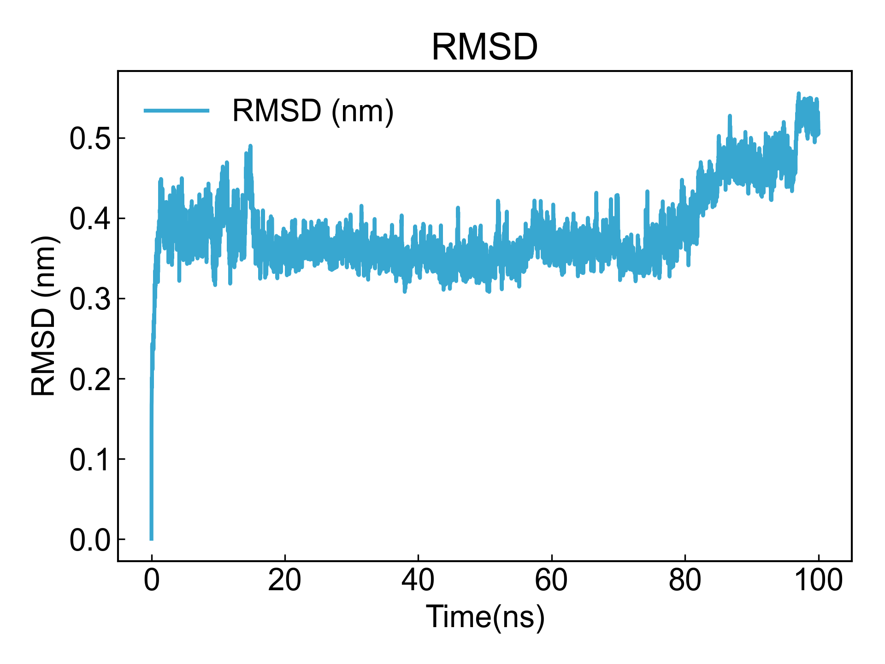

# User_Mod

This module can help users customize some simple analysis methods.

## Input YAML

```yaml
- User_Mod:
    user_commands: []  # file could be copied by bash cmd
```

The `user_commands` field can save a series of bash or cmd commands in list form, which will be executed during DIP execution.

Note that DIP will first enter the directory to be analyzed, such as the MD1 directory containing trajectory files, then create the analysis path `User_Mod` or a custom filename; then execute a series of commands entered by the user under the analysis path.

## Output

Using the following yaml input file to calculate trajectory RMSD:

```yaml
- User_Mod:
    user_commands: [
        "echo Backbone Protein | gmx rms -f ../md.xtc -s ../md.tpr -o rmsd.xvg",
        "dit xvg_show -f rmsd.xvg -xs 0.001 -x Time(ns) -ns -o rmsd.png"
    ]
```

After executing DIP, you can see in the screen display or log:

```txt
[Info] 2024-02-04 10:43:47
>>> run User_Mod module in \test\MD1
[Info] 2024-02-04 10:43:47
Pid 13640 >>> echo Backbone Protein | gmx rms -f ../md.xtc -s ../md.tpr -o rmsd.xvg
[Info] 2024-02-04 10:43:52
Pid 13532 >>> dit xvg_show -f rmsd.xvg -xs 0.001 -x Time(ns) -ns -o rmsd.png
[Info] 2024-02-04 10:43:55
>>> User_Mod module finished !
[Info] 2024-02-04 10:43:55
DIP may you good day ! The run costs 8.98 seconds.
```

Then you can see that rmsd.xvg and rmsd.png files have appeared in the analysis directory.



Other simple analyses can also be customized in this way, including distance calculation, angle calculation, etc. Users can also run custom script files here. DIP will execute these commands in different analysis directories to help users quickly complete analysis tasks.

## References

If you use this analysis module from DIP, please properly cite this documentation.
