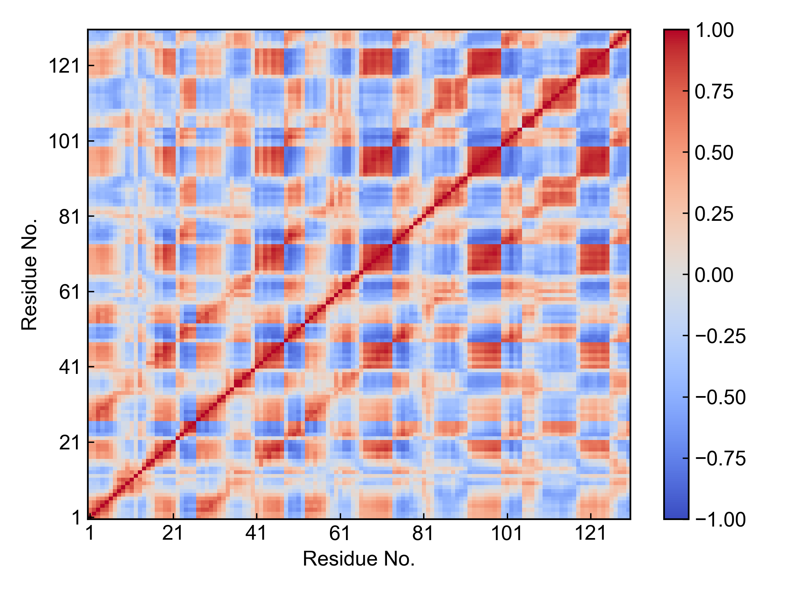

# gmx_DCCM

This module is used to generate the dynamic cross-correlation matrix (DCCM).

This module calls the `gmx covar` command to generate the covariance matrix between user-selected atoms, then converts it to DCCM and visualizes it.

Before using this module, please ensure that the [preprocessing](https://duivyprocedures-docs.readthedocs.io/en/latest/Framework.html#id7) has been completed!

## Input YAML

```yaml
- gmx_DCCM:
    group: C-alpha
```

The input parameters for this module are very simple - you only need to define an atom group for calculating the covariance matrix. For general protein DCCM analysis, calculating for the protein's C-alpha group is sufficient.

## Output

This module outputs the covariance matrix (xpm file), DCCM (xpm file), and DCCM visualization image.



The default output image is relatively simple. If users prefer the bio3D style, they can use the `dit` tool to change the style.

## References

If you use this analysis module from DIP, please cite GROMACS, DuIvyTools (https://zenodo.org/doi/10.5281/zenodo.6339993), and properly cite this documentation (https://zenodo.org/doi/10.5281/zenodo.10646113).
