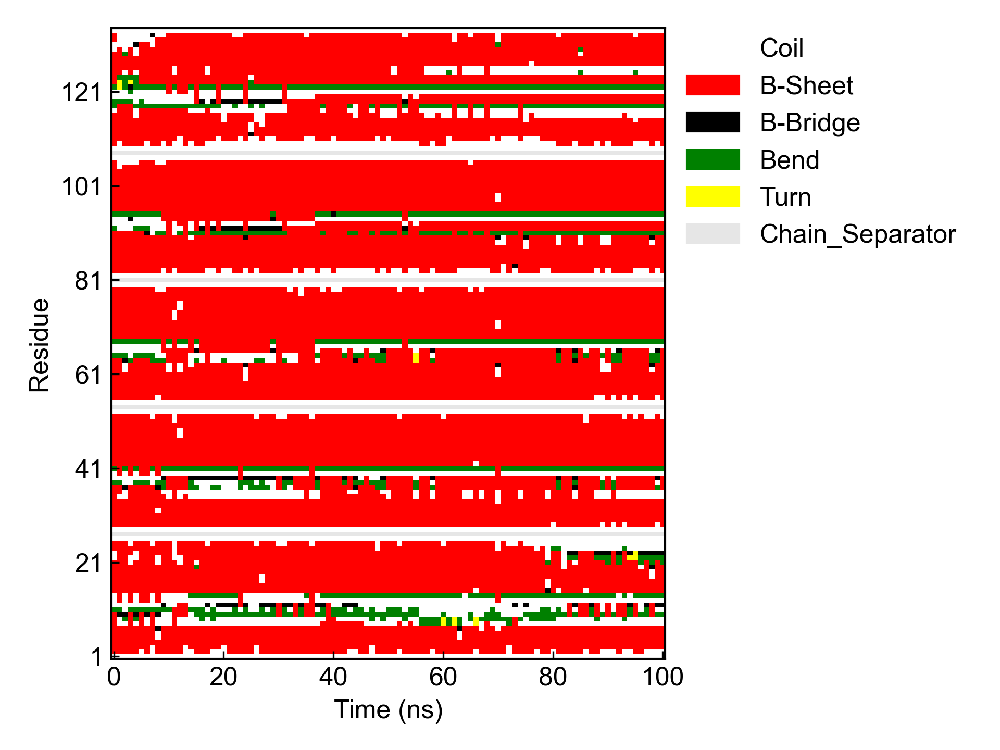
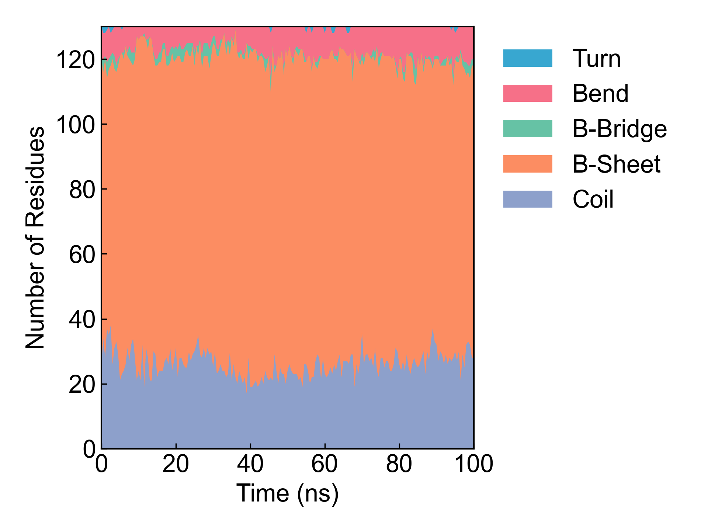

# gmx_DSSP

This module calls GROMACS to perform protein secondary structure (DSSP) calculation.

Before using this module, please ensure that the [preprocessing](https://duivyprocedures-docs.readthedocs.io/en/latest/Framework.html#id7) has been completed!

## Installing DSSP

For GROMACS 2022 and earlier versions, please install the DSSP program and set up the environment variable (reference: https://zhuanlan.zhihu.com/p/380242442).

DSSP has both version 3.0 and 4.0. We need version 3.0.

It is recommended to install DSSP 3.0 using conda for convenience. For example:

Create a new environment and install DSSP in the separate environment:

```bash
conda create -n DSSP 
conda activate DSSP
conda install dssp -c salilab # install DSSP 3.0 which is compatible with GROMACS 2022 and below
```

In the latest test (2024.02.24), it was found that this installation is missing the dependency libboost=1.73.0, so it needs to be installed manually:

```bash
conda install -c conda-forge libboost=1.73.0
```

Check if it runs correctly and add to environment variable:

```bash
mkdssp -h # check if mkdssp is installed correctly

where mkdssp # check the location of mkdssp (which is dssp executable)
## or 
which mkdssp # check the location of mkdssp (which is dssp executable)

## set the environment variable DSSP, could be added to ~/.bashrc
export DSSP=/path/to/mkdssp # set the environment variable DSSP
```

DSSP installed this way is in a separate conda environment and will not conflict with the DIP environment.

On Windows systems, you can directly download the DSSP 3.0 [installation package](https://charles8hahn.pythonanywhere.com/download/DSSP.zip), extract it, and add (create) the mkdssp.exe file to the environment variable DSSP.

For GROMACS 2023 and later versions, you do not need to install the DSSP program.

## Input YAML

```yaml
- gmx_DSSP:
    group: Protein
    gmx_parm:
      tu: ns
      dt: 0.5
```

`group`: The protein group name. The group set here must contain at least the protein backbone atoms.

`gmx_parm`: GROMACS run parameters. Users can customize required parameters such as step size. Here, as an example, the step size is larger to reduce computation time.

## Output

DIP converts the GROMACS output file into a heatmap of protein secondary structure, and a stacked line plot of protein secondary structure content over time.





It also outputs a stacked line plot of protein secondary structure content by residue, which is not shown here.

## References

If you use this analysis module from DIP, please cite GROMACS, DuIvyTools (https://zenodo.org/doi/10.5281/zenodo.6339993), and properly cite this documentation (https://zenodo.org/doi/10.5281/zenodo.10646113).
If the analysis uses the DSSP program, please also cite DSSP.
