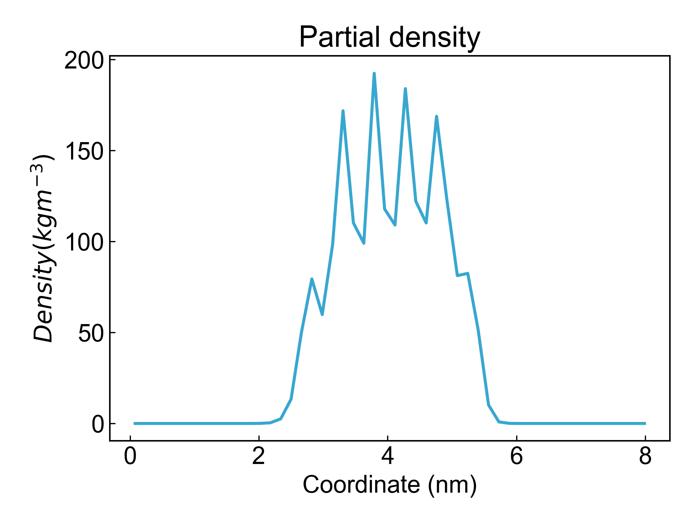

# gmx_Density

This module depends on the `gmx density` command to generate density distribution plots along a certain axis. The default is along the Z-axis.

Before using this module, please ensure that the [preprocessing](https://duivyprocedures-docs.readthedocs.io/en/latest/Framework.html#id7) has been completed!

## Input YAML

```yaml
- gmx_Density:
    calc_group: Protein
    gmx_parm:
      b: 50000
      d: Z
```

`calc_group`: The name of the calculation group, i.e., the atom group for which the density distribution plot will be generated.

`gmx_parm`: You can add `gmx density` command parameters here as needed, such as defining the start and end time of analysis, `d` axis direction, etc. DIP sets the `-o` output parameter by default, so users do not need to add this parameter.

## Output

DIP will visualize the output density distribution plot by default:



## References

If you use this analysis module from DIP, please cite GROMACS, DuIvyTools (https://zenodo.org/doi/10.5281/zenodo.6339993), and properly cite this documentation (https://zenodo.org/doi/10.5281/zenodo.10646113).
