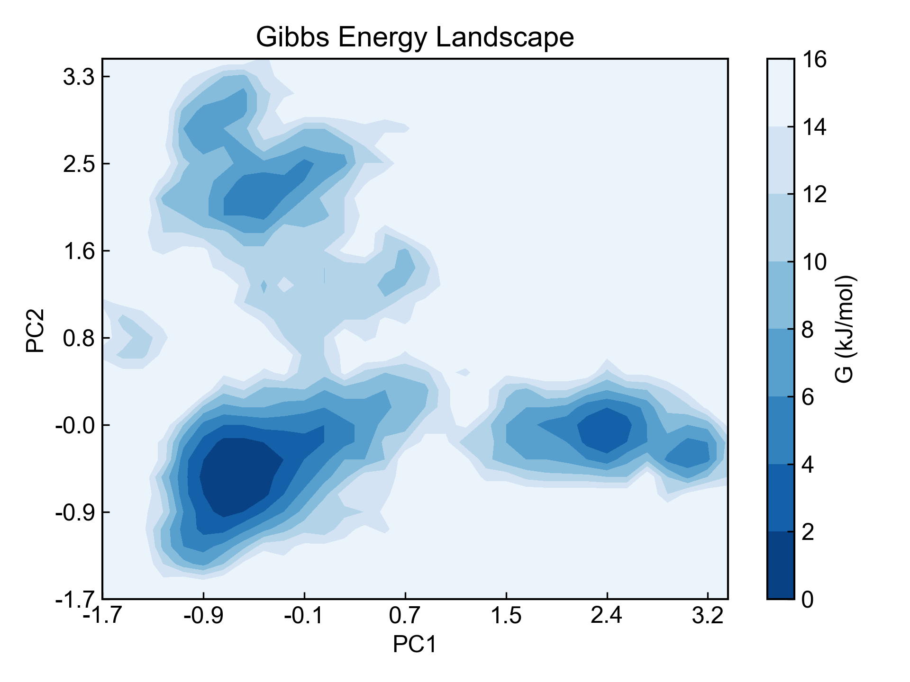
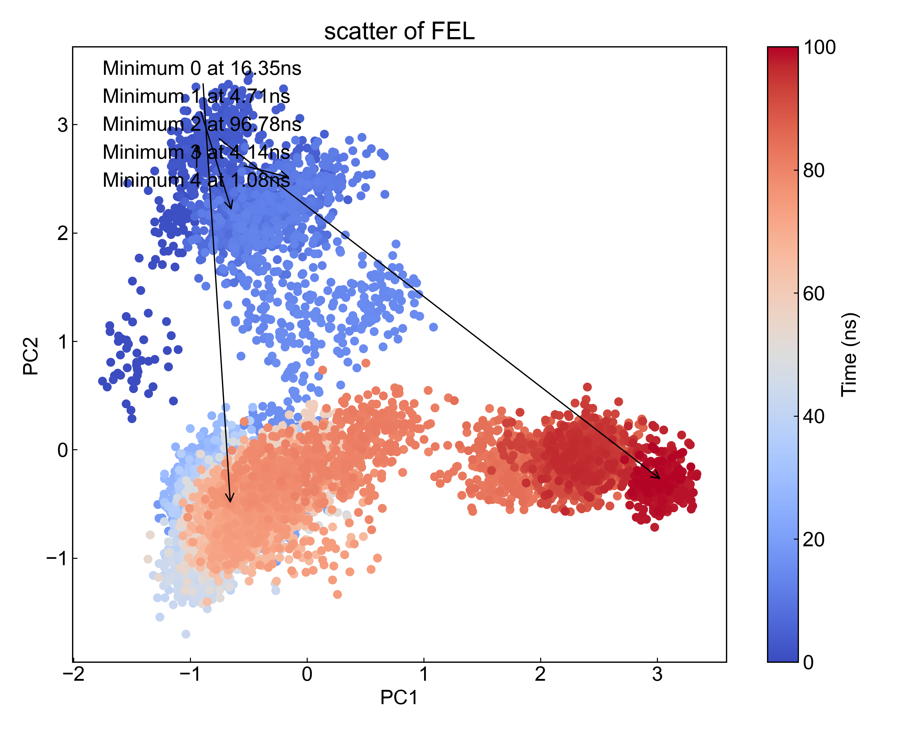

# gmx_FEL

This module uses the `gmx sham` command to plot the Free Energy Landscape (FEL) from a three-column data file (time, first column data, second column data).

## Input YAML

```yaml
- gmx_FEL:
    mkdir: dFEL
    inputfile: ../gmx_dPCA/dpc12.xvg
    find_minimum: true
    minimum_num: 2
    gmx_parm:
      tsham: 310
```

`inputfile`: Input file path, requires three columns of data (time, first column data, second column data). Here we use the results from the previous module as input. Since the results from the previous module are saved in the gmx_dPCA folder, and our analysis module runs in the set `dFEL` directory, which is at the same level as `gmx_dPCA`, the file path here is written as `../gmx_dPCA/dpc12.xvg`.

`find_minimum`: Whether to find local minima. If set to `true`, the program will automatically find local minima in the FEL, mark them, and output the trajectory time frames corresponding to these minima, i.e., pdb files.

`minimum_num`: The number of local minima to find. Users can set how many minima to find, but this value cannot exceed the number of local minima present in the FEL.

`gmx_parm`: Parameters under this will be passed to the `gmx sham` command. Here the `tsham` parameter is set to describe the system temperature. The test system here was simulated at 310K. Parameters such as `-dist -histo -bin -lp -ls -lsh -lss -g` are included by default, so users do not need to add them.

## Output

DIP will visualize all xpm files obtained from `gmx sham` analysis, including gibbs.xpm, prob.xpm, enthalpy.xpm and entropy.xpm. Here only gibbs.xpm is shown:



The gibbs.xpm here uses the `dit -m contour` mode by default. Users can also use `dit` to plot in other styles.

If the user has set to find minima, DIP will find the corresponding trajectory frames and output them to pdb files, here:

```txt
Minimum_0_Protein_17.71ns.pdb
Minimum_1_Protein_75.88ns.pdb
```

And will mark the minimum points in the data scatter plot:




## References

If you use this analysis module from DIP, please cite GROMACS, DuIvyTools (https://zenodo.org/doi/10.5281/zenodo.6339993), and properly cite this documentation (https://zenodo.org/doi/10.5281/zenodo.10646113).
