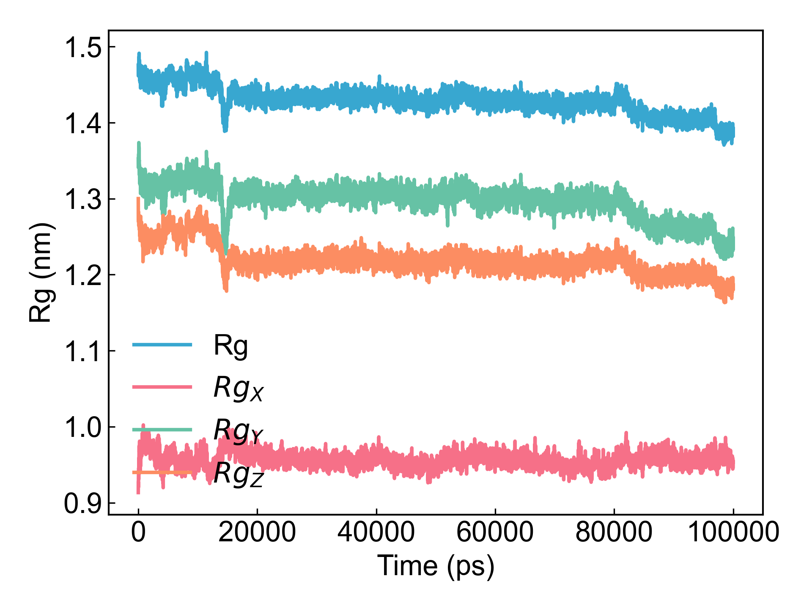

# gmx_Gyrate

This module depends on GROMACS to calculate the radius of gyration for user-selected atom groups.

Before using this module, please ensure that the [preprocessing](https://duivyprocedures-docs.readthedocs.io/en/latest/Framework.html#id7) has been completed!

## Input YAML

```yaml
- gmx_Gyrate:
    calc_group: Protein
```

Very simple parameters - just select a calculation group.
If users need other parameters, such as `gmx gyrate -q`, they can also add them through the `gmx_parm` parameter.

## Output

DIP will plot the xvg data file generated by `gmx gyrate`:



## References

If you use this analysis module from DIP, please cite GROMACS, DuIvyTools (https://zenodo.org/doi/10.5281/zenodo.6339993), and properly cite this documentation (https://zenodo.org/doi/10.5281/zenodo.10646113).
