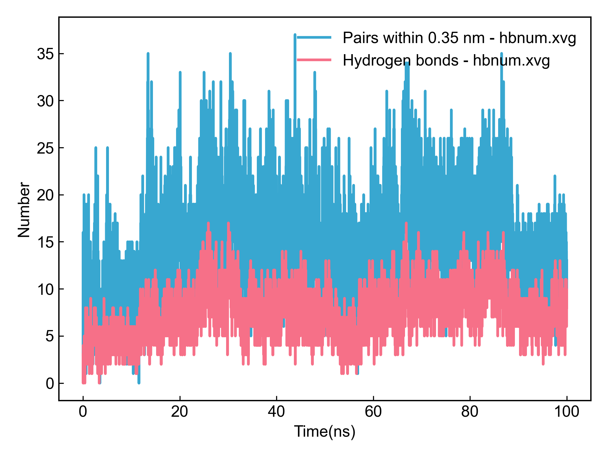
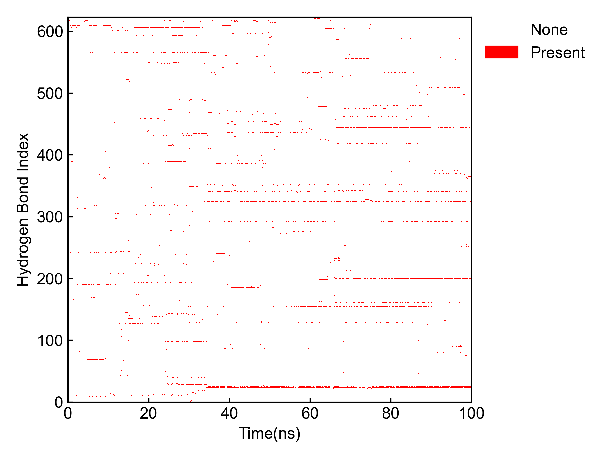
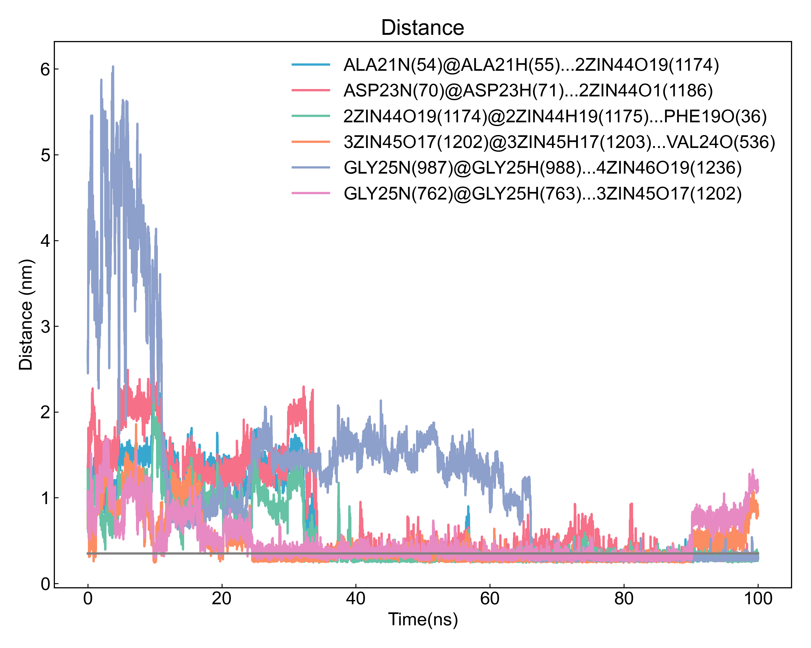
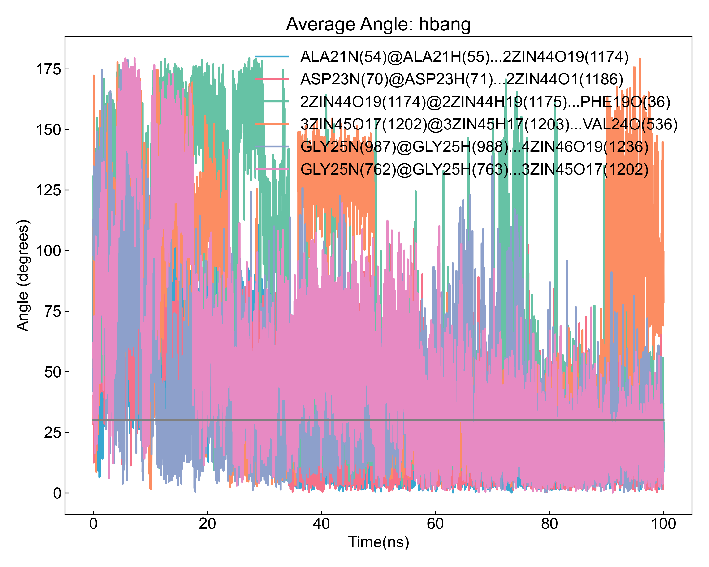
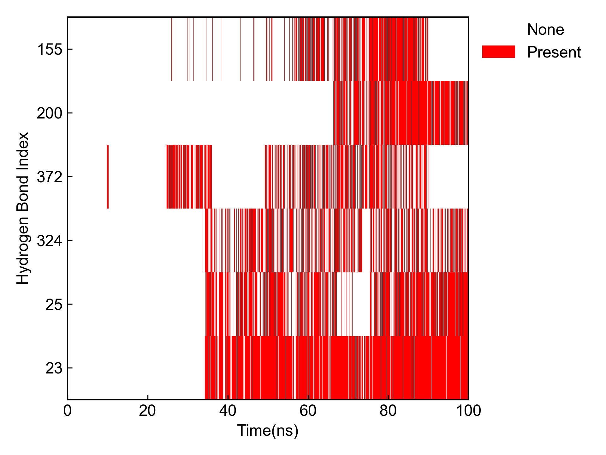

# gmx_Hbond

This module depends on GROMACS to calculate hydrogen bonds, including the number of hydrogen bonds, time occupancy, average distance and angle of hydrogen bond formation, etc.

Before using this module, please ensure that the [preprocessing](https://duivyprocedures-docs.readthedocs.io/en/latest/Framework.html#id7) has been completed!

## Input YAML

```yaml
- gmx_Hbond:
    group1: Protein
    group2: ZIN1 #Ligands # cannot start with a number
    top2show: 6
    only_calc_number: no
    gmx_parm:
      b: 50000
      e: 90000
```

`group1` and `group2` are the two atom groups for hydrogen bond calculation. If you need to calculate hydrogen bonds within the same group of atoms, both groups can be the same. Note that group names cannot start with a number, such as `1ZIN`, which will cause GROMACS to recognize the wrong group.

`top2show` specifies how many hydrogen bonds with the highest occupancy to display, default is 6, can be adjusted as needed.

If you only need to calculate the number of hydrogen bonds, or when the estimated number of hydrogen bonds is very large (e.g., calculating hydrogen bonds between protein and water), you can set `only_calc_number` to `yes`, which means only calculating the number of hydrogen bonds without calculating other parameters.

Under `gmx_parm` parameter, you can write some GROMACS parameters. Since this module involves `gmx hbond`, `gmx distance` and `gmx angle` commands, only 6 parameters are allowed here: `a`, `r`, `da` will only be appended to the `gmx hbond` command, while `b`, `e`, `dt` parameters will be appended to all three commands; other parameters will be ignored.


## Output

First, DIP will visualize the hydrogen bond count plot and hydrogen bond occupancy plot output by `gmx hbond`:





Then DIP will calculate the distance and angle changes over time for the hydrogen bonds with the highest occupancy:





It will also visualize the occupancy of the top hydrogen bonds:



DIP will count the time occupancy, average distance and average angle of all hydrogen bonds, and output to a CSV file:

```csv
id,donor@hydrogen...acceptor,occupancy(%),Present/Frames,Distance Ave(nm),Distance Std.err(nm),Angle Ave(deg),Angle Std.err(deg)
0,LEU34N(383)@LEU34H(384)...1ZIN43O17(1140),0.02,1/4001,0.3030,0.0000,  9.38,0.00  
1,MET35N(392)@MET35H(393)...1ZIN43O12(1133),0.02,1/4001,0.3280,0.0000, 17.28,0.00  
2,MET35N(392)@MET35H(393)...1ZIN43O19(1143),0.05,2/4001,0.3050,0.0283, 23.95,3.43  
3,LEU34N(608)@LEU34H(609)...1ZIN43O12(1133),0.10,4/4001,0.3300,0.0097, 20.82,7.01  
4,LEU34N(608)@LEU34H(609)...1ZIN43O19(1143),0.07,3/4001,0.3103,0.0295, 22.75,2.69  
5,MET35N(617)@MET35H(618)...1ZIN43O19(1143),0.07,3/4001,0.3227,0.0225, 18.74,9.73  
6,LEU34N(833)@LEU34H(834)...1ZIN43O17(1140),0.02,1/4001,0.3160,0.0000, 29.34,0.00  
7,1ZIN43O12(1133)@1ZIN43H12(1134)...GLY33O(157),0.87,35/4001,0.2846,0.0206, 15.18,7.49  
8,1ZIN43O12(1133)@1ZIN43H12(1134)...ILE31O(368),0.10,4/4001,0.3058,0.0311, 23.62,6.99  
9,1ZIN43O12(1133)@1ZIN43H12(1134)...GLY33O(382),3.77,151/4001,0.2892,0.0214, 15.45,6.85  
```

The hydrogen bond name consists of [donor@hydrogen...acceptor]. Each part has the following meaning: residue name, residue number, atom, with atom number in parentheses.

## References

If you use this analysis module from DIP, please cite GROMACS, DuIvyTools (https://zenodo.org/doi/10.5281/zenodo.6339993), and properly cite this documentation (https://zenodo.org/doi/10.5281/zenodo.10646113).
