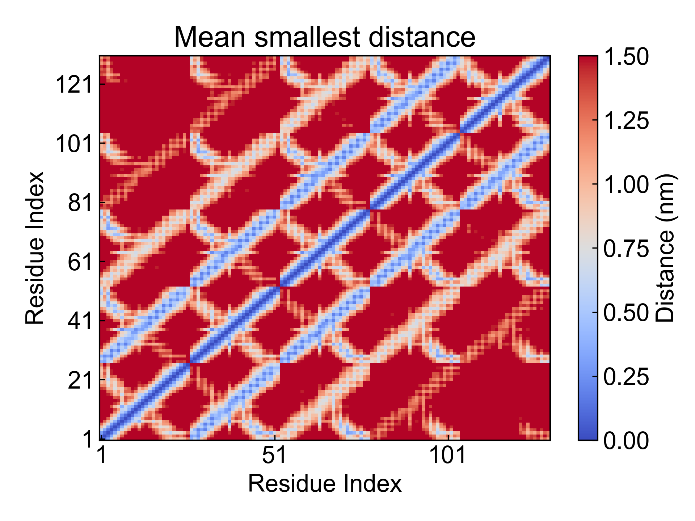
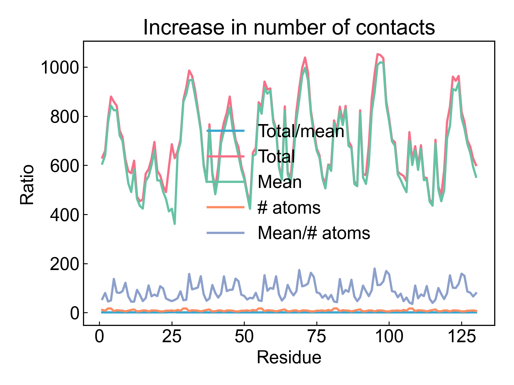

# gmx_Mdmat

This module uses GROMACS to calculate the shortest distance matrix between residues, also known as the residue contact matrix.

Before using this module, please ensure that the [preprocessing](https://duivyprocedures-docs.readthedocs.io/en/latest/Framework.html#id7) has been completed!

## Input YAML

```yaml
- gmx_Mdmat:
    group: Protein
    gmx_parm:
      t: 1.5
```

You only need to determine the group for calculation. You can also set some additional parameters through `gmx_parm`, such as the distance cutoff `-t 1.5` set here. DIP will call `-mean -no` output parameters by default, so these two do not need to be added here.

## Output

DIP will visualize the generated average residue contact matrix and plot the line graph of contact count over time:





## References

If you use this analysis module from DIP, please cite GROMACS, DuIvyTools (https://zenodo.org/doi/10.5281/zenodo.6339993), and properly cite this documentation (https://zenodo.org/doi/10.5281/zenodo.10646113).
