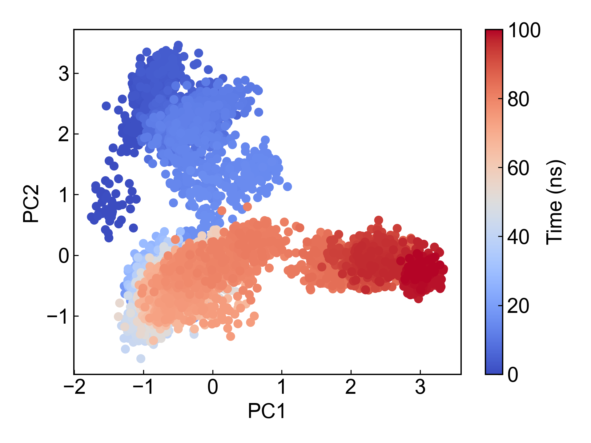
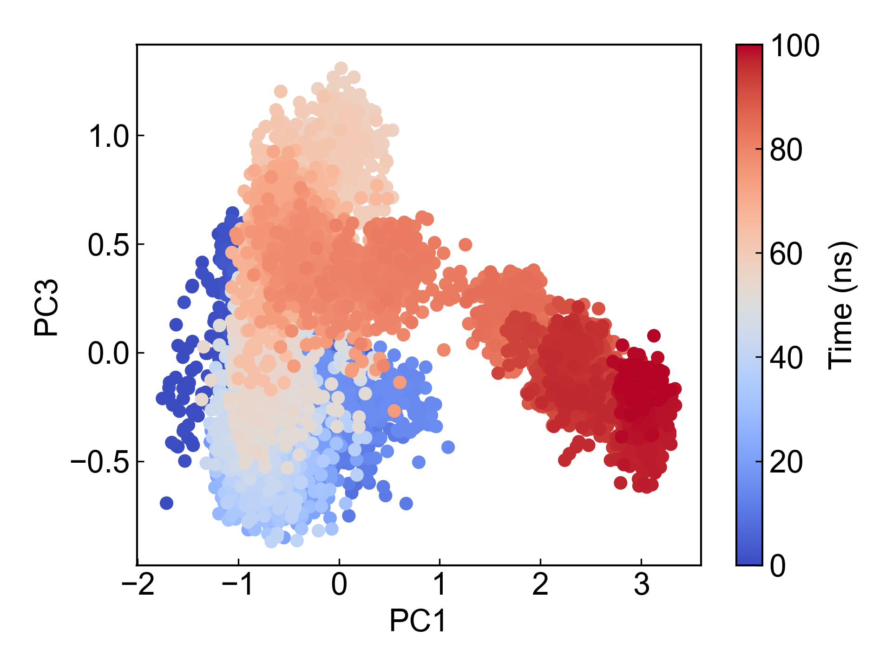
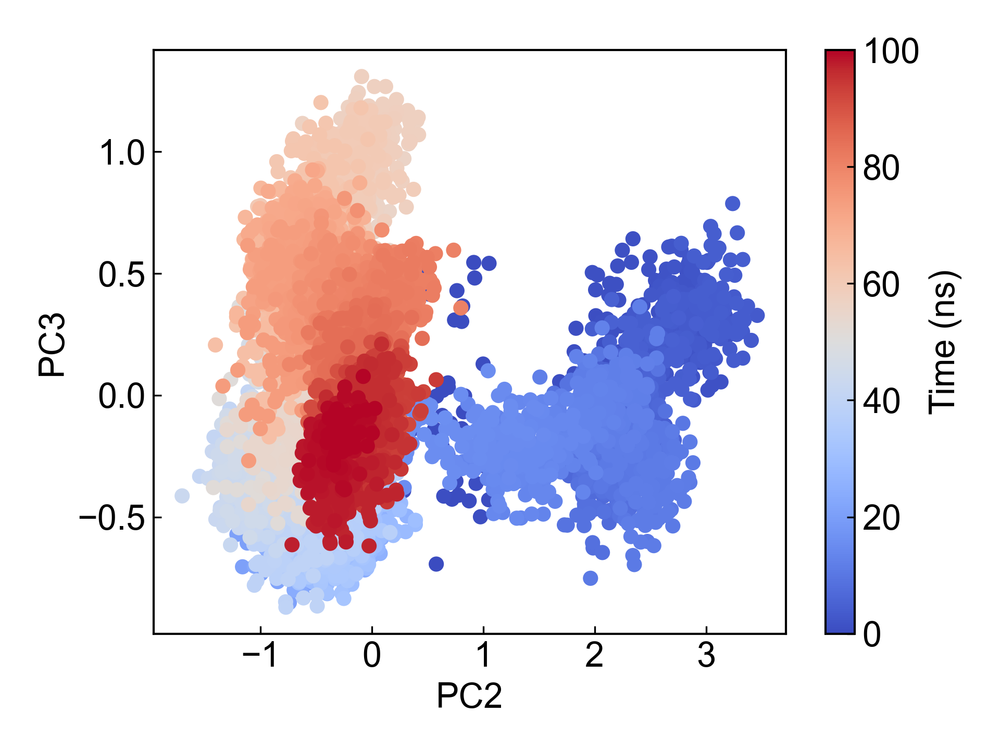
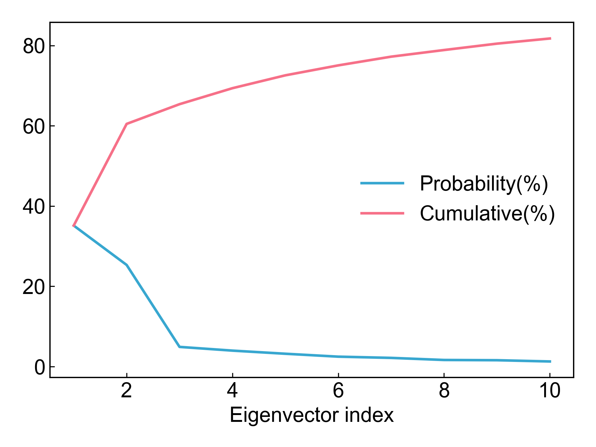
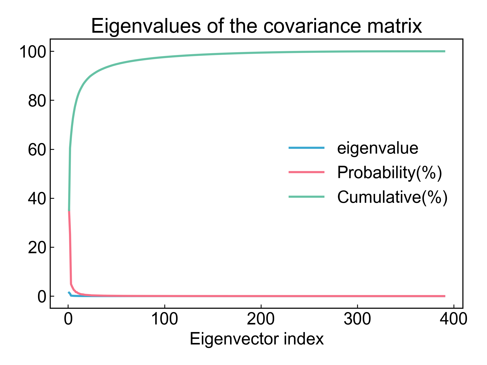

# gmx_PCA

This module depends on GROMACS to perform principal component analysis on the coordinates of selected atom groups.

Before using this module, please ensure that the [preprocessing](https://duivyprocedures-docs.readthedocs.io/en/latest/Framework.html#id7) has been completed!

## Input YAML

```yaml
- gmx_PCA:
    group: C-alpha
    gmx_parm:
      tu: ns
```

`group`: Select the atom group for principal component analysis. For proteins, C-alpha is usually a good choice.

`gmx_parm`: Users can add shared parameters for `gmx covar` and `gmx anaeig` commands here, such as `-b`, `-e` for time control.

## Output

After completing the PCA calculation, this module will export the first three principal components and plot scatter plots for each pair of principal components, as well as a line plot showing the proportion of all and the first 10 principal components.











DIP will also organize xvg files for pairs of the first three principal components, which can be directly used in the `gmx_FEL` module to plot PCA-based free energy landscapes.

The calculation of principal component cosine content is also a check for PCA. DIP will calculate and output the cosine content for each PC. When the cosine content of the first few components is close to 1, it indicates that the PC may correspond to random diffusion, meaning the simulation has not converged and sampling is poor. For more information about cosine content, please refer to Berk Hess. Convergence of sampling in protein simulations. Phys. Rev. E 65, 031910 (2002).

The projections of the extreme values of the first three principal components on the trajectory will also be output to pdb files, such as `pc1_proj.pdb`, which can be visualized using PyMOL or other tools to observe structural changes along the PC direction.

## References

If you use this analysis module from DIP, please cite GROMACS, DuIvyTools (https://zenodo.org/doi/10.5281/zenodo.6339993), and properly cite this documentation (https://zenodo.org/doi/10.5281/zenodo.10646113).
