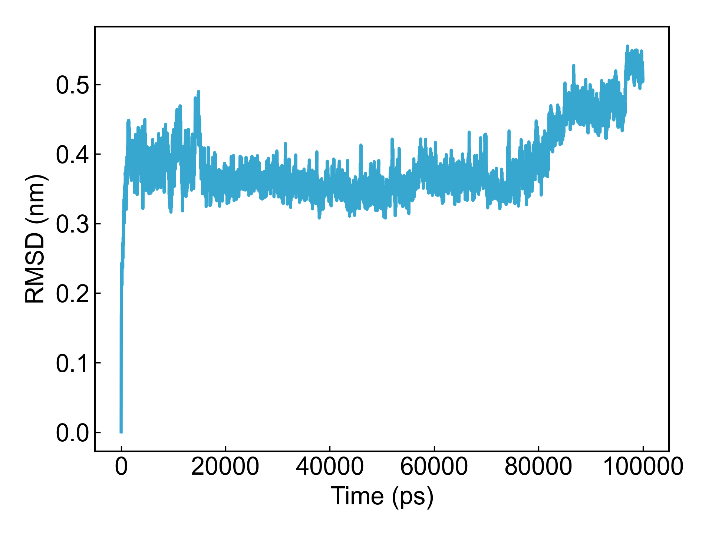
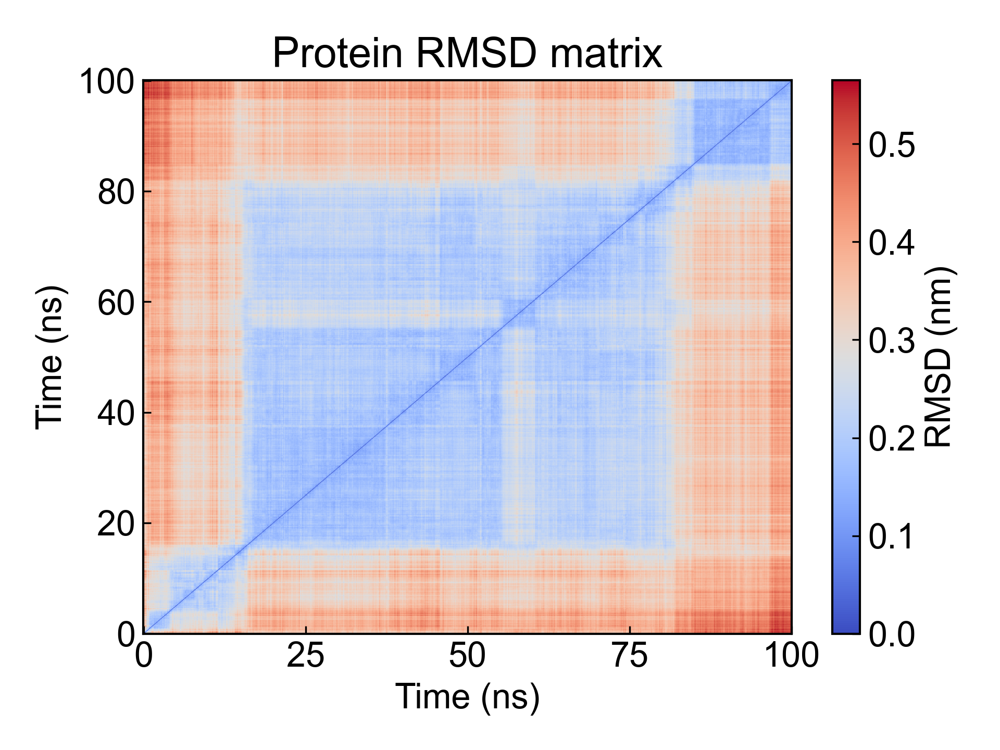

# gmx_RMSD

This module depends on GROMACS to calculate the root mean square deviation (RMSD).

Before using this module, please ensure that the [preprocessing](https://duivyprocedures-docs.readthedocs.io/en/latest/Framework.html#id7) has been completed!

## Input YAML

```yaml
- gmx_RMSD:
    calc_group: Protein
    fit_group: Backbone
    rmsd_matrix: no
```

During the RMSD calculation process, the system needs to be aligned first, then the RMSD between the structure and the reference structure is calculated. Therefore, `fit_group` is used to specify the alignment group, while `calc_group` is used to specify the group for RMSD calculation.

`rmsd_matrix` is used to specify whether to output the inter-frame RMSD matrix. If set to `yes`, the RMSD matrix will be output, but please note that calculating the RMSD matrix is a relatively time-consuming process. Users can set parameters through `gmx_parm` to connect to the `gmx rms` command to reduce the number of frames to calculate, for example:

```yaml
- gmx_RMSD:
    mkdir: RMSD2
    calc_group: Protein
    fit_group: Backbone
    rmsd_matrix: yes
    gmx_parm:
      tu: ns
      dt: 0.1
```

## Output

DIP will plot the calculated RMSD data as a line graph, and if the RMSD matrix is calculated, DIP will also visualize it together.






## References

If you use this analysis module from DIP, please cite GROMACS simulation engine, DuIvyTools (https://zenodo.org/doi/10.5281/zenodo.6339993), and properly cite this documentation (https://zenodo.org/doi/10.5281/zenodo.10646113).