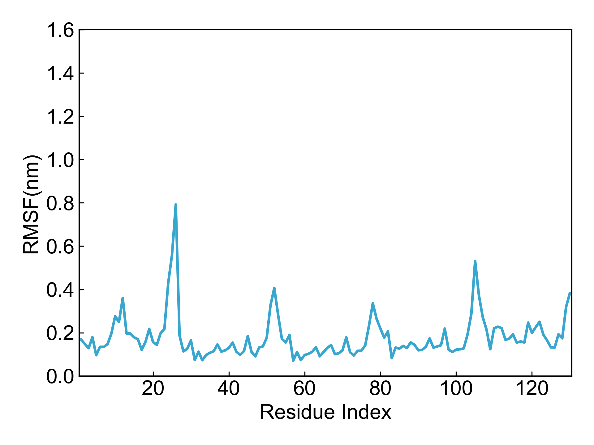

# gmx_RMSF

This module depends on GROMACS to calculate the root mean square fluctuation (RMSF).

Before using this module, please ensure that the [preprocessing](https://duivyprocedures-docs.readthedocs.io/en/latest/Framework.html#id7) has been completed!

## Input YAML

```yaml
- gmx_RMSF:
    calc_group: Protein
    by_residues: true
    multichain: yes
```

`calc_group`: The calculation group, i.e., the atom group for which RMSF will be calculated.

`by_residues`: Whether to calculate RMSF by residues. `no` means calculating by atoms.

`multichain`: Whether the system has multiple chains, i.e., whether residue numbers are duplicated. If duplicated, the plot will show messy lines. When set to yes, DIP will renumber residues during plotting. The example system here contains multiple chains, so it is set to yes.

If you need to add other parameters to the `gmx rmsf` command, you can use the `gmx_parm` parameter.

## Output

DIP will visualize the calculated RMSF data:




## References

If you use this analysis module from DIP, please cite GROMACS, DuIvyTools (https://zenodo.org/doi/10.5281/zenodo.6339993), and properly cite this documentation (https://zenodo.org/doi/10.5281/zenodo.10646113).
