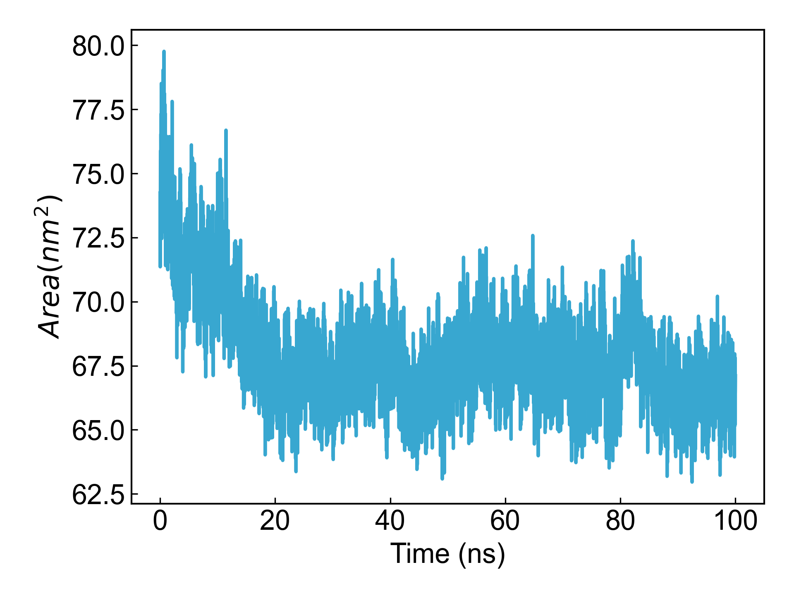

# gmx_SASA

This module depends on GROMACS to calculate the solvent accessible surface area (SASA).

Before using this module, please ensure that the [preprocessing](https://duivyprocedures-docs.readthedocs.io/en/latest/Framework.html#id7) has been completed!

## Input YAML

```yaml
- gmx_SASA:
    group: Protein
    gmx_parm:
      tu: ns
```

`group` parameter sets the atom group for SASA calculation. You can also add parameters through `gmx_parm` that you want to add to the `gmx sasa` command.

## Output

DIP will visualize the calculated area over time:



## References

If you use this analysis module from DIP, please cite GROMACS, DuIvyTools (https://zenodo.org/doi/10.5281/zenodo.6339993), and properly cite this documentation (https://zenodo.org/doi/10.5281/zenodo.10646113).
