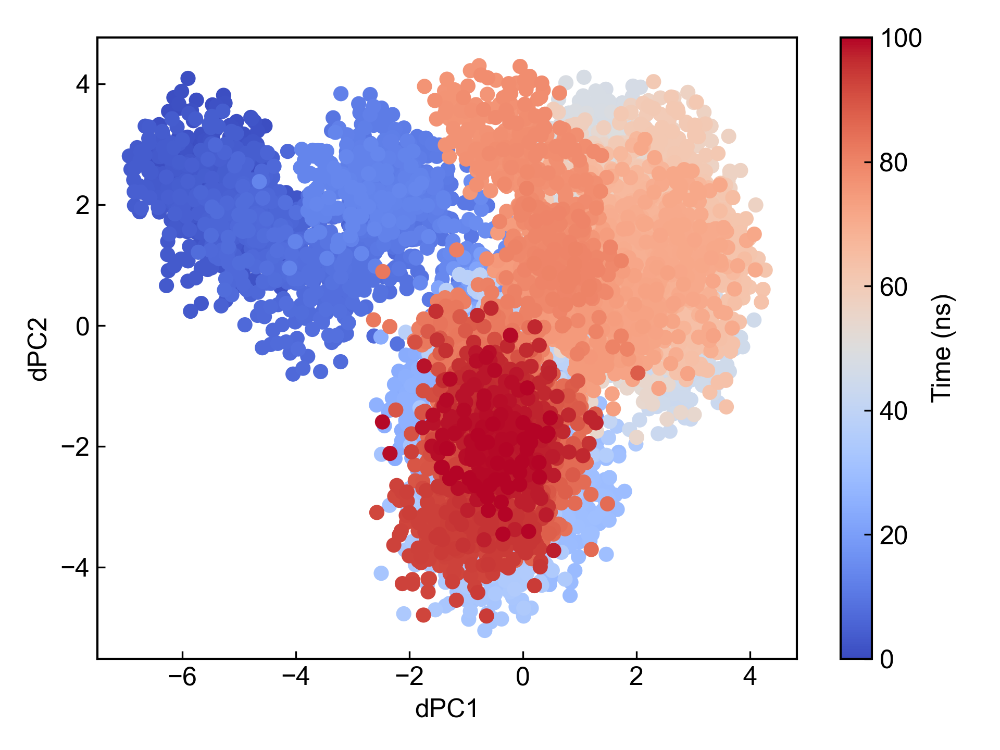
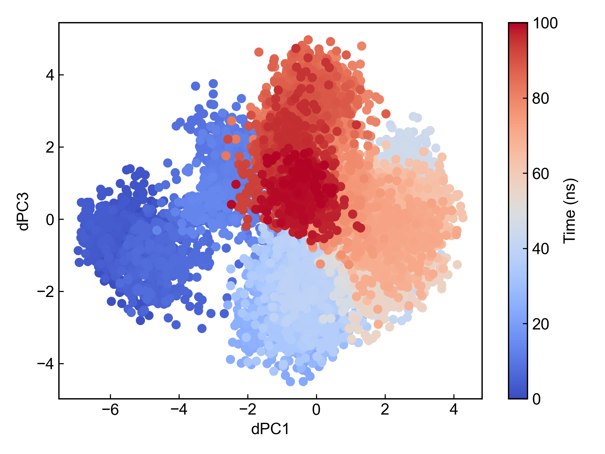
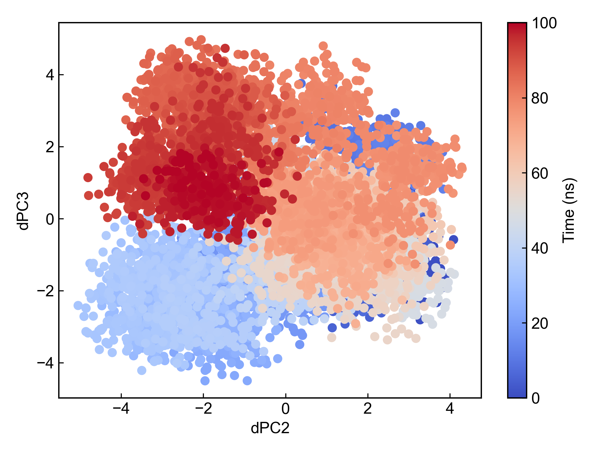
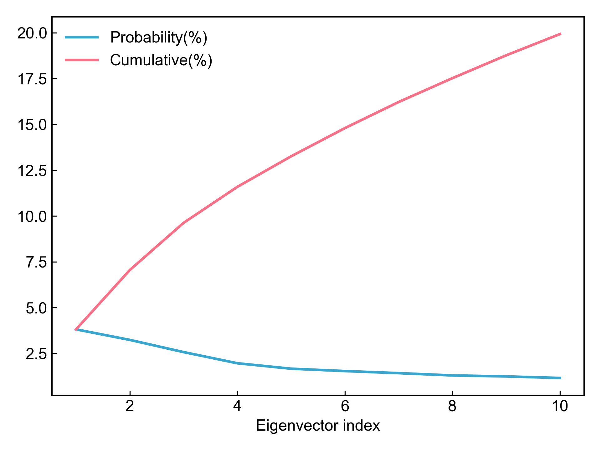
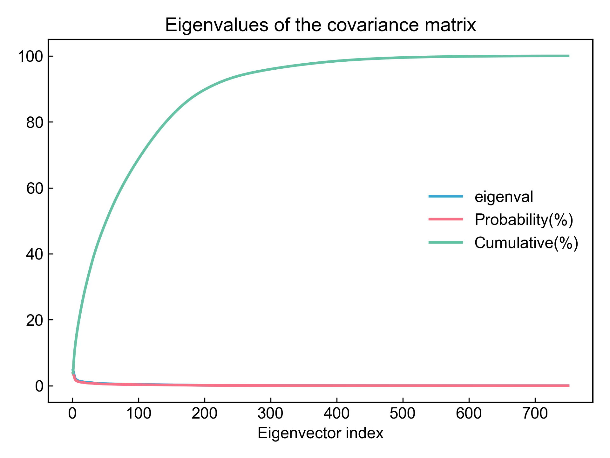

# gmx_dPCA

This module uses GROMACS to perform principal component analysis on protein backbone dihedral angles.

For detailed calculation process, please refer to: https://zhuanlan.zhihu.com/p/479009558

Due to the existence of the `gmx angle` command, the calculation of this module will be very slow. At the same time, considering that DIP does not limit the GROMACS version, and some GROMACS versions may have issues with the `gmx anaeig` command output; plus there are some scientific controversies about dPCA calculation:
- https://doi.org/10.1002/prot.20310
- https://doi.org/10.1063/1.2746330

Therefore, **users are advised to carefully check the analysis results after using this module for dPCA calculation!!!**

Before using this module, please ensure that the [preprocessing](https://duivyprocedures-docs.readthedocs.io/en/latest/Framework.html#id7) has been completed!

## Input YAML

```yaml
- gmx_dPCA:
    group: Protein
    fast_mode: no
    gmx_parm:
      tu: ns
```

`group`: Protein group name, i.e., `Protein`, or other groups containing backbone atoms can be selected.
`gmx_parm`: This module involves multiple GROMACS commands, the gmx_parm parameter here will only be added to the `gmx anaeig` command for exporting principal components, so users can generally customize parameters for the `gmx anaeig` command.

`fast_mode`: Whether to use fast mode. During dPCA analysis, there is a step where `gmx angle` generates a dihedral angle trr file. Since this command performs some statistical calculations after generating the trr file, it takes a very long time to wait. If the user sets `fast_mode: yes`, DIP will not wait for the `gmx angle` command to complete. After the dangle.trr file is generated, DIP will kill the `gmx angle` process and continue with subsequent calculations. **Note that on Windows systems, the `gmx angle` command may not be killed due to various reasons, but this does not affect DIP's calculation. Users can manually kill the `gmx angle` process.**

**Note that because this analysis method depends on GROMACS and has some dirty tricks, it cannot be guaranteed to always complete successfully.** For example, if one of the three coordinate values of an "atom" in the trr file storing dihedral angles is 0, GROMACS will report an error and the program cannot continue.


## Output

After completing the dPCA calculation, this module will export the first three principal components and plot scatter plots for each pair of principal components, as well as a line plot showing the proportion of all and the first 10 principal components.











DIP will also organize xvg files for pairs of the first three principal components, which can be directly used in the `gmx_FEL` module to plot dPCA-based free energy landscapes.

The calculation of principal component cosine content is also a check for PCA. DIP will calculate and output the cosine content for each PC. When the cosine content of the first few components is close to 1, it indicates that the PC may correspond to random diffusion, meaning the simulation has not converged and sampling is poor. For more information about cosine content, please refer to Berk Hess. Convergence of sampling in protein simulations. Phys. Rev. E 65, 031910 (2002).


## References

If you use this analysis module from DIP, please cite GROMACS, DuIvyTools (https://zenodo.org/doi/10.5281/zenodo.6339993), and properly cite this documentation (https://zenodo.org/doi/10.5281/zenodo.10646113).

Please also cite the relevant literature on dPCA:
- https://doi.org/10.1002/prot.20310
- https://doi.org/10.1063/1.2746330
