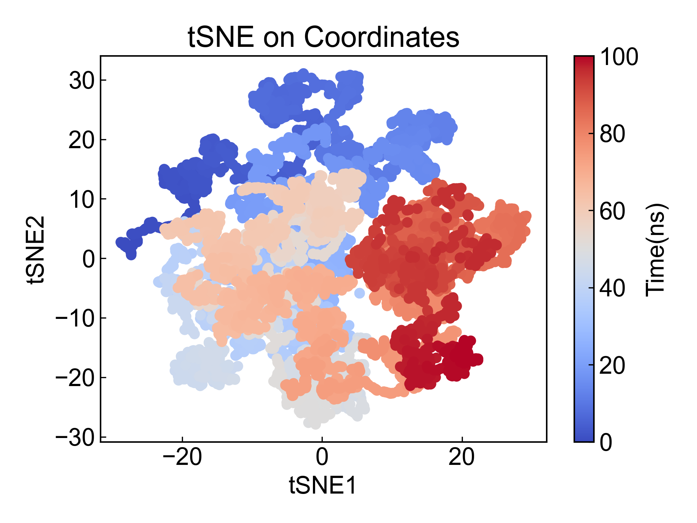
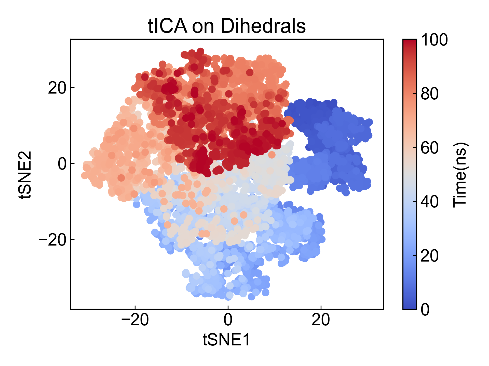

# tSNE

t-distributed Stochastic Neighbor Embedding (tSNE) is a dimensionality reduction method. This module implements tSNE analysis based on coordinates and dihedral angles.

Before using this module, please ensure that the [preprocessing](https://duivyprocedures-docs.readthedocs.io/en/latest/Framework.html#id7) has been completed!

## Input YAML

```yaml
- tSNE:
    atom_selection: protein and name CA
    byType: atom # res_com, res_cog, res_coc
    target: coordinates
- tSNE:
    mkdir: tSNE_d
    atom_selection: protein
    byType: atom # res_com, res_cog, res_coc
    target: dihedrals
```

Here we list the parameters for both coordinate-based and dihedral-based tSNE analysis.

`atom_selection`: Atom selection for specifying the atom group for tSNE. If performing dihedral analysis, the selected atom group must contain atoms that form backbone dihedral angles. The atom selection syntax here follows MDAnalysis atom selection syntax. Please refer to: https://userguide.mdanalysis.org/2.7.0/selections.html

`byType`: Specifies the method for coordinate-based dimensionality reduction, only effective when `target` is `coordinates`. There are four options: `atom`, `res_com`, `res_cog`, `res_coc`. `atom` calculates dimensionality reduction of all selected atom coordinates; commonly, you can select CA atoms in `atom_selection` with `protein and name CA` to calculate protein dimensionality reduction; `res_com` calculates dimensionality reduction of each residue's center of mass; `res_cog` calculates dimensionality reduction of each residue's geometric center; `res_coc` calculates dimensionality reduction of each residue's charge center. When using `res_com`, `res_cog` or `res_coc`, the atom selector should contain all atoms of the selected residues, otherwise only the center of mass, geometric center, or charge center of selected atoms within a residue will be calculated.

`target`: The target for tSNE, can be `coordinates` or `dihedrals`. If `coordinates` is selected, tSNE will be based on atom coordinates; if `dihedrals` is selected, tSNE will be based on dihedral angles.

**Note**: The dPCA literature discusses that dihedral angles differ from coordinates - dihedral angles are periodic. Therefore, dPCA articles apply trigonometric transformation to angles before PCA analysis. This module also converts dihedral angles to sin and cos values before dimensionality reduction analysis. **Users performing dihedral angle dimensionality reduction analysis with this module should carefully compare with the literature to verify if the calculation process is appropriate! If uncertain, please do not use this module's dihedral angle dimensionality reduction analysis** For any questions or improvement suggestions, please contact Du Ruo. Du Ruo and Du Ivy welcome any suggestions and arguments. Thank you very much!

This module also has three hidden parameters for frame selection:

```yaml
      frame_start:  # start frame index
      frame_end:   # end frame index, None for all frames
      frame_step:  # frame index step, default=1
```

These parameters can specify the start frame, end frame (exclusive), and frame step for trajectory calculation. By default, users do not need to set these parameters, and the module will automatically analyze the entire trajectory.

For example, to calculate DCCM from frame 1000 to frame 5000, every 10 frames:

```yaml
      frame_start: 1000 # start frame index
      frame_end:  5001 # end frame index, None for all frames
      frame_step: 10 # frame index step, default=1
```

If only one or two of the three parameters need to be set, the others can be omitted.


## Output

This module saves the first three components to xvg files and creates pairwise scatter plots for visualization.

Here only the results for the first two components are shown:






## References

If you use this analysis module from DIP, please cite MDAnalysis, scikit-learn (https://scikit-learn.org/stable/about.html#citing-scikit-learn), DuIvyTools (https://zenodo.org/doi/10.5281/zenodo.6339993), and properly cite this documentation (https://zenodo.org/doi/10.5281/zenodo.10646113).
