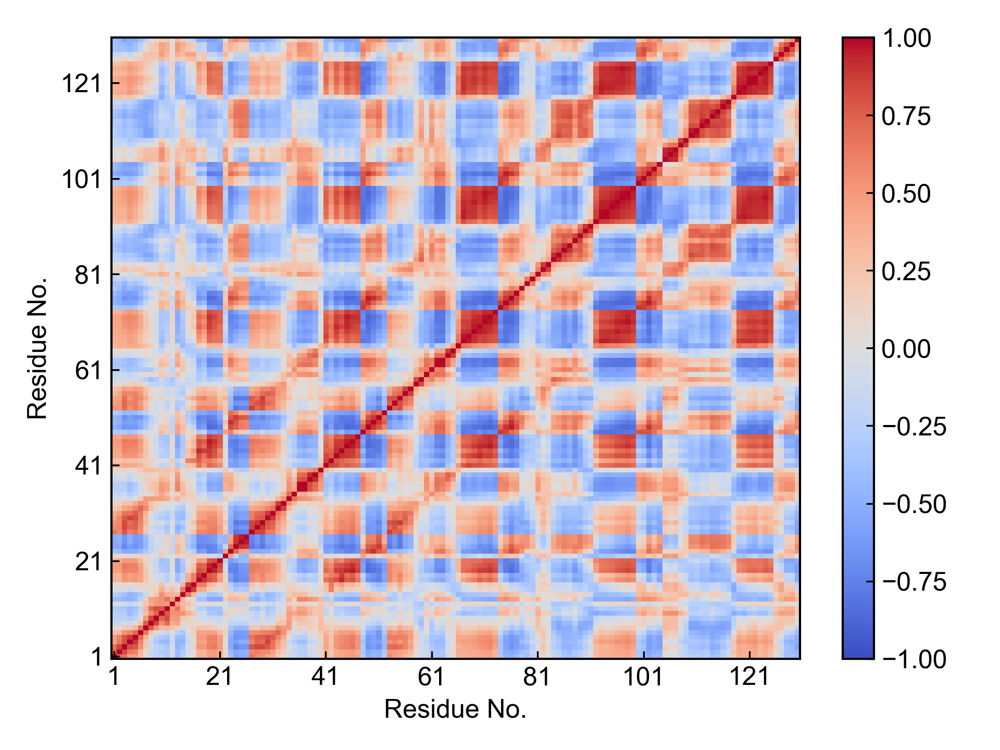

# gmx_DCCM

本模块用于生成动态互相关矩阵（DCCM）。

本模块调用`gmx covar`命令生成用户所选原子之间的协方差矩阵，之后将之转化成DCCM并可视化。

## Input YAML

```yaml
- gmx_DCCM:
    group: C-alpha
```

本模块的输入参数非常简单，只需要定义一个用于计算协方差矩阵的原子组就行了。一般的绘制蛋白质DCCM的分析，只需要对蛋白质的C-alpha组进行计算即可。

## Output

该模块会输出协方差矩阵(xpm文件)、DCCM(xpm文件)以及DCCM的可视化图片。



默认输出的图片是比较朴素的，用户如果喜欢bio3D的风格，可以使用`dit`软件自行更改风格。

## References

如果您使用了DIP的本分析模块，请一定引用GROMACS模拟引擎、DuIvyTools(https://zenodo.org/doi/10.5281/zenodo.6339993)，以及合理引用本文档(https://zenodo.org/doi/10.5281/zenodo.10646113)。

