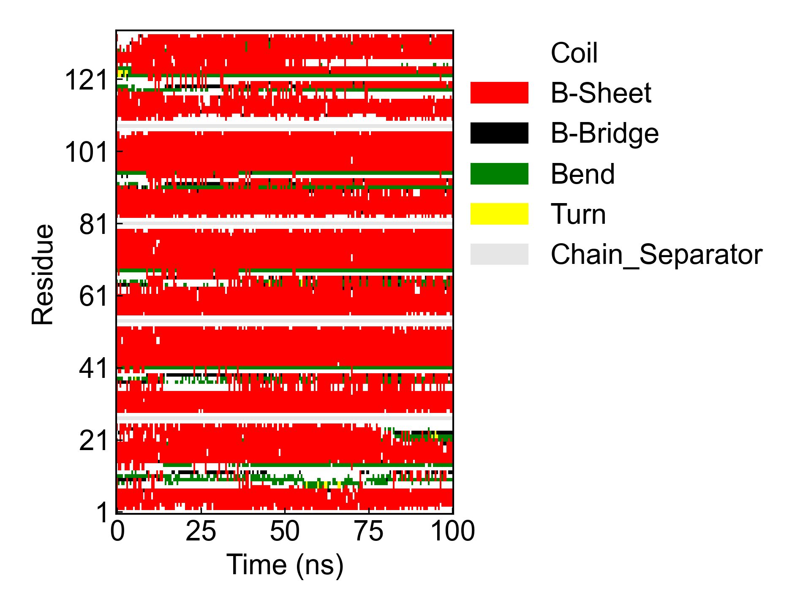
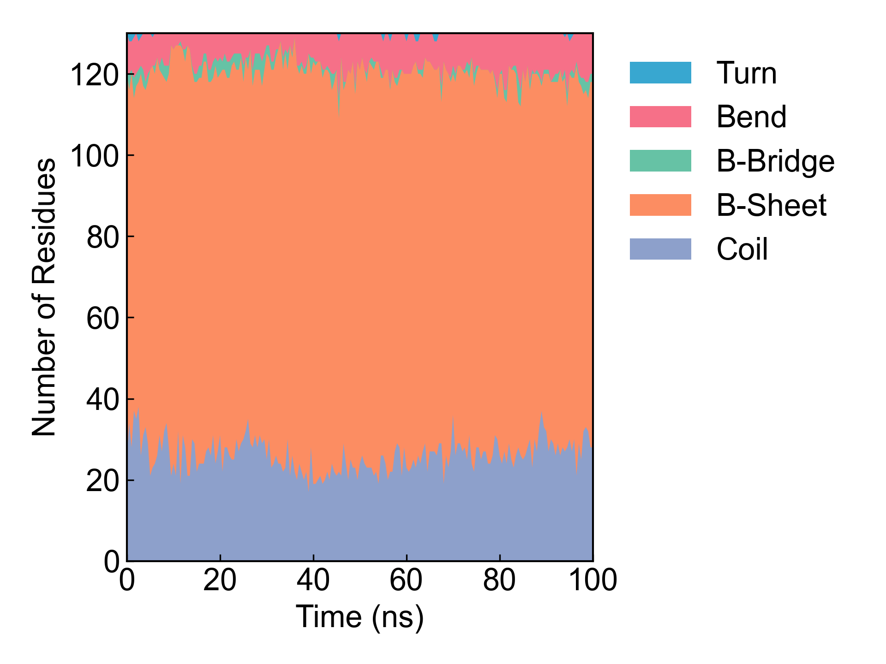

# gmx_DSSP

本模块用于调用GROMACS完成蛋白质的二级结构（DSSP）计算。

使用本模块前请注意[前置处理](https://duivyprocedures-docs.readthedocs.io/en/latest/Framework.html#id7)已经完成！

## 安装DSSP程序

对于GROMACS2022及以下的GROMACS版本，请自行安装好DSSP程序并设置好环境变量（可参考：https://zhuanlan.zhihu.com/p/380242442）。

DSSP同时存在3.0和4.0的版本，我们需要的是3.0版本。

建议使用conda安装DSSP3.0，会比较方便，例如：

新建环境并在新的独立环境中安装DSSP程序

```bash
conda create -n DSSP 
conda activate DSSP
conda install dssp -c salilab # install DSSP 3.0 which is compatible with GROMACS 2022 and below
```

在最新的测试(2024.02.24)中发现这样安装会缺依赖libboost=1.73.0，因此需要手动安装：

```bash
conda install -c conda-forge libboost=1.73.0
```

检查能否正常运行，并添加到环境变量：

```bash
mkdssp -h # check if mkdssp is installed correctly

where mkdssp # check the location of mkdssp (which is dssp executable)
## or 
which mkdssp # check the location of mkdssp (which is dssp executable)

## set the environment variable DSSP, could be added to ~/.bashrc
export DSSP=/path/to/mkdssp # set the environment variable DSSP
```

这样安装的DSSP是在一个单独的conda环境中的，和DIP环境不会冲突。

Windows系统下，可以直接下载DSSP3.0[安装包](https://charles8hahn.pythonanywhere.com/download/DSSP.zip)，解压后将mkdssp.exe文件添加（新建）到环境变量DSSP中。

对于GROMACS2023及以后的版本，则不需要安装DSSP程序。

## Input YAML

```yaml
- gmx_DSSP:
    group: Protein
    gmx_parm:
      tu: ns
      dt: 0.5
```

`group`：蛋白质的组名，这里设置的组必须至少包含蛋白质的骨架原子。

`gmx_parm`：GROMACS的运行参数，用户可以自定义需要的步长等参数，这里作为示例，步长较长以减小计算量。

## Output

DIP会将GROMACS的输出文件转化为蛋白质二级结构的热图，以及蛋白质二级结构含量随时间的堆积折线图。





## References

如果您使用了DIP的本分析模块，请一定引用GROMACS模拟引擎、DuIvyTools(https://zenodo.org/doi/10.5281/zenodo.6339993)，以及合理引用本文档(https://zenodo.org/doi/10.5281/zenodo.10646113)。
如果分析用到了DSSP程序，还请一定引用DSSP程序。

