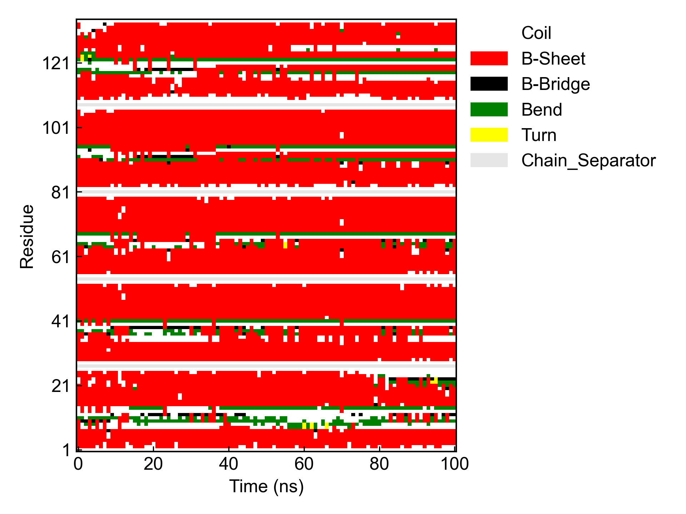

# gmx_DSSP

本模块用于调用GROMACS完成蛋白质的二级结构（DSSP）计算。

对于GROMACS2022及一下的GROMACS版本，请自行安装好DSSP程序并设置好环境变量（可参考：https://zhuanlan.zhihu.com/p/380242442）。

对于GROMACS2023及以后的版本，则不需要安装DSSP程序。

## Input YAML

```yaml
- gmx_DSSP:
    group: Protein
    gmx2023: False
    gmx_parm:
      tu: ns
      dt: 0.5
```

`group`：蛋白质的组名，这里设置的组必须至少包含蛋白质的骨架原子。

`gmx2023`：是否使用GROMACS2023及以后的版本。因为不同版本调用和处理方式不同，需要这里手动设置一下。

`gmx_parm`：GROMACS的运行参数，用户可以自定义需要的步长等参数，这里作为示例，步长较长以减小计算量。

## Output

DIP会将GROMACS的输出文件转化为蛋白质二级结构的热图，以及蛋白质二级结构含量随时间的堆积折线图。




## References

如果您使用了DIP的本分析模块，请一定引用GROMACS模拟引擎、DuIvyTools(https://zenodo.org/doi/10.5281/zenodo.6339993)，以及合理引用本文档。
如果分析用到了DSSP程序，还请一定引用DSSP程序。

