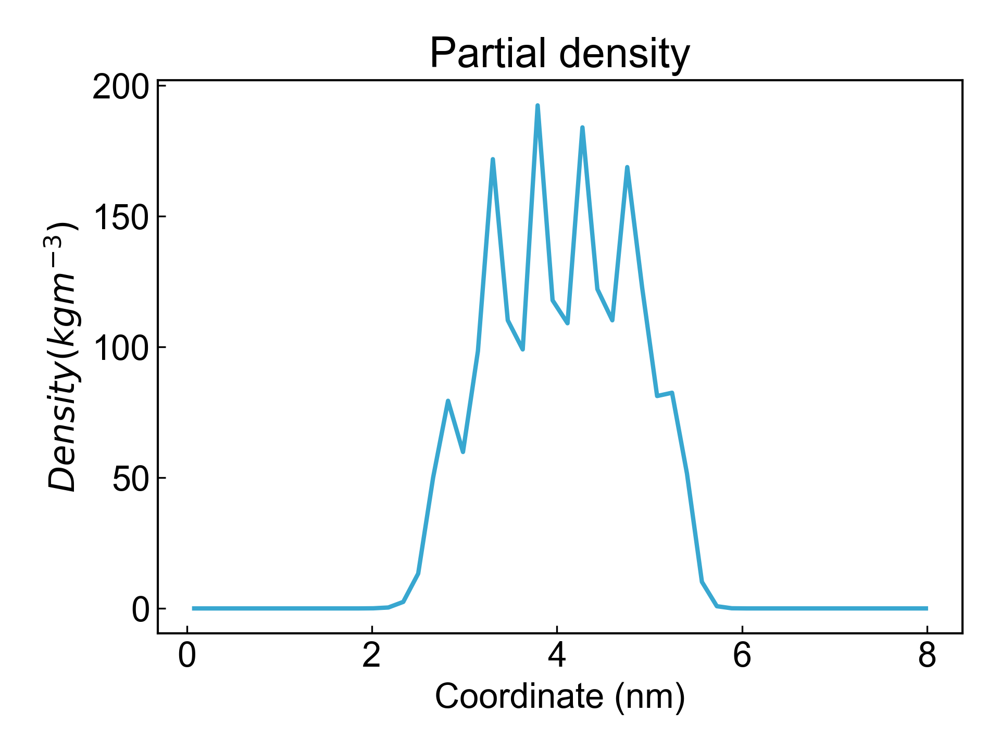

# gmx_Density

本模块用于依赖`gmx density`命令生成体系沿某一轴向方向上的密度分布图。默认是沿z轴方向。

## Input YAML

```yaml
- gmx_Density:
    calc_group: Protein
    gmx_parm:
      b: 50000
      d: Z
```

`calc_group`：计算组的名称，即需要生成密度分布图的原子组。

`gmx_parm`：可以在这里添加用户想要添加的`gmx density`命令参数，如定义分析的起止时间、`d`轴向方向等。DIP默认设置了`-o`输出参数，因而用户不需要再添加此参数了。

## Output

DIP默认会可视化输出的密度分布图，如下：



## References

如果您使用了DIP的本分析模块，请一定引用GROMACS模拟引擎、DuIvyTools(https://zenodo.org/doi/10.5281/zenodo.6339993)，以及合理引用本文档。


