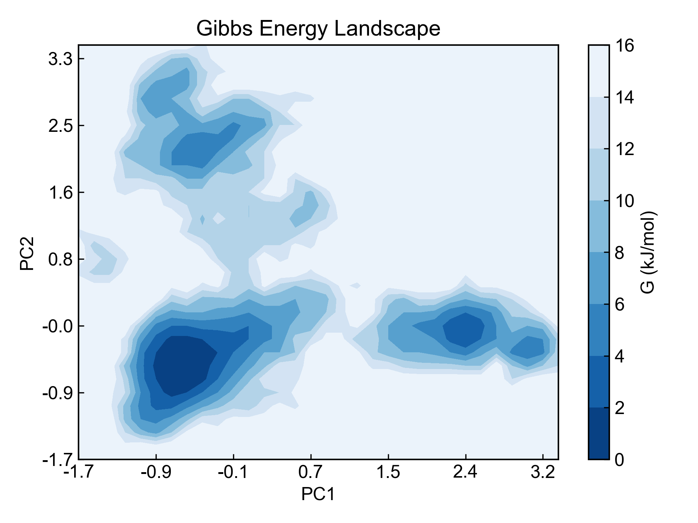
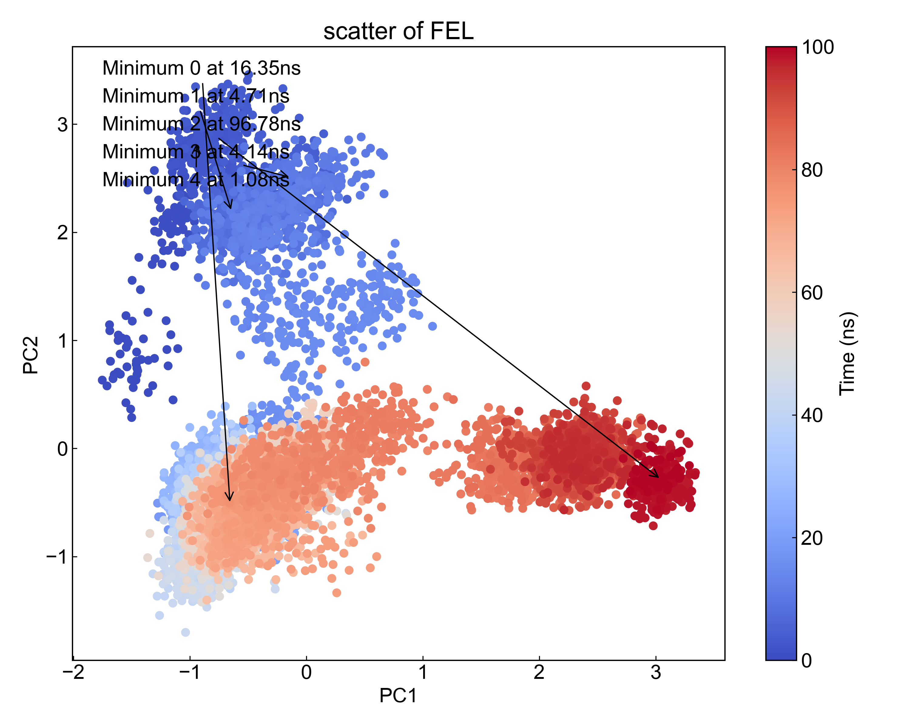

# gmx_FEL

本模块用于从三列数据（时间、第一列数据、第二列数据）的文件出发，利用`gmx sham`命令绘制自由能形貌图（Free Energy Landscape）（FEL）。

## Input YAML

```yaml
- gmx_FEL:
    mkdir: dFEL
    inputfile: ../gmx_dPCA/dpc12.xvg
    find_minimum: true
    minimum_num: 2
    gmx_parm:
      tsham: 310
```

`inputfile`：输入文件路径，要求三列数据（时间、第一列数据、第二列数据）。这里我们利用前一个模块的结果来作为输入。因为前一个模块的结果都保存在gmx_dPCA文件夹中，而我们分析模块的运行路径是在设定的`dFEL`目录中的，与`gmx_dPCA`平级，因而这里文件路径写作`../gmx_dPCA/dpc12.xvg`。

`find_minimum`：是否寻找局部最小值。如果设置为`true`，则程序会自动寻找FEL中的局部最小值，并将其标记出来，同时输出这些最小值对应的轨迹的时间帧，也即pdb文件。

`minimum_num`：寻找的局部最小值的数量，用户可以自己设置要寻找前几个最小值，但是这个数值不能大于FEL中有的局部最小值数量。

`gmx_parm`：该参数下面的参数会被连接到`gmx sham`命令中，这里设置了`tsham`参数，用于描述体系的温度。这里的测试体系是在310K条件下模拟的。`-dist -histo -bin -lp -ls -lsh -lss -g`等参数是默认有的，因而不需要用户再添加了。

## Output

DIP会将`gmx sham`分析得到的xpm文件都可视化，包括gibbs.xpm、prob.xpm、enthalpy.xpm和entropy.xpm。这里只举例gibbs.xpm:



这里的gibbs.xpm默认使用了`dit -m contour`模式进行绘制，用户也可以自行使用`dit`绘制成其它的风格。

如果用户设置了需要寻找最小值，那么DIP会找出对应的轨迹帧并输出到pdb文件，在这里为：

```txt
Minimum_1_Protein_17.71ns.pdb
Minimum_1_Protein_75.88ns.pdb
```

同时会将最小值点在数据的散点图中标记出来：




## References

如果您使用了DIP的本分析模块，请一定引用GROMACS模拟引擎、DuIvyTools(https://zenodo.org/doi/10.5281/zenodo.6339993)，以及合理引用本文档(https://zenodo.org/doi/10.5281/zenodo.10646113)。
