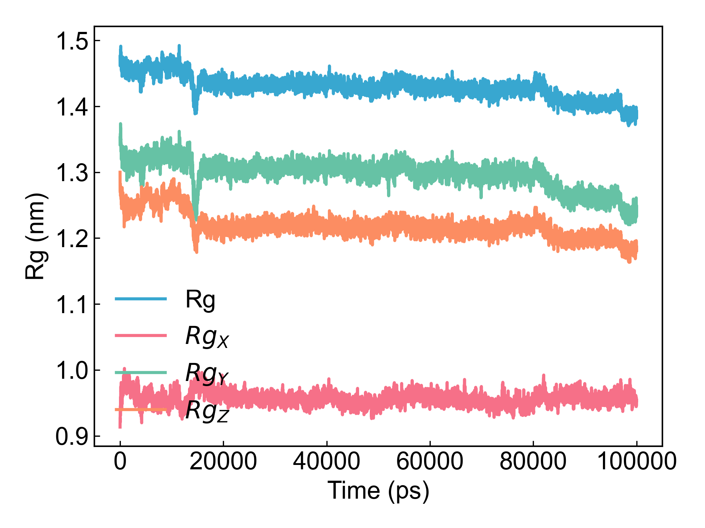

# gmx_Gyrate

本模块依赖GROMACS计算用户所选原子组的回旋半径（Gyration）。

## Input YAML

```yaml
- gmx_Gyrate:
    calc_group: Protein
```

非常简单的参数，选个计算组就行了。
如果用户需要其它的参数，例如`gmx gyrate -q`等，也可以通过`gmx_parm`参数去添加。

## Output

DIP会将`gmx gyrate`生成的xvg数据文件绘制成图：



## References

如果您使用了DIP的本分析模块，请一定引用GROMACS模拟引擎、DuIvyTools(https://zenodo.org/doi/10.5281/zenodo.6339993)，以及合理引用本文档。