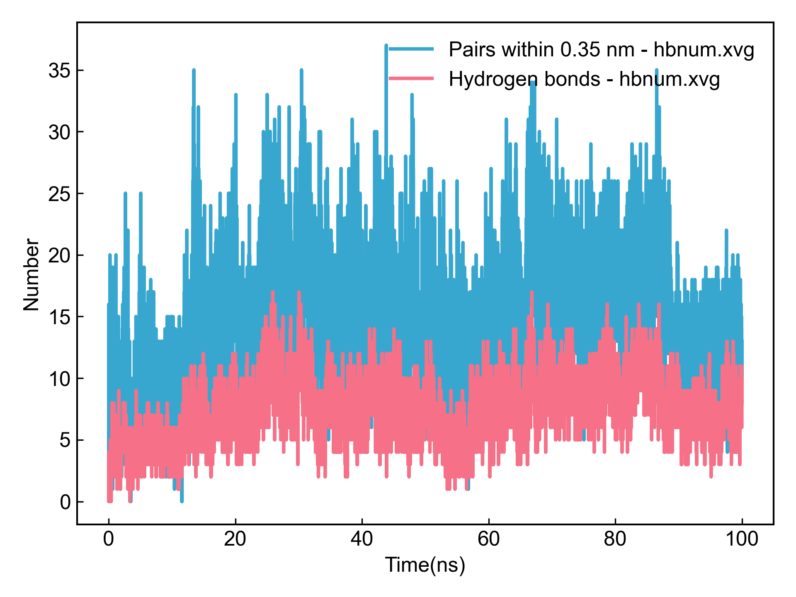
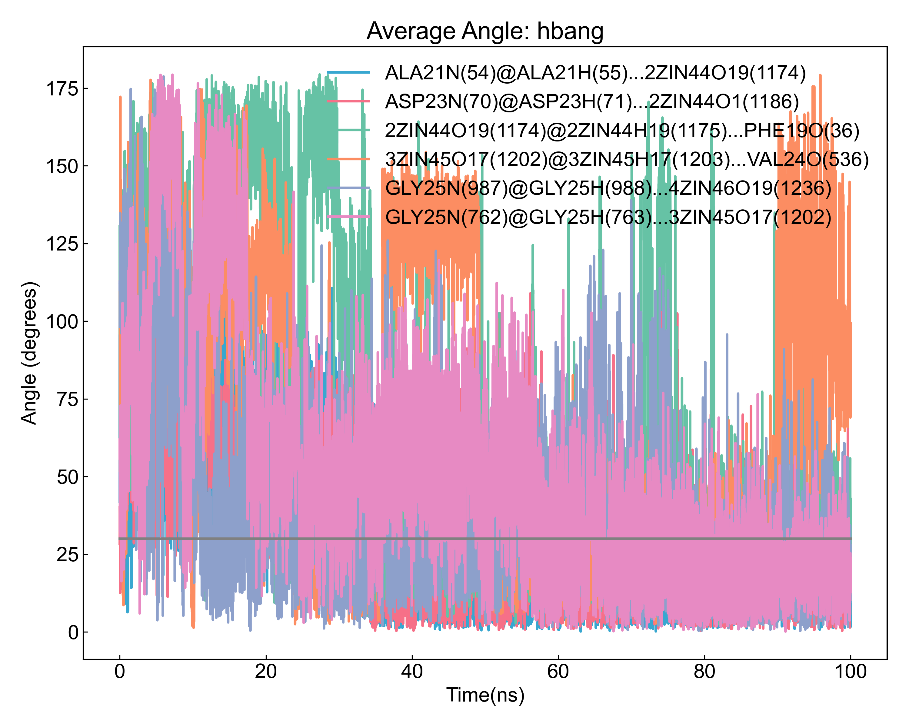
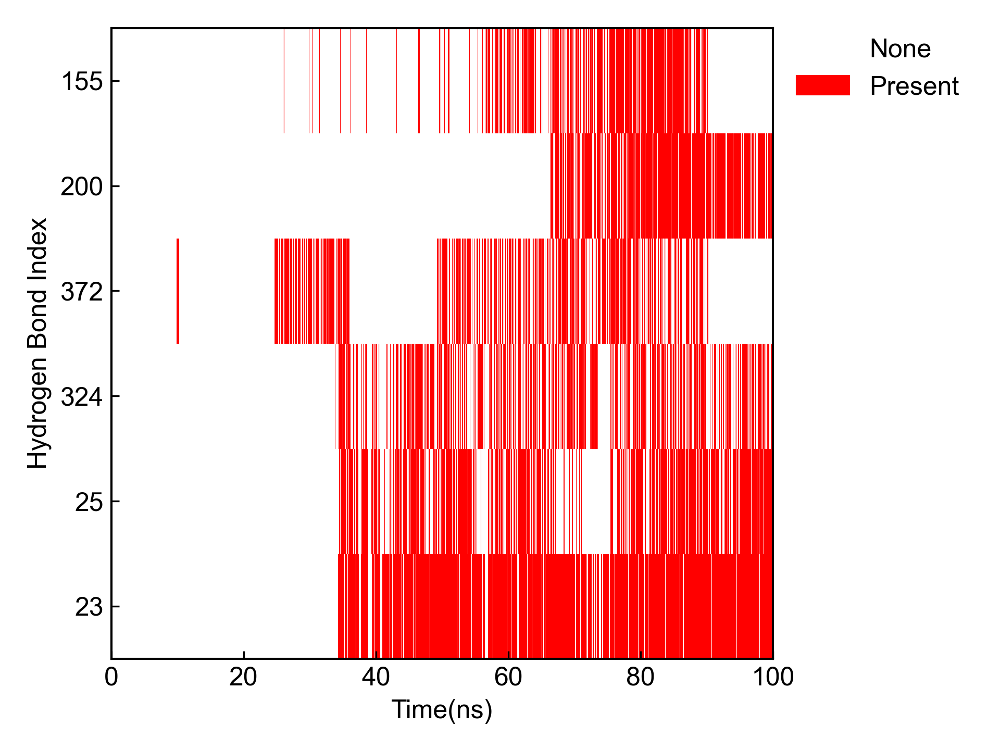

# gmx_Hbond

本模块依赖GROMACS进行氢键的计算，包括氢键的数量、时间占有率、氢键形成的平均距离和角度等。

使用本模块前请注意[前置处理](https://duivyprocedures-docs.readthedocs.io/en/latest/Framework.html#id7)已经完成！

## Input YAML

```yaml
- gmx_Hbond:
    group1: Protein
    group2: ZIN1 #Ligands # connot start with a number
    top2show: 6
    only_calc_number: no
    gmx_parm:
      b: 50000
      e: 90000
```

`group1`和`group2`是需要计算氢键的两个原子组，如果需要计算同一组原子内的氢键的话，两个组可以写成一样的。需要注意的是，组名不能是数字开头的，例如`1ZIN`这样的组名，会导致GROMACS识别到错误的组。

`top2show`是指展示前面多少个占有率最高的氢键数量，默认是6，可以根据需要调整。

如果只需要计算氢键数量，或者当预估的氢键数量特别大时（例如计算蛋白质和水的氢键），可以将`only_calc_number`设置为`yes`，也即只计算氢键数量，而不计算其他参数。

`gmx_parm`参数下面可以写一些gmx的参数；由于此模块涉及到`gmx hbond`、`gmx distance`和`gmx angle`命令，s所以这里只允许6个参数：`a`、`r`、`da`这三个参数只会被连接到`gmx hbond`命令中，而`b`、`e`、`dt`参数会被连接到全部三个命令中；其余的参数都将被忽略。

**请注意，本模块对GROMACS2024不适用，2024改了命令参数**。

## Output

首先DIP会可视化`gmx hbond`输出的氢键数量图和氢键占有率图：




之后DIP会对检测到的占有率最高的几个氢键，计算其距离和角度随时间的变化，如图：




同时还会对占有率最高的几个氢键进行占有率的可视化：



DIP会统计所有氢键的时间占有率、形成了氢键的平均距离和平均角度，并输出到csv文件中:

```csv
id,donor@hydrogen...acceptor,occupancy(%),Present/Frames,Distance Ave(nm),Distance Std.err(nm),Angle Ave(deg),Angle Std.err(deg)
0,LEU34N(383)@LEU34H(384)...1ZIN43O17(1140),0.02,1/4001,0.3030,0.0000,  9.38,0.00  
1,MET35N(392)@MET35H(393)...1ZIN43O12(1133),0.02,1/4001,0.3280,0.0000, 17.28,0.00  
2,MET35N(392)@MET35H(393)...1ZIN43O19(1143),0.05,2/4001,0.3050,0.0283, 23.95,3.43  
3,LEU34N(608)@LEU34H(609)...1ZIN43O12(1133),0.10,4/4001,0.3300,0.0097, 20.82,7.01  
4,LEU34N(608)@LEU34H(609)...1ZIN43O19(1143),0.07,3/4001,0.3103,0.0295, 22.75,2.69  
5,MET35N(617)@MET35H(618)...1ZIN43O19(1143),0.07,3/4001,0.3227,0.0225, 18.74,9.73  
6,LEU34N(833)@LEU34H(834)...1ZIN43O17(1140),0.02,1/4001,0.3160,0.0000, 29.34,0.00  
7,1ZIN43O12(1133)@1ZIN43H12(1134)...GLY33O(157),0.87,35/4001,0.2846,0.0206, 15.18,7.49  
8,1ZIN43O12(1133)@1ZIN43H12(1134)...ILE31O(368),0.10,4/4001,0.3058,0.0311, 23.62,6.99  
9,1ZIN43O12(1133)@1ZIN43H12(1134)...GLY33O(382),3.77,151/4001,0.2892,0.0214, 15.45,6.85  
```

氢键名称由[供体@氢...受体]组成, 每部分的命名含义如下：残基名字、残基编号、原子、括号里面是原子编号。

## References

如果您使用了DIP的本分析模块，请一定引用GROMACS模拟引擎、DuIvyTools(https://zenodo.org/doi/10.5281/zenodo.6339993)，以及合理引用本文档(https://zenodo.org/doi/10.5281/zenodo.10646113)。
